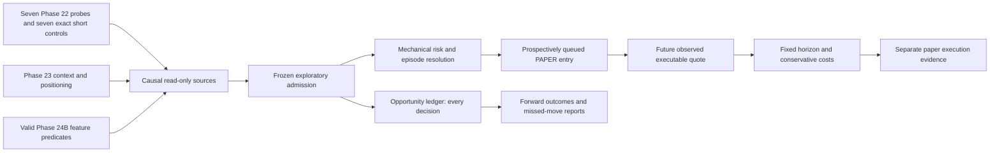

# Exploratory Paper Trader v2 — Phase 25A

Paper Trader v2 is designed to learn from trading, not to wait until learning is already complete.

A bad paper trade is evidence. A paper trader that never trades produces little evidence.

**Paper is where Prism earns evidence through action, not where already-proven strategies go to wait.**

This is prospective exploratory research infrastructure. There is no live order path,
wallet, signing, private key, exchange order adapter or paper/live switch. A subsequent
live phase requires an independent design and implementation. Paper PnL never proves alpha.
Implementation does not deploy, register or activate a production account automatically.

## V1 audit and retirement

The pre-change production audit is [PHASE25A_V1_AUDIT.md](PHASE25A_V1_AUDIT.md);
[raw audit](evidence/phase25a/v1-production-audit.json) records exact definitions,
policy IDs, event counts and the last 12 prospective job durations. Production was
read directly, on deployed/main revision `2a58e751682d`.

The known run ID is confirmed:
`paperrun_27b0a336e707c389a3fb574cd9d09a7800b563f0691612bf4fb4f1fd97029279`.
At 2026-10-09 ~06:24 UTC: created 2026-10-04T14:59:39.411736Z, age 4.64 days,
ACTIVE/HEALTHY, 40 successful cycles, 5 daily evaluations, 0 fired signals/intents/
fills/trades, no open positions or pending orders, equity/cash 10,000 USDC.

The immediate cause is **no signal** from the two frozen daily crossover strategies:
`ma_trend_10_50_long` and `ma_trend_20_100_short`, on AAVE/BTC/ETH/HYPE/LINK/SOL.
Research admission restrictions were not reached because no intent existed. V1 additionally
requires substantial prior research evidence, validation registration, forward tracking
and non-adverse corroboration. Its 10-day horizons cannot capture intraday participation.
V1 is an unsuccessful exploratory design; its records are a historical baseline.

`market paper retire-v1` appends a STOPPED lifecycle event (the existing terminal equivalent)
with exactly this reason:

> Retired because the conservative daily strategy/admission design produced no useful exploratory trading activity and is superseded by Paper Trader v2.

Once flat, it appends a `paper_retirements` row with state RETIRED, final equity,
original definition/policy IDs, frozen execution statistics and SHA-256 digests of all
per-run historical tables. No old definition, event, cycle, snapshot, brief or result is
updated/deleted. Repeating retirement returns the same frozen row. Paper v2 uses new tables
and identities. Comparison verifies the frozen digests; mutation fails visibly.

If positions/orders exist, retirement first stops new entries, returns DRAINING and keeps
v1 management jobs until the original deterministic fixed exits/cancellations finish.
Repeat retirement when flat. No position disappears and no last-price forced close is invented.
The production audit found none. All later direct v1 evaluation/snapshot/brief/evidence
and notification paths respect the freeze. Shared forward/co-pilot/incubation work continues.

Runtime selects steps from current account state under the existing writer lock: when v1
is stopped/flat it omits `paper`, `brief`, and the v1-only intraday `shadow` subprocess.
It retains shared prices, funding, OI, context, research, collector, checkpoints and backups.
A code deployment is required for this process-level skipping; an old deployment still
starts the legacy CLI processes even when the account is stopped.

## Architecture and identities

Migration 25 appends separate `paper_v2_*` policy/universe/run/evaluation/context/opportunity/
outcome/event/report/delivery tables plus the v1 retirement archive. No old schema is removed.



All identities are content-addressed, including the full frozen definitions and semantic
versions. Exact IDs and all parameters are in
[frozen-definition.json](evidence/phase25a/frozen-definition.json).
The current universe ID is
`paperuniverse_v2_5c0ca1f65dcef5d531fb01dffd764ae471ebcb45611ad16c244f7bfd44090d9a`.
Registration accepts only the released 28-hypothesis universe, version
`paper_exploratory_v2_2`. Creation requires registration,
checks stored content against policy IDs, rejects an active/draining v1 or v2 account,
and records a fresh `paperrun_v2_…` identity and exact UTC activation instant. A code or
parameter change cannot silently alter an existing run. No v1 identity is reused.
A new account begins at activation; earlier signals are not even inserted as opportunities.

An AI may read state, explain evidence, inspect misses, or propose a future reviewed
registration. The CLI has no arbitrary hypothesis-registration input, manual trade command,
size/risk override, discretionary conflict decision, or writable historical-clock option.

## Exact bootstrap universe

Phase 22 scientific verdicts remain unchanged. Replaying the original registered study on
a scratch copy reproduced digest `d6c9e4a060b69b02da40c3a260a40a337aaa8a3007e6ac382ce87ca089b7c4ad`.
The [bootstrap evidence](evidence/phase25a/phase22-bootstrap.json) includes exact original
strategy IDs. The seven INTERESTING long variants remain exploratory probes; none is
validated alpha and none was an incubation candidate. Their seven existing exact mechanical
short mirrors are also included, tagged **EXPLORATORY_TECHNICAL_CONTROL**. All seven retain
their original Phase 22 **REJECTED** verdict and exact reason
**contemporary net effect credibly negative**. The
[control evidence](evidence/phase25a/technical-controls.json) records the original strategy
IDs, verdicts, reasons and historical frequencies; it does not revise Phase 22 evidence.
The remaining 111 catalogue variants are excluded and no new technical rule is invented.
The [frozen definition](evidence/phase25a/frozen-definition.json) records all 28 hypothesis
IDs, the new universe ID, and the unchanged admission/risk/execution IDs. All original 21
hypothesis IDs are preserved. The preceding 21-member universe ID is retained as lineage;
registration appends a new universe rather than updating any registered definition/run.

| Hypothesis | Side | Source | Primary exit |
|---|---|---|---|
| `ema_cross_trend[n=20]:1h:long` | long | EXPLORATORY_TECHNICAL, Phase 22 | 8h |
| `ema_stretch_fade[k=3.0]:1h:long` | long | EXPLORATORY_TECHNICAL, Phase 22 | 4h |
| `ema_stretch_fade[k=4.0]:1h:long` | long | EXPLORATORY_TECHNICAL, Phase 22 | 4h |
| `compression_breakout[n=24,pct=0.35]:1h:long` | long | EXPLORATORY_TECHNICAL, Phase 22 | 4h |
| `expansion_continuation[k=3.0]:1h:long` | long | EXPLORATORY_TECHNICAL, Phase 22 | 4h |
| `expansion_fade[k=3.0]:1h:long` | long | EXPLORATORY_TECHNICAL, Phase 22 | 4h |
| `exhaustion[n=24,z=3.0,strong_close=no]:1h:long` | long | EXPLORATORY_TECHNICAL, Phase 22 | 4h |
| `ema_cross_trend[n=20]:1h:short` | short | EXPLORATORY_TECHNICAL_CONTROL, Phase 22 REJECTED | 8h |
| `ema_stretch_fade[k=3.0]:1h:short` | short | EXPLORATORY_TECHNICAL_CONTROL, Phase 22 REJECTED | 4h |
| `ema_stretch_fade[k=4.0]:1h:short` | short | EXPLORATORY_TECHNICAL_CONTROL, Phase 22 REJECTED | 4h |
| `compression_breakout[n=24,pct=0.35]:1h:short` | short | EXPLORATORY_TECHNICAL_CONTROL, Phase 22 REJECTED | 4h |
| `expansion_continuation[k=3.0]:1h:short` | short | EXPLORATORY_TECHNICAL_CONTROL, Phase 22 REJECTED | 4h |
| `expansion_fade[k=3.0]:1h:short` | short | EXPLORATORY_TECHNICAL_CONTROL, Phase 22 REJECTED | 4h |
| `exhaustion[n=24,z=3.0,strong_close=no]:1h:short` | short | EXPLORATORY_TECHNICAL_CONTROL, Phase 22 REJECTED | 4h |
| `crowding_vulnerability_long_v1` | long | Phase 23 | 2h |
| `crowding_vulnerability_short_v1` | short | Phase 23 | 2h |
| `oi_price_stall_long_v1` | long | Phase 23 | 1h |
| `oi_price_stall_short_v1` | short | Phase 23 | 1h |
| `oi_directional_pressure_long_v1` | long | Phase 23 | 2h |
| `oi_directional_pressure_short_v1` | short | Phase 23 | 2h |
| `continuation_core_long_v1` | long | Phase 24B | 15m |
| `continuation_core_short_v1` | short | Phase 24B | 15m |
| `absorption_book_long_v1` | long (sell absorption) | Phase 24B | 1h |
| `absorption_book_short_v1` | short (buy absorption) | Phase 24B | 1h |
| `absorption_oi_rising_long_v1` | long (sell absorption) | Phase 24B | 1h |
| `absorption_oi_rising_short_v1` | short (buy absorption) | Phase 24B | 1h |
| `continuation_persistent_long_v1` | long | Phase 24B | 30m |
| `continuation_persistent_short_v1` | short | Phase 24B | 30m |

The universe is **14 long / 14 short**: 7/7 technical, 3/3 positioning and 4/4 microstructure.
The [long/short audit](evidence/phase25a/long-short-audit.json) records frozen counts and
historical signals, admissions, support events and every rejection reason by side.
Every short technical control uses its long counterpart's exact parameters, warmup,
hourly cadence, primary horizon and half-horizon cooldown, with mechanically mirrored
signal direction. Both use the same admission, sizing, leverage, exposure limits, costs,
episode handling, cancel-both conflict rule and degradation rules. The seven long scientific
verdicts remain INTERESTING and the seven short verdicts remain REJECTED; paper admission
does not upgrade scientific evidence. Side audits report signals, admissions and rejection
reasons separately. A downside regime without a short trade must be explained by the
registered signals and recorded mechanical blocks, rather than absence of short definitions.

Positioning rules (fixed before any v2 outcomes): use Hyperliquid, hourly OI change >=0.5%,
two timely hourly price captures, and signed price progress threshold 0.1% per hour.
Directional pressure follows price progress while OI expands. OI price stall fades the
funding-aligned side when absolute hourly progress <=0.1%. Crowding vulnerability requires
the opposite-side `crowded_*_like` state, funding against intended direction with absolute
hourly rate >=0.000025, and lack of progress of the crowded side. None is presumed profitable.
Scheduled/active events and macro proximity are attribution, not extra mandatory filters.

Microstructure reuses **exact existing Phase 24B predicates**:
accepted one-sided flow; weak/opposite response with resilient opposing book; weak/opposite
response with rising OI; accepted persistent flow. No new threshold search. Phase 24B's
288 prior COMPLETE 15m windows are necessary feature warmup; WARMUP/EARLY scientific
maturity does not block paper once the features exist. Other sources operate meanwhile.

## Exploratory admission

All are necessary: registered frozen definition, post-activation signal, causal timing,
healthy required data, finite required primitives/warmup, signal fires, lifecycle enabled,
and no mechanical conflict. Signal age <=20 minutes; quotes <=30 minutes old; settled
funding <=2 hours old for entry. Positioning requires hourly captures <=80 minutes old
and adjacent captures no more than 80 minutes apart. Technical warmup checks the exact
required primitives at current/previous bars; gap-dependent undefined values never fire.

Not required: Phase 20 lifecycle, profitability, t>=2, BH survival, replication, long
lifetime history, 30-day forward validation, incubation candidacy or a research-supported
tier. Evidence maturity and scientific verdict are recorded, not promoted by admission.

Lifecycle states are ENABLED_EXPLORATORY, DISABLED, DEGRADED and RETIRED. Initial degradation
is deliberately permissive: >=100 primary-trigger closed trades, with last-50 mean net
return <=−0.5% and >=40 losing trades; or no fired signal for 30 days. These cause a
DEGRADED admission block with a reason. Three losers do not disable a hypothesis. Broken
required data blocks entries immediately with a dependency reason; actual execution failures
are observable and alert through the runtime after three consecutive failures. New
hypothesis versions or later graduation require separate explicit registration/design.

## Account, risk and executable economics

Start **100 simulated USDC**, isolated **2x**; notional **20% current marked equity**, rounded
**down** to the asset lot. Leverage determines margin, not a multiplier on this notional.
At inception that is about $20 notional / $10 margin per trade, at most three concurrent
positions, **60% equity gross notional**. No averaging, martingale, pyramid, recursive
leverage or portfolio optimizer. At most one position per asset. Gross/net long/short and
same-direction concentration are visible; a BTC beta estimate is unavailable, not invented.

The deterministic global catastrophe guard is **75% drawdown from marked equity peak**.
Normal 5–10% drawdowns do not halt trading. A human `kill` cancels queued entries and closes
positions at the next observed executable quote. Isolated margin liquidation is modeled as
full margin loss; adverse minute/bar ranges can trigger it. No discretionary stop/target.

Public Hyperliquid metadata read on 2026-10-09 freezes size decimals BTC 5, ETH 4, SOL 2,
HYPE 2, LINK 1, AAVE 2 and max leverage 40/25/20/10/10/10. Every 2x assumption is mechanically
below those maxima. The minimum notional is **$10**, per
[venue error documentation](https://hyperliquid.gitbook.io/hyperliquid-docs/for-developers/api/error-responses).
Size precision follows [tick/lot rules](https://hyperliquid.gitbook.io/hyperliquid-docs/for-developers/api/tick-and-lot-size).
When 20% equity, after lot rounding, cannot reach $10, MIN_NOTIONAL is recorded. V2 does
not upsize to evade the constraint: below approximately $50 equity the rule can become
untradable. Asset price and coarse lot size can make the boundary slightly higher.

Baseline executable costs retain **4.5 bp taker per side** (no discounts), and adverse
slippage BTC/ETH 2 bp, SOL 4, HYPE/LINK 6, AAVE 8 bp per side. Base fees agree with
[Hyperliquid's fee table](https://hyperliquid.gitbook.io/hyperliquid-docs/trading/fees).
Entry fee uses entry fill notional, exit fee uses exit fill notional. Slippage moves actual
simulated fills, rather than being subtracted twice. Hourly settled funding is side-signed
on entry notional (frozen small-order approximation); positive funding is paid by longs,
received by shorts. Missing settlements make marks provisional and delay final closure/
research outcomes until known; they are never silently reported as zero-cost complete PnL.
Trade return and impact on entry account equity are separate fields.

## Entry, exit and causality

A signal can only queue an entry at **actual evaluation time**, after all its data is
available. Filling uses the first COMPLETE future minute's end mid, with adverse slippage,
strictly after that decision. Before minute data exists, technical/context entries may
use the next stored 15m bar open; this coarser path is tagged. Quotes recorded later can
complete an already-queued intent at its fixed future reference time. They cannot create
an earlier signal/intent. If there is no executable quote within 20 minutes, the pending
entry expires visibly. Fill rechecks lot/minimum/gross exposure. This is a small taker-order
simulation, without passive fill probabilities or live transport.

Phase 24A finalization is necessary but **not sufficient** for this DB consumer:
`available_at` is ingestion time, and windows are loaded with `known_at=evaluation_time`.
All 15 contributing minutes must be COMPLETE, past production cutover and already ingested.
Later revisions are undone by the causal loader. The latest window and its prior-only
normalizations must be valid according to Phase 24B. This intentionally adds collector-to-DB
latency; the study's earlier finalized clock never grants the paper account an earlier entry.

Phase 23 snapshot events use first_seen_at, updates observed_at, links linked_at, captures
captured_at, and strict positioning availability. Publication time alone never grants
knowledge. The exact snapshot is stored once in paper context storage and referenced by
ID, with causal positioning/macro/market attribution. V2 does not rewrite context history.

Exit is the first complete reference at or after **entry + declared primary horizon**.
If a missing quote delays it, `exit_delay_minutes` is explicit; never invent the missing
price. No per-trade horizon or optimized stop/target. MFE/MAE are side-signed path returns;
time to extrema is measured from entry. Favourable-first uses frozen ±0.5% touches and
marks same-minute touches AMBIGUOUS. Pre-entry wicks are excluded. Coarse bar fallback is
visible and cannot establish within-bar ordering.

## Opportunity ledger, overlap and conflicts

Every source evaluation gets a row: NO_SIGNAL, feature/data blocks, fired/admitted,
fired/rejected or support. Thus both traded and untraded hypotheses remain measurable.
Signal time, availability, decision time, side, asset, horizon, hypothesis/family/version,
source phase, scientific verdict, maturity, prospective sample count, Phase 24B checkpoint,
feature version and context reference are preserved. Forward research outcomes are appended
in a separate immutable table once the frozen horizon is known. Hypothetical rejected
outcomes never become account trades. Missing windows are unobserved, not inferred NO_SIGNAL.
Hypothetical research entries also respect signal availability; an invalid causal observation
or an availability timestamp before its signal does not receive a fabricated forward outcome.

Rejection vocabulary: NO_SIGNAL, DATA_STALE, FEATURE_WARMUP, HYPOTHESIS_NOT_REGISTERED,
COOLDOWN, MAX_POSITIONS, EXPOSURE_CAP, DUPLICATE_EPISODE, MIN_NOTIONAL, COST_FILTER,
INVALID_TIMING, CONTEXT_UNAVAILABLE, CONFLICT, CATASTROPHE_GUARD, KILL_SWITCH,
HYPOTHESIS_DISABLED, FUNDING_UNAVAILABLE, EXECUTION_EXPIRED. COST_FILTER is reserved;
v2 uses no profitability/cost-effect-size gate to suppress exploratory loss-making ideas.
Admission and post-admission execution expiry are separate events and can both be explained.

Cooldown per hypothesis/asset/side = max(15 minutes, half its declared horizon), measured
from last admitted/support decision. One asset/side within 10 minutes is one episode/trade;
additional registered triggers are supporting IDs. Support count is number of distinct
families, not correlated variants. Later same-asset signals are DUPLICATE_EPISODE while
that position is pending/open. Distinct assets may trade concurrently.

Simultaneous valid opposing signals **cancel both**, with identities, side and maturity
recorded. A new opposing signal on an occupied asset is CONFLICT. No AI tie-breaker.
Resource allocation uses a fixed hash order of timestamp/asset/hypothesis, rather than
long preference or a learned PnL score. The primary trigger fixes exit/sizing; supporting
hypotheses retain their own horizons for separate research outcomes.
Disabled/degraded hypotheses are recorded with HYPOTHESIS_DISABLED and do not participate
in conflict cancellation against enabled hypotheses.

## Missed moves, postmortem and reporting

Post-hoc analysis thresholds only: BTC absolute 24h move >=5% (>=8% tagged separately),
other assets >=10%. `postmortem --start … --end … --asset … --json` shows market move,
causal knowledge snapshots, registered hypotheses, fired signals, admissions, conflicts,
every recorded rejection and the rejected signal's eventual frozen-horizon return.
No trading trigger depends on these analysis thresholds. No pre-activation trade or missed
signal is invented; reports state activation and evaluation coverage.

Daily reports preserve trades/signals/rejections/PnL/costs/wins/losses/MFE/MAE/sides/families/
regimes and the largest major move with participation reasons. Frequency reports show
signals/day, filled trades/day, long/day, short/day, zero-trade days and shares >=1/3/5/10.
Five trades/day is a diagnostic reference, never a quota. Below one/day, inspect NO_SIGNAL,
warmup/stale dependencies, MIN_NOTIONAL, conflicts/episodes and resource blocks.

`compare-v1` provides frozen v1 vs current v2 age, signals, trades/day, long/short, exposure,
realised/unrealised PnL, fees, drawdown and opportunity participation. V1 participation is
unknown because it lacked the full opportunity ledger; it is not fabricated as zero.
Scientific Lab evidence remains a separate dimension from these paper execution summaries.

PAPER-labelled Telegram shows current marked equity/open positions and rolling 24h counts,
plus the previous UTC day's PnL. It is one stored daily brief; attempted delivery is recorded before
sending. An unknown outcome or failure is not retried automatically, preventing duplicates.
Delivery failures return nonzero to runtime and never change paper account PnL. Example:

```text
PAPER V2 · 2026-10-10
Equity 99.73 simulated USDC · day -0.27
Open 2 · trades 6 (L 3 / S 3)
Hypotheses 21 · signals 14 · rejected 5
Blocks: DUPLICATE_EPISODE 3, COOLDOWN 2
Paper execution evidence; scientific maturity remains separate.
```

This is an **illustration**, not actual activity. `explain TRADE_ID` loads primary trigger,
all support observations and full causal context snapshots. Separate trade notifications
are deliberately omitted to avoid spam.

## Scheduler and observability

Uses the existing authoritative Railway service, runtime writer lock and subprocess jobs:

| Job | UTC cadence | Work |
|---|---|---|
| `paper_v2_funding` | hourly :05 | `market bars funding`: bounded settled funding refresh |
| `paper_v2` | :07/:22/:37/:52 each hour | evaluate/manage after existing 15m spool ingest |
| `paper_v2_brief` | 00:12 daily | freeze yesterday and optionally send one PAPER brief |

Technical/positioning features evaluate **once per new hourly source instant**; microstructure
once per quarter-hour. Positions manage on each quarter-hour DB ingest using queued execution
and declared horizon references; recording can lag the reference. There is no heavyweight
permanent new process. Before a v2 account is created its three jobs launch no data/evaluation/
Telegram subprocesses. Persistent execution/funding failure alerts after three failures;
existing provider/collector health continues independently.

Status exposes activation, account state, engine health, latest evaluation/trade, 24h signal/
trade counts, open/pending positions, dependency health/warmup/staleness, error streak,
provisional missing funding, gross/net exposure, CPU/wall time, peak process RSS and DB row
counts, shared database/WAL bytes and exact per-run JSON payload bytes (excluding shared
contexts/indexes). Persistent feature warmup is visible even if evaluation itself is successful.

## Resource discipline and measured expectations

Retired v1 paper+brief steps used about 3–4 seconds/run, six/day (~18–24 seconds/day wall),
plus 96 normally idle shadow startups/day. No dedicated Railway service is removed. Market
API calls eliminated: **zero**. At most one Telegram brief/day disappears, plus hypothetical
trade alerts. About six paper cycle inserts/day, two paper events/day, one snapshot/day,
one brief/day and its delivery rows disappear. CPU usage of v1 was not separately measured;
wall time is not CPU time. Shared data/API/research costs remain.

The production backup `prism-20261009T013002Z.duckdb` was SHA-256 verified against Railway:
`87dd7c929f19c7df492417df766de5ae6d88237dec468e413052e21370b0e3c0`.
It passed original main's schema-24 backup verifier. Migration 25 was applied only to a
scratch copy for benchmarking; this is not production deployment or a v2 activation.
A [read-only source benchmark](evidence/phase25a/source-benchmark.json) of the preceding
21-member universe on that copy measured
1.73 seconds wall, 2.10 seconds CPU, 372 MiB peak process RSS for six assets / 126 evaluations,
13,476 quote observations and 282 funding rows. It created **no account or trade**. These
are local-machine measurements on young data; warm seven-day normalizations and Railway
hardware may cost more. The runtime records actual per-evaluation costs after activation.

A [scratch cutover rehearsal](evidence/phase25a/scratch-cutover.json) on a separate copy
of that backup, for the preceding 21-member universe, verified the unchanged v1 run row,
retirement digests, 10,000 USDC frozen v1 equity, and a separate 100 USDC scratch account
with zero historical opportunities or
trades. Only forward/copilot/incubation and bars remained in the shared v1 job pipelines.
Rehearsal wall/CPU/peak RSS were 1.25 s / 1.22 s / 349 MiB. The checkpointed file remained
233,582,592 bytes because existing DuckDB allocation was reused; this is **not** a zero
steady-state storage-growth claim. No production account was stopped or activated by the
rehearsal, and its throwaway run is not prospective production evidence.

V2 adds 96 evaluation startups/day and <=144 small funding requests/day (6 coins x24 hours),
less when shared forward has already fetched the hour; one brief/day. This is a net increase
in research work, not a claimed cost-saving project. Reusing collectors and snapshots,
computing each source once/instant and storing full context once/ID limits duplication.
At most 7,488 scheduled opportunity rows/day before data/activation gaps (the seven hourly
controls add at most 1,008 rows/day); record row counts
and checkpointed volume size after cutover to measure actual DB growth. The shared 5 GB
volume and full backup copies must be monitored. Railway dollar/CPU savings cannot be
inferred from these readings; no dollar estimate is asserted.

## Historical frequency sanity (never actual v2 activity)

[Frequency sanity](evidence/phase25a/frequency-sanity.json) reuses the seven long probes
and seven exact short controls on retained Phase 22 Binance data, 2024-11-01 to
2026-10-01 (699 days). The [reproduction script](evidence/phase25a/frequency-sanity.py)
opens only a scratch study database, read-only. It first reproduces the preceding seven-long
counts (5,342 signals, 2,635 admissions, 242 support events) before adding the controls.
It writes no paper tables. With one occupied asset, max three concurrent positions,
half-horizon cooldown, 10m same-side support, cancel-both simultaneous conflicts,
opposite-side occupied-asset conflicts and complete historical outcomes, it gives:

- Raw signals **15.40/day**: 5,342 long and 5,424 short signals (7.64 / 7.76 per day).
  This includes historically non-evaluable observations. Original Phase 22 evidence and
  its seven-INTERESTING-long ensemble frequencies remain unchanged.
- Mechanical occupancy admissions **5.13/day**: **2.53 long / 2.60 short**, 3,584 total;
  73 support events.
- Zero-admission days **0.43%**; days >=1/3/5/10: **99.57% / 92.85% / 63.81% / 0.72%**.
- Blocks: CONFLICT 3,692; DUPLICATE_EPISODE 1,080; MAX_POSITIONS 1,370; COOLDOWN 223;
  missing historical funding/path 744. Adding shorts can block a long through the existing
  symmetric conflict rule; long throughput is not simply carried forward and summed.

This does not simulate small-equity evolution/lot constraints or current Hyperliquid texture,
and does not estimate young positioning/microstructure throughput. It retains the original
sanity script's key ordering, which approximates the engine's side-neutral hashed priority.
A reasonable **technical-only scale is approximately 5 potential trades/day while tradable
equity/data persist**; current Hyperliquid and prospective ensemble throughput remain
unproven. Both technical directions now have registered definitions.
No parameter, sizing, exit or threshold was tuned to the target or historical profitability.
The source benchmark's single instant had zero fired signals and cannot estimate a daily rate.

## CLI

Read outputs are machine-readable JSON (explicit `--json` accepted):

```text
market paper v2 status|trades|signals|rejected|hypotheses|frequency --json
market paper v2 explain TRADE_ID --json
market paper v2 postmortem --start ISO --end ISO --asset BTC --json
market paper postmortem --start ISO --end ISO --asset HYPE --json
market paper v2 compare-v1 --json
market paper v2 daily [--day YYYY-MM-DD] --json
market lab paper v2 status --json
```

Administration: `market paper retire-v1 [--run-id ID]`, `market paper v2 register`,
`market paper v2 create`, `market paper v2 evaluate`, `market paper v2 brief [--send]`,
`market paper v2 kill --reason …`. Writable commands have no historical-clock option.
All runtime work uses the existing Store authority checks and DuckDB writer lock.

## Production deployment and cutover sequence

### Implementation validation

[Validation results](evidence/phase25a/validation.json): the full suite ran in one invocation
across all 46 test files: **1,067 passed, 2 failed** in 1,962.76 s. Both failures were the
collector reconnection tests because the sandbox denied binding their local mock WebSocket
server to `127.0.0.1`. Those exact cases reran unchanged with local socket access:
**2 passed** in 12.09 s. All **1,069 collected tests** are therefore verified, with no
remaining failures, errors or skips. The validation artifact retains both invocation
results and checks the final collected test identities against the JUnit evidence.

Coverage includes Phase 25A (76), Phase 24B plus scheduling (27), Phase 24A (46), Phase 23
(38), v1 paper/observation (60), Lab suites including governance (317), runtime (32), and
all remaining backtest/data/indicator/report tests. Ruff check passed, Ruff format check
passed (341 files), and `git diff --check` passed. The 23 added cases cover all seven exact
control definitions, both sides' admission/sizing/costs/horizons/cooldown, preserved REJECTED
metadata during warmup, unchanged policy identities and preservation of the previous universe.
Safety, causal rejected outcomes,
degraded-hypothesis conflicts, cross-day fee attribution, collector fallback exits and
the immutable retirement/comparison paths have regression coverage.

No production v2 activation happens during implementation. Run this sequence on an exact
reviewed/committed revision; preserve the verified pre-deploy backup and v1 audit.

1. Retire the flat v1 **before** code deployment using the current production CLI:

   ```sh
   railway ssh --service prism-runtime -- market lab paper stop paperrun_27b0a336e707c389a3fb574cd9d09a7800b563f0691612bf4fb4f1fd97029279 --reason 'Retired because the conservative daily strategy/admission design produced no useful exploratory trading activity and is superseded by Paper Trader v2.'
   railway ssh --service prism-runtime -- market lab paper status --json
   ```

   If already STOPPED, do not repeat stop. If positions exist, wait for deterministic old
   exits before proceeding. Production preflight must show final equity/history intact.

2. Deploy using the existing committed-revision wrapper, which backs up first:
   `deploy/railway/deploy.sh <reviewed-commit>`. Boot's writable open appends migration 25.
   `railway ssh --service prism-runtime -- market ops preflight` must succeed. Do not
   repurpose/restore/reset the v1 database or account. The old paper/brief/shadow steps now skip.

3. Finalize the immutable retirement archive and register exactly the released universe:

   ```sh
   railway ssh --service prism-runtime -- market paper retire-v1
   railway ssh --service prism-runtime -- market paper v2 register
   ```

4. Activate the fresh account only now:
   `railway ssh --service prism-runtime -- market paper v2 create`.
   Save its returned new run ID and exact activation timestamp. This is the start of real
   prospective v2 evidence. There is no migration that automatically creates a run.

5. Inspect `market ops crontab` and Railway logs for :05 funding, :07/:22/:37/:52 evaluation,
   00:12 brief. A manual `market ops cycle paper_v2_funding --trigger manual` can top up
   funding. `market ops cycle paper_v2 --trigger manual` confirms the first prospective
   evaluation; source instants at/before activation are intentionally skipped.

6. Verify `market paper v2 status --json`, hypotheses, signals and compare-v1. Confirm healthy
   current sources/warmup explanations, 100 USDC initial equity, no fabricated earlier trade,
   correct policy IDs, and v1 digests unchanged. No first trade is guaranteed by a manual run.

7. After the first completed prospective UTC day, verify the stored daily report and the
   once-only scheduled Telegram delivery. An explicit `market paper v2 brief --send` uses
   the same duplicate protection. Do not send pre-activation/example activity.

8. Record deployment with `market ops record-deploy --note 'Phase 25A exploratory PAPER v2;
   v1 retired; fresh activation ID/time …'`. Compare before/after runtime step durations,
   API refresh runs, ledger row counts, database/volume sizes and observed frequency.
   If <1 trade/day, report the exact observed bottleneck instead of retuning or forcing trades.

Phase 25A's production success remains contingent on this cutover: clean v1 retirement,
prospective exploratory activity, explainable participation/misses, symmetric new sources,
and evidence from losses as well as wins. Implementation/tests alone cannot establish that
activity has begun. Later graduation separately assesses statistical evidence, costs,
replication, forward stability and execution quality; none is inferred from paper profit.
