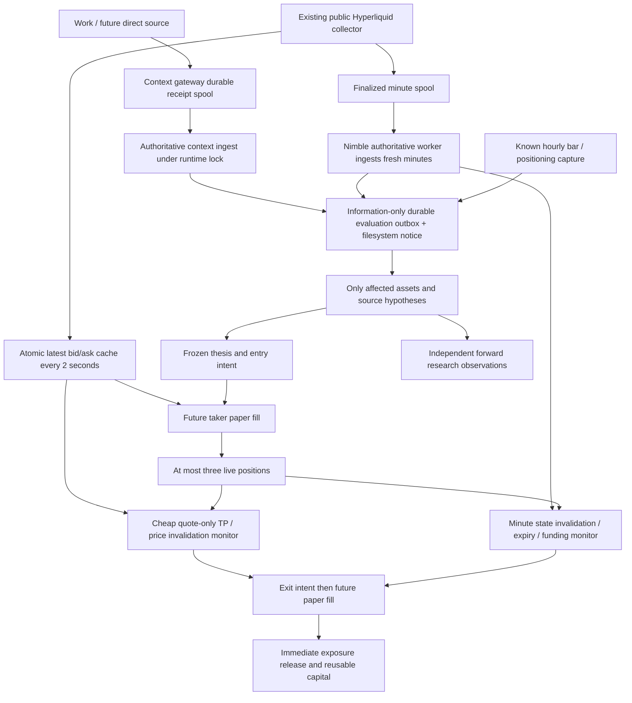

# Nimble perp paper execution — Phase 27

The automated perp trader is a fast, opportunistic system designed for minutes-to-hours trades. It is distinct from Prism's manually managed slower 2-day+ opportunity/radar workflow.

Prism's fast perp trader should enter because it has a causal reason to expect an immediate move, remain in the position only while that thesis is alive, and exit as soon as the profit objective is achieved or the thesis is wrong—not because an arbitrary clock reached eight hours.

**Time is a backstop, not the primary reason to exit a trade.**

**Being correct about the ultimate underlying story is not required. A short-horizon event trade succeeds if Prism correctly anticipates and captures the market's immediate reaction.**

The objective is profitable opportunity capture after costs. There is no trades/day ceiling or minimum activity quota. Positions close in full: no scaling, pyramiding, maker-fill assumptions or adaptive conviction sizing. No LLM, exchange order adapter, signing, credentials or live mode exists in the execution engine.

## Current Paper v2 audit and preservation

Phase 27 starts at main `1c206e5`. The production audit is [v2-production-audit.json](evidence/phase27/v2-production-audit.json). Preserve the active account as `EXPLORATORY_FIXED_HORIZON_BASELINE`:

- Run `paperrun_v2_3811cccc40db4fbe6413ebd018c129d1026748f3cd72e619ec80ba88e47ada95`.
- Activation `2026-10-09T10:19:06.981566+00:00`.
- Universe `paper_exploratory_v2_2`: exactly 28 hypotheses, 14 long / 14 short.
- Existing run, admission/risk/execution definitions, signals, trades and forward outcomes remain unchanged.

V2 queues at evaluation time, takes a future complete minute mid with adverse slippage (or a coarse 15m open), and schedules its normal exit at entry plus the research horizon. Its 15-minute evaluator runs at `:07/:22/:37/:52`; its microstructure DB ingest runs at `:06/:21/:36/:51`. Fixed expiry and missing settled funding can keep capital occupied after the useful response ends. There is no ordinary TP or setup invalidation.

The audited ETH/LINK/SOL entries demonstrate the distinction between reference/fill time and actual knowledge: intents `12:07:03.539457`, simulated minute quote `12:08:00`, quote available `12:21:03.550685` UTC. The SOL position's two-hour exit was already overdue while funding was missing. These observations are retained; Phase 27 does not repair them by rewriting v2.

Nimble creation copies the baseline definition and ordered evidence-prefix digests into its activation record. Comparison rechecks the frozen prefixes, allowing new baseline rows to append. A changed historical prefix or original run definition fails verification. V2's source adapter accepts an optional asset/ledger selection for reuse; the v2 defaults, predicates, IDs, execution policy and runtime cadence are unchanged. Faster shared ingest can improve subsequent v2 data availability; its recorded historical times are untouched, and this collection-cadence difference is an A/B attribution caveat.

## Research horizon versus execution lifecycle

Entry identities come directly from `paper.v2.spec.bootstrap()`. The 14 Phase 22 technical probe/control identities retain their INTERESTING/REJECTED verdicts. Six Phase 23 positioning and eight Phase 24B microstructure identities are unchanged. Technical controls have no upgraded independent directional evidence; technical geometry is primarily execution context.

The original primary research horizon and the frozen 15/30/60/120/240/480-minute comparison horizons are stored separately from expiry and max hold. `paper_nimble_research_pending` remains after a position closes. Minute forward returns, MFE/MAE and delay/missing-path flags append to `paper_nimble_research` at each original horizon. Fired rejected signals retain descriptive curves when a causal quote exists. These are known-quote signal observations, **not fictitious executable trades**, and do not overwrite Phase 22/24B scientific results or the baseline outcome table.

Future event curves use 1/5/15/30/60/120 minutes. Immediate and confirmed event entries must have separate registered identities, even if they cite one logical catalyst. Execution evidence, scientific evidence and live lifecycle decisions remain distinct.

## Entry thesis and immutable experiment

`ExecutionThesis` is deterministic, content-addressed and stored in `paper_nimble_theses`. Before an entry can fill, freeze hypothesis ID, asset/side, trigger, evidence availability, actual evaluator/intent time, causal context snapshot, positioning, microstructure, reference price, fixed target/invalidation/emergency levels, expiry/progress definition, maximum hold, episode ID, source-latency metadata and policy versions.

The entry reference is the quote known when the thesis is frozen; the later actual entry quote/fill/reference have separate fields. Entry geometry never shifts to rescue an adverse fill. Target economics and invalidation are rechecked at fill. All quote fills require a new quote after the intent, and carry exchange time, receipt/availability, evaluator and fill timestamps. The CLI accepts no historical clock, arbitrary trade, discretionary size or risk override.

Registration accepts only the released `paper_nimble_v1` definition. A new run records an exact prospective activation, execution-policy ID, reused risk-policy ID, `execution_thesis_v1`, `thesis_exit_v1`, and a seven-day comparison-review instant. Any policy/content mismatch fails instead of silently adapting an existing account. Startup recovers positions from atomic projections; `market paper nimble recover` rebuilds them from the immutable ledger and verifies thesis hashes.

## TP families and exact mappings

Use causal prior structure and a small frozen policy set; no historical parameter search:

| Reused entry family (both sides) | Full-exit profit objective | Response window | Max hold | Cooldown |
|---|---|---:|---:|---:|
| `continuation_core` | Half volatility move | 5m | 15m | 2m |
| `continuation_persistent` | Half volatility move | 15m | 30m | 5m |
| `absorption_book`, `absorption_oi_rising` | Opposite prior 15-minute local extreme | 30m | 60m | 5m |
| `oi_price_stall` | 1R from structural invalidation | 30m | 60m | 15m |
| `oi_directional_pressure` | 1R | 60m | 120m | 15m |
| `crowding_vulnerability` | 1R | 60m | 240m | 15m |
| Technical `ema_cross_trend` probe/control | Half hourly log ATR-equivalent move | 240m | 480m | 30m |
| Remaining six technical probe/control pairs | Half hourly log ATR-equivalent move | 60m | 240m | 30m |

For microstructure/positioning geometry, use 15 consecutive prior COMPLETE known minutes: local high/low and mean minute true range divided by last mid, scaled by sqrt(15). The volatility objective is half that move. Where the original technical observation supplies a positive log ATR, use `expm1(ATR)` before taking half; it is not a dollar ATR. A structural objective uses the opposite local price extreme. A 1R target uses the distance to the fixed invalidation. Microstructure entries require complete minute geometry. Technical/positioning entries may instead use the latest causal hourly/15m bar respectively, so microstructure is not mandatory for every setup; missing/stale geometry blocks entries. Costs never enlarge a target. The two 8h backstops belong only to the hourly trend pair.

TP requires the observed **executable exit side** (bid for a long, ask for a short) to reach the fixed objective. This creates an exit intent; the next future eligible quote determines the taker fill. A TP label describes the observed trigger, not a guaranteed profit or limit fill at that level.

## Invalidation and bounded downside

Normal price invalidation is below the prior local low for longs / above the prior local high for shorts, buffered by one entry-observed spread. It stays fixed. No universal ordinary percentage stop is imposed.

State invalidations use only updates observed after entry and available by evaluation:

- Continuation: two complete **post-entry** minutes each with trade-direction-signed taker notional fraction <= -0.35.
- Absorption: the defended bid depth for a long / ask depth for a short falls below half its entry snapshot, while price moves against the entry reference. Breaking the causal defended price area also hits price invalidation.
- Crowding vulnerability: the latest hourly crowding state becomes neutral without favourable price response.
- OI pressure/stall: a later known hourly OI expansion becomes nonpositive.
- Technical controls: fixed price structure; no invented directional indicator upgrade.
- Future event contracts: pre-event level reclaimed, two post-entry flow-reversal minutes, or explicit catalyst denial/inactive state.

Aggregate OI alone never supplies a direction. Missing state is unknown, not proof of invalidation. Record `PRICE_LEVEL`, `FLOW_REVERSAL`, `ABSORPTION_DEFENCE_LOST`, `CROWDING_NORMALIZED_WITHOUT_RESPONSE` or `OI_EXPANSION_LOST` alongside `INVALIDATED`.

A distinct wide 10% adverse emergency level produces `CATASTROPHE_GUARD`; it is mechanical protection, not fitted alpha. Isolated 2x paper margin and an explicit gap/liquidation adjustment bound modeled downside; raw market price/slippage and the adjustment remain visible. The global 75% equity-peak drawdown guard prevents new entries and drains positions. `DATA_FAILURE` queues a close after 180 seconds without a fresh quote; `ADMIN_STOP` drains on a future valid quote. Missing quotes never create a fabricated historical fill.

## Thesis expiry and maximum hold

At or after a setup's response window, a trade expires if its current favourable executable progress is below 25% of the original target distance. The check remains active; a response that subsequently disappears can also expire. Otherwise TP/invalidation continue to monitor it, with max hold as the hard backstop. Expiry is measured from the frozen trigger; max hold from actual simulated opening. Entry rejects a signal already as old as its response window, with a 20-minute absolute signal-age limit.

Every exit uses the first observed valid condition. Mechanical safety and conservatively ambiguous price invalidation take precedence when conditions coincide; the taxonomy includes `TAKE_PROFIT`, `INVALIDATED`, `THESIS_EXPIRED`, `MAX_HOLD`, `COST_DECAY`, `DATA_FAILURE`, `CATASTROPHE_GUARD`, `ADMIN_STOP`.

## Funding awareness and net costs

Hyperliquid funding is hourly and positive rates cost longs/credit shorts ([venue funding documentation](https://hyperliquid.gitbook.io/hyperliquid-docs/trading/funding)). Store the current predicted hourly rate, next settlement, estimated signed next payment, cumulative observed payments, missing settlements and adverse reserve. Settled costs use frozen entry notional, matching the existing small-order approximation; this is not an exact future live position-notional model.

A simple frozen marginal-edge proxy is the remaining distance to the causal target, not a statistical forecast. When age exceeds half the reaction window, progress remains below 80% of target, settlement is <=120 seconds away, and adverse funding exceeds 25% of the remaining target move, `COST_DECAY` queues an exit. Beneficial funding never triggers this rule. It does not automatically close before settlement.

An exit **always releases exposure immediately** once its future quote fill is confirmed. Missing settlement data makes accounting provisional and reserves the last known adverse rate; beneficial estimates are not credited prematurely. Later observed settlement rows append a funding adjustment and update account cash/equity, without changing the exit time, price or thesis. The daily report separately shows price PnL, spread/slippage, fees, funding, reserve, liquidation adjustment and net PnL. A stale/unknown predictor is disclosed; it cannot fabricate a settlement.

Base taker fees are frozen at 4.5 bp each way ([venue fee table](https://hyperliquid.gitbook.io/hyperliquid-docs/trading/fees)). Adverse slippage per side is BTC/ETH 2, SOL 4, HYPE/LINK 6, AAVE 8 bp. Add observed full spread, both fees/slippage and a conservative adverse predicted funding reserve through max hold. Admit only if predefined target distance >= **2x** that estimate. Otherwise `UNECONOMIC_TARGET`; do not resize, inflate targets, assume maker fills or borrow hindsight alpha. Without spread/funding, cost floors are 13/17/21/25 bp round trip by those asset groups; minimum target floors are twice those values.

Preserve $100 equity, 20% current equity notional, 2x isolated margin, three simultaneous positions, 60% gross notional, exact existing asset lot rounding and $10 minimum. Below roughly $50 equity, lot rounding/minimum can obstruct exploration. No larger account or normalization is silently introduced. If that block becomes material, propose a separate unit-notional descriptive research series alongside the unchanged realistic account, without calling it executable PnL.

## Event-driven evaluation and microstructure flow

The public HTTP/MCP process only writes its receipt spool. It never imports or calls the evaluator. Context ingest commits the ledger, then writes the outbox with actual post-commit context availability and sender/receipt metadata. Identical retries recover an omitted outbox notice without duplicate evaluation. TEST submissions never enqueue execution work. The outbox remains authoritative if a filesystem notice is lost.

The collector does not open DuckDB. It writes a separate atomic latest-book cache every two seconds, with session/runtime identity, exchange time and receipt time. Complete minute ingest emits one information trigger per coin/minute/revision. The nimble worker polls every two seconds, obtains the existing runtime lock nonblocking, opens DuckDB only for new information, due minute management or a possible order lifecycle action, and releases both locks between ticks. Cached quote-only checks do not repeatedly run indicators, snapshots, the whole universe or AI inference.

Minute ingest occurs shortly after the existing five-second collector grace. Phase 24B entry predicates retain their exact 15-minute window and 288-prior-window warmup; changing them to new rolling one-minute entry predicates would require new scientific IDs. Complete minute arrival wakes the relevant eight predicates for that coin; the opportunity ledger skips already evaluated feature instants. Open-position flow/book state uses minutes immediately. Technical and positioning discovery checks latest closed/captured inputs once per minute and targets the affected source/asset, preserving original hourly entry features.

The released entry universe contains no event-direction predicate. Context wake-up therefore evaluates **zero unregistered event entries**, while recording relevant dispatch/corroboration for existing exposure. Immediate/confirmed event contracts are structurally supported and tested, but remain explicitly unregistered for the later direct-source phase. Arbitrary Work narrative cannot create a trade. A government-labelled BTC transfer catalyst means **possible salient negative market reaction**, not proof of sale intent. Future watcher episodes must use canonical chain transaction/logical-event IDs, deduplicating Work/news/source reports. Subsequent independently timed setups need separate episode identity plus cooldown; corroboration does not multiply exposure.

## Fill assumptions, latency and ordering

The baseline is immediate/taker-like: buys cross the ask and sells cross the bid, plus adverse slippage. No candle-open/mid fallback grants a fast fill. A quote must be finite, positive, uncrossed, <=3 seconds old by exchange and receipt clocks, known by evaluator time, and produced by the active authoritative collector session. Entry waits at most 60 seconds for a valid future quote, then cancels. Exit intents persist until a future quote is executable; they never backdate fills.

Freeze condition-observed/available, evaluator, intent, quote exchange/availability and actual simulated fill times. Known-at excludes future events, updates, geometry, quotes and settlement rows. Production intent times are taken after inputs are built, not before a potentially expensive indicator computation.

If both TP and price invalidation are observed inside a complete post-entry minute, record `AMBIGUOUS` ordering and conservatively exit as invalidated, at a future executable quote. A pre-entry wick cannot trigger an exit, and a TP-only wick is never assumed filled. The baseline monitor observes sampled current books; a touch between samples can be missed. One-minute path data is descriptive and does not grant historical fills. There is no claim of tick-perfect execution or guaranteed two-second SLA: writer contention, ingest cost, disconnects and deferred fills are measured separately.

Phase 26A's genuine Work measurement (~3 seconds sender→context, ~1.5 seconds receipt→context) is metadata, not universal source latency. Store those clocks for later event studies. The configured two-second consumer adds polling/quote-publication delay plus runtime-lock queueing; actual entry/exit distributions come from prospective records. Local synthetic tests establish timestamp arithmetic and two-second future fills, not production reaction claims.

## High-frequency operation, capital reuse and conflicts

There is no daily count cap. Ten, fifty or a hundred trades/day and 500 signal decisions are engineering load scenarios. Runtime projections query at most three open/pending positions instead of folding the full trade ledger every two seconds. Minute marks store compact deltas; full theses remain immutable and are referenced by ID. Independent source evaluation never widens into a whole-universe scan per context event.

After a confirmed close, cash, equity, marked exposure and capacity update within the same authoritative evaluation before subsequent admission. A same-asset short can follow a closed long; an opposing entry while the long remains OPEN/EXIT_PENDING is rejected. Fresh opposing eligible hypotheses cancel each other deterministically; same-direction support is recorded with zero exposure increase. Existing invalidation/close management occurs first. No LLM tie-break, immediate double counting or accidental contradictory positions occurs.

Telegram defaults to one daily summary at 00:14 UTC and unusual worker failures at a three-failure streak. The DB/CLI retain trade details; scalps do not individually notify by default. Daily summaries are frozen and delivery attempts are idempotent. Optional `brief --send --trade-details` adds up to 30 individual trade lines to the same summary; it never sends a scalp notification from the deterministic evaluator.

Degradation needs >=100 final-accounting trades in a hypothesis, with last-50 mean net return <=-0.5% and >=40 losses. A tiny streak never disables a setup; no automatic replacement or optimization follows.

## A/B comparison, capture efficiency and missed opportunities

Run the original fixed-horizon experiment and nimble experiment independently. A seven-day review is an **operational comparison period**, not a scientific sample-size graduation. Preserve the baseline runtime if measured incremental resource cost is acceptable; stop it only through an explicit reviewed runtime-freeze plan if costs become material. Never retrofit nimble exits to its existing trades.

`market paper nimble compare` checks baseline integrity and reports same-activation-window trades, gross/net PnL, fees, funding, hold, turnover, profit factor, win rate, expectancy per trade/day and capital utilization, alongside prior baseline sample count and nimble drawdown. Small samples remain descriptive. Capture efficiency compares realized favourable price move against the complete original primary-horizon MFE; MAE avoidance compares executed and primary-horizon adverse paths. Unavailable/gapped paths return null metrics instead of inventing precision. These metrics do not tune the policy during the experiment.

Signals record blocking trade IDs, notional, holding state, age/expiry and causal stale-state attribution. Daily reports count blocked opportunities and stale blockers. Nimble postmortem adds entries/exits, price range, exit conditions and whether positions closed before or held through the move. The existing `market paper postmortem`/v2 CLI adds a separate `nimble_execution` view when a nimble run exists; Phase 25A's original baseline metrics remain intact for the same window. This distinguishes profitable capture from merely placing a trade, and diagnoses capital tied up after the useful response window.

## Safety and future live-graduation boundary

Migration 27 creates separate paper-only policy/run/thesis/opportunity/event/research/report/projection/outbox tables. No old experiment rows are rewritten. The engine accepts values, not venue clients; transport/signing/order/private-key imports are prohibited by tests. All account mutations use one authoritative DuckDB writer under the existing runtime lock, with append-only events and atomic recoverable projections. A broken quote/feature dependency blocks admission or queues a deterministic risk exit; it never consults an LLM.

A profitable week does not graduate anything to live. Live transport, security, liquidation realism, execution error handling, latency and independent evidence requirements need a separate future design and authorization.

## Production cutover sequence

1. Complete Phase 27, Phase 26A, Phase 25A, Phase 24B/24A/23, runtime/scheduler and full pytest; Ruff, formatting, shell syntax and diff checks. Record synthetic benchmarks separately from production measurements.
2. Commit the exact source revision; push it for recoverability. Read production preflight, backup through the existing deployment helper, deploy one replica to the existing Railway service. Preserve context gateway OAuth/configuration and baseline scheduler.
3. Verify collector cache, supervisor, authority and migration. The nimble worker stays idle before registration/creation. Register the released policy, then create a new $100 prospective run. Record the full IDs and activation UTC.
4. Verify actual worker heartbeat/last-success and targeted source receipts, entry-intent future-quote enforcement, minute position monitoring, daily scheduler, baseline prefix hashes, restart recovery and disk/resource cost. Use isolated scratch-only synthetic lifecycle checks; never inject test trades/events into production evidence.
5. Retain v2 for the recorded seven-day review if measured incremental cost is small. Record any contention/quote gaps as latency limitations; do not promise a hard SLA. The baseline's missing funding remains an observable original-account issue.

## Exactly one recommended next phase

**Phase 26B: deterministic government-labelled BTC transfer source with canonical transaction episodes and separately registered immediate/confirmed reaction hypotheses.** Phase 27 prepares its execution semantics; the watcher, address labels and its new entry registrations are not implemented here.
