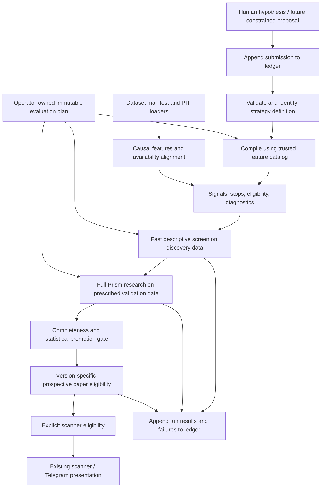

# Strategy Lab: repository audit and incremental design

Inspection date: 2026-10-03. This is a design grounded in the existing implementation,
including the local database and generated reports. Only the representation foundation
(section 6), research governance ledger (section 7), daily feature compiler (section 8),
fast screen (section 9), preregistered search batches (section 10), structured
strategy families (section 11), evidence profiles (section 12) and prospective forward
tracking (section 13) are implemented. No production strategies, evaluation rules, paper
records, scanners or Telegram paths were changed; the only schema changes are the additive
Lab migrations described in sections 7, 10, 12 and 13.

## 1. Current architecture

| Area | Existing implementation | Reuse |
|---|---|---|
| Spot strategy interface | `setups/base.py`: `Setup`, `SetupContext`, `SetupOutput(signal, stop, eligible, diagnostics)`, registry, `edge_trigger`, `conditions_mask`, `ConditionsSetup` | Preserve the eligibility/diagnostic contract and causal trigger helper. Adapt to this interface rather than replace it. |
| Spot strategies | `quality_pullback.py`, `breakout_retest.py`, `rerating.py`; defaults in `config/setups/`; experiment overrides in `config/experiments/` | Keep existing implementations and defaults. Breakout/retest is a state machine; the small conjunction DSL cannot faithfully replace it. |
| Spot experiments | `research/runner.py`: `Experiment`, `ResearchContext`, `evaluate_universe`, `run_experiment`, `save_report`; `research/run_all.py` | Reuse loaders, feature cache, PIT fundamentals/regimes, reporting and research orchestration. |
| Perp strategies | `perps/strategies.py`: `PerpStrategy`, `Signals`, `STRATEGIES`; each declares hypothesis, defaults, primary horizon, sensitivity and walk-forward choices | Retain registered Python strategies; eventually allow an explicitly supplied compiled candidate alongside them. |
| Price features | `features.py`: command-scoped `FeatureStore`; `indicators/technical.py`: causal SMA/EMA, Wilder RSI/ATR, ROC, ranges, volatility, relative volume | Reuse individual indicator functions. The full feature frame assumes daily calendar horizons and annualisation. |
| Event studies | `backtest/events.py`: `forward_returns`, `AssetEvents`, `run_event_study`, `baseline_bars`, `decluster`, random-entry test | Shared statistical core for both markets; reuse forward-return calculations for screening. |
| Perp returns | `perps/backtest.py`: `daily_funding`, `perp_frame`, `side_forward_returns`, `perp_asset_events` | Reuse daily, side-specific returns with funding and costs. |
| Robustness | `backtest/robustness.py`: `walk_forward`, `window_excess`, `sensitivity_grid`, `plateau_verdict`, `split_by_label`; shared `automatic_verdict` in `research/runner.py` | Stage 2 foundation. Preserve defaults, grids, seed and verdict implementation; add explicit completeness checks for Lab promotions. |
| Simulation | `backtest/engine.py` for spot; `perps/backtest.py` for perps; shared `backtest/metrics.py` | Preserve separate engines and market-specific execution assumptions. No new simulator is needed for daily candidates. |
| Persistence | `data/store.py`: DuckDB migrations, ingestion/run provenance, raw archives, scans, positions/journal, `research_runs`, perp tables | Extend using additive migrations and a single writer. Keep existing reports and identifiers. |
| Scanner and presentation | `scoring/engine.py`, `presenter.py`, `brief.py`, `dashboard/views/perps.py` | Later integration needs explicit versioned promotion records, not discovery of every Lab definition. |

Paths above are relative to `src/market_signal/` unless prefixed with `config/` or
`dashboard/`.

### Strategies, research and execution

Spot has three maintained strategies: Quality Pullback (trend plus pullback/momentum),
Breakout + Retest (a sequential breakout/retest state machine), and Fundamental Re-rating
(PIT equities; crypto current-only). The additional conditions DSL already supports named
boolean predicates and numeric `min/max/gt/lt` bounds. `control_trend_only` is an existing
economic control. Composite scanner scores are not themselves the backtested strategies.

Perps has `trend_ls`, `funding_fade`, and `breakout_ls`, each producing both long and short
signals and stops. `funding_fade` ranks trailing average daily funding against the coin's
history. No existing perp strategy uses OI. Perp `Signals` currently has no eligibility
mask, unlike spot `SetupOutput`.

Spot event returns enter at the next open and exit at the horizon close, on total-return
prices, net of configured fee/slippage assumptions. Signal features use split-adjusted
prices. Event baselines use each asset's eligible bars; independent events are spaced by
the horizon. Perp studies reuse this machinery with separate `coin:long`/`coin:short`
series and same-side baselines. Returns are on notional, without leverage, subtracting
signed funding weighted by price. Windows spanning missing funding are excluded.

Walk-forward uses anchored training, window-local baselines, training purges, at most two
varying parameters, and reports default-parameter OOS outcomes as well as the selected
parameters. Sensitivity uses up to two axes and assesses a plateau around defaults.
The spot runner also reports regime, benchmark-trend, volatility, rate-cycle and class
splits. The perp runner reports side and coin/side breakdowns but does not yet attach the
spot runner's regime/trend/rate splits.

Both simulators schedule entries for the next open, skip entries gapping through their
stop, use conservative adverse-first intrabar rules, and fill close-decided time exits at
the next open. Spot sizes by stop risk or a fixed investment allocation, with cash and
gross-exposure limits. Perps uses isolated margin, risk-sized notional, bounded leverage
derived from stop/liquidation distance, fees on fills, extra stop slippage, funding erosion
and conservative liquidation loss. These are distinct from event-study holding returns.
Perp missing funding during a position is carried from the last known rate (zero if none),
and imputed days are counted. Neither simulator models an exchange order book.

Current configured spot per-side fee + slippage is 10 + 10 bps for crypto (HYPE 10 + 20),
5 + 5 for equities/commodities, and 5 + 3 for ETFs. Perp taker fee assumptions are 4.5 bps
on Hyperliquid and 5 on Binance, plus coin-specific slippage and 10 bps extra stop
slippage. Perp risk defaults include 0.5% account risk, 3x leverage cap, 50% equity per
position's notional and 2x total gross notional. These are repository configuration values,
not a verification of current exchange fee schedules.

### Data and point-in-time handling

Spot bars are keyed by asset, timeframe, provider and open timestamp. The update path
validates OHLC, timestamps and duplicates, stores only closed bars, logs gaps/revisions,
and archives raw payloads with SHA-256 and ingestion metadata. Provider series are explicit.
Raw bars and corporate actions generate split/total-return views on read.

Configured crypto spot data uses Coinbase (4h aggregated from complete 1h buckets) and
Hyperliquid for HYPE; equities/ETFs/commodity proxies use Tiingo. Bitstamp, Stooq and CSV
paths also exist. Daily and 4h spot series are configured; `Timeframe.H1` and provider
capabilities exist, but the inspected database has no stored 1h series. Weekly bars are
derived on read. Macro uses FRED/ALFRED vintages and EIA release rules; equity fundamentals
use EDGAR filing availability. `data/pit.py` rejects reconstructed data for historical
research. Crypto fundamentals accumulate prospective snapshots as well as separately
labelled reconstructed history.

Perp `perp_bars`, `perp_funding` and `perp_snapshots` are separate from spot. Hyperliquid
and Binance ingestion/loaders currently hard-code **daily** perp candles. Funding history
has settlement timestamps and `available_at`; Hyperliquid snapshots contain mark/oracle
prices, premium, current funding, OI in coins, OI notional and max leverage. The funding
history and current predicted funding snapshot are different datasets. Binance currently
has candle/funding ingestion, not an OI feed. No liquidation tape, CVD or trade/order-flow
history is ingested.

Point-in-time primitives already exist: explicit `close_time`, backward regime/label
joins, vintage-aware macro lookup, closed-bar filtering, and complete-bucket aggregation.
They are useful building blocks, not a complete multi-timeframe feature service.

### Paper, scanner, Telegram and CLI

`portfolio/book.py` records manually entered paper/real positions and journal entries;
it does not submit orders. Separately, `perps/paper.py` records strategy checks during
`market update`, only for the newest closed bar within 36 hours. Checks are write-once,
missed days are not backfilled, and evaluation uses only live-checked bars as the baseline.
This is forward signal tracking, not an automated paper fill engine. Spot
`research/track_record.py` scores persisted ACTIONABLE/WAIT episodes.

The scanner evaluates the three spot setups, then combines technicals, fundamentals,
regime, entry zones and risk sizing. It persists assessments. `presenter.py` separates
research evidence from scores and caps rejected setups at WATCH for displayed decisions.
Evidence currently loads the latest saved run by **name**. Perp dashboard signals are
labelled candidates for PROMISING or WEAK_POSITIVE verdicts; all preregistered perp
strategies are paper-checked regardless of verdict. The daily Telegram brief renders the
stored spot scan, freshness and undelivered alerts through `portfolio/telegram.py` when
`market brief --send` is explicitly invoked. It does not currently run a general perp Lab
scanner. No Telegram messages were sent during this task.

Relevant commands:

- Data: `update`, `doctor`, `import-csv`, `assets`, `demo-data`.
- Spot research: `experiments`, `backtest [experiment-or-path]`, `research [--only …]`.
- Perps: `perps`, `perp-strategies`, `perp-research [name] [--venue binance]`, `perp-paper`.
- Scanner/output: `scan`, `asset`, `regime`, `hype`, `brief`, `track`, `telegram-setup`.
- Manual book: `open`, `close`, `portfolio`, `journal`, `alerts`, `alert-add`.

### Existing evidence inspected

README, RESULTS.md and parts of ROADMAP/PLAN still describe real research as pending.
The local artifacts and read-only database inspection show it has run:

- Six spot experiment reports dated September 25: saved `breakout_retest` is PROMISING;
  the other five are REJECT. Its saved positive excess differs substantially by asset
  class; it should not be read as proof across all classes.
- Latest October 3 reports for all three perp strategies are REJECT on both Hyperliquid
  and the earlier Binance windows. An earlier Binance `trend_ls` report is also retained.
- There are 13 saved `research_runs` rows. Inspecting these did not rerun the research or
  independently recertify the saved verdicts.
- Perp bars: 11,755 Hyperliquid and 11,923 Binance rows, all daily. Funding rows: 147,416
  and 35,845 respectively. Price history and usable funding history have different starts.
- OI: **18 Hyperliquid snapshot rows, all October 3**. This cannot support historical
  24-hour OI changes yet. A same-day sample must not be represented as a historical OI feed.

Generated reports live under ignored `results/` and include Markdown, summary JSON,
events, trades and equity CSVs. References: `results/RESULTS_generated.md`,
`results/perps/<strategy>/<run>/report.md`, `docs/BACKTESTING.md`,
`docs/PERPS_BACKTEST.md`, `docs/SETUPS.md`, `docs/DATA_SOURCES.md` and `PLAN.md`.

## 2. Gaps and compatibility constraints

| Requirement | Already present | Remaining work |
|---|---|---|
| Standard strategies | Spot protocol/DSL, perp callable strategies, YAML experiments | Typed, versioned Lab definitions; compiler/adapters without forcing state machines into conjunctions |
| Feature vocabulary | Price/volume indicators; daily funding and rolling funding percentile | Parameterised feature catalog with units, warmup, market, timeframe, availability and implementation versions; volume z-score/change, relative strength and OI research features |
| Many assets/timeframes | Multi-asset daily research, spot 4h/weekly display | Explicit dataset selection and general closed-bar MTF alignment; perp 1h/4h ingestion and execution validation |
| Cheap screening | Vectorised forward-return functions, baselines, basic summary metrics | Cached returns/features, batched descriptive summaries, fixed selection policy, resource limits; no simulations/WF/bootstrap per candidate |
| Full validation | `run_perp_research`, spot runner, shared robustness/verdicts | Explicit candidate injection, eligibility masks, immutable evaluation plans, provenance, perp regime splits, validation completeness |
| Permanent ledger | Successful report saves append `research_runs`, including negative verdicts | Record submissions and attempts before work, errors/cancellations/zero events, canonical identity, lineage, dataset snapshots and methodology versions |
| Multiple testing | Roadmap calls for block bootstrap and Benjamini–Hochberg across `research_runs` | Neither implemented; define trial families and holdouts before large-scale screening |
| Promotion | Current name-based evidence, live checks, manual positions | Version-specific research → paper → scanner eligibility, matched dataset/policy evidence and independent promotion records |

Details that constrain reuse:

1. **Feature meanings differ.** Spot ATR is Wilder-smoothed with a particular seed;
   perp `_atr` is a rolling simple mean including its first true range. Percentile
   conventions also differ: technical `rolling_percentile` and funding `rolling.rank`
   have different tie rules. A shared feature catalog must name/version both meanings.
   `compute_features` uses daily class horizons even when called on 4h data; do not call
   a 30-bar intraday ROC “one month” or apply daily volatility annualisation to 1h data.
2. **Eligibility is incomplete for new perp candidates.** Current research defaults to
   funding-defined bars rather than each strategy's full feature warmup. The adapter
   must supply explicit per-side eligibility to `perp_asset_events`; this changes the
   baseline for new Lab runs and needs a recorded methodology version. Regime filters
   and matched baselines also need an explicit policy: spot currently filters signals
   by regime but retains a broader eligible baseline. The trend-only control is a
   separate experiment; `automatic_verdict` does not automatically test a pullback
   candidate against that control, despite the economic comparison described in RESULTS.md.
3. **Existing verdicts are not a promotion state machine.** `automatic_verdict` skips
   checks for missing WF/sensitivity objects and can return PROMISING with a plateau
   even if WF is absent. `--no-wf`/`--no-sens` are valid existing research options, not
   evidence of complete Lab validation. A separate Lab completeness gate must require
   the prescribed checks before promotion. Preserve historical verdicts as issued.
4. **Statistical assumptions need explicit review at scale.** Random-entry draws match
   the number of declustered observed events, but do not enforce horizon spacing within
   each random draw. Coin/side independence also does not remove correlations between
   coins. Walk-forward purges training with a calendar-time approximation; test windows
   are selected by signal time and can have outcomes beyond a fold boundary. Arbitrary
   gaps/intraday horizons need outcome timestamps and explicit outcome boundaries.
   `run_event_study(n_boot=0)` currently yields a primary p-value of 1 when events exist;
   it is not an appropriate “screen only” public result without changing its contract.
5. **Funding is a daily approximation.** `daily_funding` infers cadence from the median
   spacing of the entire supplied history, rounds settlements to the nearest minute,
   and scales sufficiently covered partial days. Appending a different funding cadence
   could change earlier coverage calculations. Daily funding must not be broadcast into
   earlier intraday decisions; settlement availability and changing schedules need
   focused tests and a versioned policy before intraday or strict PIT Lab evaluation.
6. **Historical margin inputs are not fully PIT.** `load_perp_input` uses the latest
   Hyperliquid max-leverage snapshot (or config default) for the whole simulation. Label
   this as an assumption, or introduce as-of margin tables under a new methodology.
7. **Simulation timing deserves a separate audit before generalisation.** Both engines
   iterate by bar close, processing a whole symbol's bar before another symbol's bar at
   that timestamp. Their shared-equity sizing can therefore depend on another symbol's
   later-in-bar result when filling an earlier open. Test global open/close ordering
   before claiming an intraday or cross-calendar portfolio implementation. No execution
   changes are made here.
8. **Provenance and versioning are partial.** Spot fingerprints cover raw bar series,
   not every corporate-action/macro/fundamental dependency. Perp reports record counts,
   ranges and coverage but no full data content hash. Config hashes/commits omit some
   resolved strategy defaults, feature semantics, dirty code and dependencies.
   Perp upserts overwrite revisions. Paper hashes include name/defaults, not signal
   implementation; paper primary keys omit the hash. Latest evidence is selected by
   name rather than exact strategy version. Timestamp-to-the-second report directories
   can collide. These patterns are insufficient for a permanent high-volume ledger.
9. **Source isolation must be explicit in the Lab.** Default perp loaders can fall back
   to synthetic data; `load_snapshots` includes real and synthetic sources together for
   Hyperliquid. Lab manifests must pin exact sources and forbid silent fallback/mixing.

These are inspection findings and design constraints, not fixes hidden inside this first
step. Existing regression tests pass; they do not prove these additional properties.

## 3. Proposed architecture and control boundaries



Keep three separate objects:

- **Hypothesis/definition:** economic explanation, source, declared ancestry and immutable
  rule. Single directional candidates simplify side-specific baselines. A future composite
  can refer to long/short child IDs; existing two-sided Python strategies remain supported.
- **Evaluation plan:** operator-owned universe, exact venues/price bases, discovery and
  validation windows, warmup, horizons, costs, execution model, null model, seeds, grids,
  thresholds and required checks. Snapshot before evaluation. The hypothesis cannot
  override it. Regenerating a plan after seeing outcomes is another recorded research
  decision, not a silent retry. A future AI process gets submission access only, not
  writable source/config, result rows, database credentials or evaluation settings.
- **Run:** definition ID + plan ID + dataset manifest ID + feature/compiler/code version +
  attempt ID, status history, results and artifacts. Same strategy on another asset,
  timeframe/period or venue is traceable without pretending to be independent evidence.

### Feature and MTF contract

Feature calculation should be pure and cached by exact dataset, asset, market, venue,
price basis, native timeframe, feature version and parameters. Reuse existing individual
indicators and complete-bar aggregation. Calculate only requested dependencies; keep
forward outcomes in a separate cache that signal evaluation cannot read.

Every feature output needs its value, native bar identity, `available_at`, validity and
coverage/staleness metadata. At trigger close T, select only the latest completed source
bar available at or before T with a backward as-of join. A daily bar opened at midnight
is unavailable until its following midnight close; it cannot inform that day's 1h bars.
Equal close timestamps may be used only under a documented availability/latency policy.
Normalise UTC and timestamp resolution; require sorted, unique series. Snapshot data is
available at capture time, not retroactively at the market timestamp it describes.

Missing input makes a condition **undefined** and the decision **ineligible**, not an
ordinary false observation. No backfill. Set maximum source age and completeness rules
in the trusted plan/catalog, rather than filling through long outages. Crossing operators
must eventually require valid consecutive native observations and documented behaviour
on the trigger clock. Warmup is loaded before a window; signal/output eligibility is
masked to the window. Enforce outcome cutoffs separately from signal cutoffs.

Daily price/volume/funding features come first. Add OI only when a manifest establishes
coverage and capture times. Choose explicitly between OI in contracts/coins and USD
notional: price changes alone can move USD OI. Price-up/OI-up and the other three quadrants
must use matched elapsed windows, not an unqualified number of irregular snapshots.
Funding percentile needs explicit average/lookback/minimum history and tie convention.
Basis from snapshots is prospective; liquidation/CVD need new provider datasets.

### Fast screen versus full research

Fast screen reuses `forward_returns` / `side_forward_returns` with cached horizon arrays.
Aggregate finite, eligible events by asset, side, horizon and predeclared time block:
signal/evaluable/completed counts, mean/median return, hit rate, excess versus eligible
same-asset/same-side/window baseline, dispersion and asset/time consistency. A rough
mean/standard-deviation ratio is descriptive; overlapping event returns are not an
annualised portfolio Sharpe. Missing horizons stay missing, with exclusions reported.
Keep costs and daily funding inexpensive and consistent with the selected policy.

Screen outcomes are `REJECT_SCREEN`, `REVIEW_FULL` or `INSUFFICIENT_DATA`, never PROMISING
or live-eligible. No parameter search, bootstrap, WF, sensitivity or portfolio simulation
is implicitly invoked. Screens use designated discovery data only. Full validation must
retain untouched data; running ordinary WF after screening on its test periods does not
restore out-of-sample status.

For Stage 2, inject a compiled candidate into `perps/research.py` explicitly, keeping
`get_strategy(name)` as the default for existing callers. Adapt signals/stops into
`PerpInput` and explicit eligibility into `AssetEvents`. Reuse `_events`, the shared
event study, robustness functions, `simulate_perps`, verdict calculation and report
rendering. For spot, adapt to `Setup`/`SetupOutput` and allow explicit setup injection in
the runner rather than mutating the production registry. Existing stateful strategies
can use implementation-reference adapters with code/config hashes; they need not be
translated into a lossy DSL.

Extend completeness/provenance and missing splits in small follow-ups. Lab reports get
their own namespace and link back to existing `research_runs`; the legacy latest-by-name
evidence reader must never interpret a screen as validation. Daily engine reuse does not
establish intraday execution correctness.

### Permanent ledger and multiple testing

Use additive tables in the existing DuckDB, written through a Lab-only service. Do not
create another result database or overwrite old `research_runs`. Suggested tables (the
schema actually implemented in Step 2 is described in section 7):

| Table | Immutable record |
|---|---|
| `lab_submissions` | Receipt ID/time, raw proposal, source, authored timestamp, hypothesis text, validation outcome/error, canonical ID when valid; includes invalid submissions |
| `lab_definitions` | Full canonical definition, schema/catalog version, content ID; duplicate submissions link here, not to a fresh strategy |
| `lab_lineage` | Parent/child IDs, declared family and revision reason; ancestry never deletes a failed parent |
| `lab_plans` / `lab_datasets` | Resolved methodology JSON/hash and exact data manifest/hash; venue, assets, timeframes, periods, coverage, input versions |
| `lab_runs` | Attempt ID, stage, strategy/plan/data/code IDs, start time and old research-run link if applicable |
| `lab_run_events` | Append-only lifecycle/results/errors/cancellation records, artifact paths and checksums; current status is a projection |
| `lab_promotions` | Version-specific paper/scanner eligibility, supporting run IDs, reason and later revocation |

Commit a submission/run before invoking evaluation. Record failed, cancelled, timed-out,
zero-event and unavailable-data attempts. A crash leaves an observable unfinished run;
recovery appends an interruption record. Never auto-replace earlier results. Use run IDs
in directories (`results/lab/<strategy_id>/<run_id>/`), atomically publish artifacts and
check their hashes. Store resolved plans and canonical rules with reports. A hash verifies
an input but cannot reconstruct overwritten history: retain exact local input snapshots
or reconstructible revision sets, with backups of the DB and artifacts. Keep provider
data local. Application-level append-only access is not tamper-proof storage against a
database owner.

Content identity detects renames and condition reordering. It cannot prove general
logical/economic equivalence or catch every near-duplicate parameter tweak. Preserve all
submissions, parameter variants, family/parent links and similarity diagnostics. Explicitly
register the testing family and all planned endpoints before evaluation. Identical reruns
are reproducibility checks, not new independent discoveries; changing data, horizon,
methodology or inspected results is visible in the trial history.

`docs/ROADMAP.md` already proposes block bootstrap and Benjamini–Hochberg. Add a batch
manifest listing all candidates tested, including screen failures, with raw p-values and
adjusted q-values where valid. Do not run BH only over survivors evaluated on the same
data that selected them. A defensible initial design screens on discovery data and runs
preregistered family tests on an untouched validation window. Define how asset/side/horizon
claims and revisions count, and address correlated strategies/assets and repeated batches
before asserting FDR control. Ledger visibility alone and a per-run p < 0.05 threshold do
not control data mining; BH does not repair invalid or adaptively selected p-values.

## 4. Phases and review boundaries

| Phase | Files/modules | Reviewable completion criterion |
|---|---|---|
| 1 — Representation (implemented) | New `research/lab/spec.py`, `config/lab/examples/`, `tests/test_lab_spec.py`, this report | Strict data-only documents, explicit timeframes/ATR meaning, stable identity, no production imports or evaluation |
| 2 — Ledger and locked plans (implemented, section 7) | Add `research/lab/ledger.py`, `policy.py`, `datasets.py`; additive migrations in `data/store.py`; Lab-only `cli/lab_cmds.py` | Every attempted submission/run is durably recorded before work; duplicate/lineage/crash tests; plan/data/code hashes; exact inputs retained. No mass screening yet |
| 3 — Daily compiler/features (implemented, section 8) | Added `research/lab/vocabulary.py`, `features.py`, `compiler.py`; reuse `indicators/technical.py`, `data/prices.py`, perp helpers. `alignment.py`/`adapters.py` deferred: daily-only needs no MTF alignment, and adapters belong with Phase 5 injection | Small daily vocabulary compiles to signals/stops/eligibility; synthetic hand-calculation, missing-data, truncation/future-shock and legacy parity tests; no registry mutation |
| 4 — Fast screen (implemented, section 9) | Added `research/lab/screen.py`, plan schema v2 in `policy.py`; Lab CLI `preregister`, `screen`. `report.py`/`compare`/`history` deferred: results are inspected through `market lab experiment` | Bounded deterministic batches on discovery data; cached returns; all failures persisted; asset/time/side summaries; measured runtime/memory; cannot invoke full research or promote |
| 5a — Search batches and FDR (implemented, section 10) | Added `research/lab/batch.py`, migration 8, `market lab batch create/run/show`, `market lab batches` | Frozen testing families, BH over one primary test per strategy, family-aware statuses, holdout refusal, immutable analyses |
| 6 — Structured strategy families (implemented, section 11) | Added `research/lab/families.py`, `config/lab/families/*.yaml`, `market lab families`, `family show`, `batch generate` | Versioned economic families with bounded grids generate deterministic Phase 1 variants and Phase 5 manifests without running them |
| 7 — Evidence profiles (implemented, section 12) | Added `research/lab/evidence.py`, migration 9, `market lab evidence build/report/show` | Consumer-neutral, versioned, append-only profiles with stage provenance; VALIDATED reserved |
| 5b — Full-research adapters and statistical gate | Extend spot/perp runners for explicit candidate injection; add `research/lab/validation.py`, `multiple_testing.py`; reuse reports/robustness/simulators | Existing strategies retain parity; trusted plan requires completed checks; address audit items with separate versioned methodology patches; holdout/family controls before large-scale claims; link old reports |
| 6 — Perp MTF and OI | Extend `perps/data.py`, `perps/binance.py`, provider loaders and dataset manifests; extend Lab features/alignment and research policy | Stored 1h/4h data with completeness/availability; settlement-level funding treatment; same-close/gap/stale/snapshot tests; portfolio timing validated before intraday execution claims |
| 8 — Prospective forward tracking (implemented, section 13) | Added `research/lab/forward.py`, migration 11, profile schema 3, `market lab forward …` | Explicit enrollment freezing the evidence profile; live-only daily evaluations (no backfill); write-once T+1-open/T+h-close outcomes; descriptive `paper_forward` profiles; no execution |
| 7 — Paper and scanner eligibility | Add `research/lab/promotion.py`; additive versioned paper storage and opt-in adapters in `perps/paper.py`, `scoring/engine.py`, presenter/brief/CLI | Exact strategy + implementation + policy versions carry evidence; paper starts prospectively, no backfill; explicit scanner allowlist; existing strategies unchanged |
| Later — Constrained hypothesis generation | Submission client only, reading the versioned catalog and writing proposals through ledger service | No AI dependency until separately requested; model cannot edit evaluator, plans, tests, data/results or promotion policy |

The MTF contract is specified now and encoded in references. Enabling additional data and
execution clocks is a later capability, not an implicit consequence of accepting an MTF
document. Ledger and discovery/validation boundaries must precede bulk evaluation.

## 5. Risks and decisions still required

- **Leakage/alignment:** close time versus bar open, publication/capture latency, incomplete
  higher bars, stale as-of matches, irregular OI samples, funding schedule changes, weekly
  completeness, adjusted prices and portfolio event order. The existing `weekly_from_daily`
  docstring mentions `weekly_asof`, but no such helper is implemented. Add boundary tests
  before a general MTF research path uses weekly data.
- **Parameter/data snooping:** specify untouched periods, hypothesis families, primary
  endpoints, revision policy and promotion thresholds before looking at new screen output.
  Earlier Binance windows already used by existing research are not fresh holdouts for
  hypotheses derived from those results. Today's universe remains selection-biased.
- **Versioning:** separate authored label, behaviour ID, code/catalog version, evaluation
  plan and attempt. A changed feature implementation cannot inherit an old strategy's
  paper evidence. Historical result imports must be labelled retrospective, with missing
  provenance explicit; do not invent preregistration timestamps.
- **Reproducibility:** snapshot all inputs, not just bar counts; record Python/dependency
  lock, git revision plus dirty patch/hash, seeds, exact venue/basis and compiler versions.
  Canonical definitions alone cannot reproduce a backtest.
- **Cost:** avoid recomputing full indicator frames, horizon outcomes and event DataFrames
  for every candidate/grid point. Bound features, candidates, retained detail and memory;
  share immutable arrays; use one DuckDB writer. Benchmark before adding process workers.
- **Compatibility:** maintain callable/stateful strategies and separate spot/perp engines.
  Schema v1's conjunctions intentionally cannot express every legacy setup. Any parity
  failure should produce an explicit new version, not a silent replacement.
- **Policy choices:** baseline conditioning, OI units/sampling/staleness, simultaneous
  conflicting directions, allowed timeframe/venue combinations and exact paper/live gates
  need operator-owned definitions. This task chooses no new return or significance hurdle.

## 6. Step 1 implemented

`research/lab/spec.py` adds immutable Pydantic models using Prism's existing dependency
and `Timeframe` enum: `FeatureRef`, `Condition`, `ExitIntent`, `StrategyDefinition`, and
`Hypothesis`, plus `load_hypothesis(Path)`. No existing module imports the Lab.

The minimal vocabulary is grounded in existing functions:

| Reference | Defined meaning for a future compiler |
|---|---|
| `close` | Native closed bar's close; declared market/source and price basis from the plan |
| `sma_20`, `sma_50`, `sma_200` | `technical.sma`, periods in native bars, full warmup |
| `ema_21` | `technical.ema`, recursive `adjust=False` semantics and warmup |
| `rsi_14` | `technical.rsi`, existing Wilder seeding |
| `rel_volume` | Volume divided by full 20-native-bar volume mean |
| `roc_1m` | Existing daily class-based month ROC, 30 crypto / 21 NYSE bars; daily only |
| `funding_day` | Existing daily funding aggregation semantics; perp/daily only, subject to the audit above |
| Exit `wilder_14` / `perp_sma_14` | Explicit distinction between `technical.atr` and perp `_atr`; sampled on trigger bars |

One definition is one market/side, a trigger timeframe, one to four conjunctive
comparisons (`gt/ge/lt/le`) against a finite number or another feature, a bounded cooldown
and exit intent. Dependencies must be at least as slow as the trigger. Spot shorts and
spot funding are rejected. Future evaluation will apply existing `edge_trigger` semantics
to the valid conjunction (first rising edge, then silence for the cooldown); unsupported
data/timeframes must fail at compilation, not fall back. This module does not evaluate
that contract yet.

Stop distance is positive and at most 10 ATR; optional target at most 20 R; holding/cooldown
counts are bounded at 10,000 native bars. These are representation limits, not optimized
values or research pass thresholds. Candidate definitions cannot specify fills, sizing,
costs, evaluation thresholds, test periods or results. Unknown fields are rejected at every
level; numeric strings, booleans in numeric parameters and nonfinite thresholds are rejected.
YAML uses a safe loader and rejects duplicate/merge keys. The JSON schema is available
through `Hypothesis.model_json_schema()` for a later constrained proposal client.

Full SHA-256 identity hashes the canonical behaviour, including schema version, resolved
defaults, feature references, thresholds and exits. Condition order and numeric spelling
do not change it; name, explanation, source, authored timestamp and ancestry are metadata.
Changing a rule/timeframe/side/exit produces a different ID. The timestamp must be aware;
parent IDs are validated structurally and cannot point to the same definition. Existence
and family/near-duplicate checks remain ledger responsibilities. This is **not** the
permanent ledger, and no proposal has been screened or promoted by this change.

Example: `config/lab/examples/daily_trend.yaml` is outside `config/experiments/`, so
`market research` will not automatically discover or run it. Load it locally with:

```python
from pathlib import Path
from market_signal.research.lab.spec import load_hypothesis

h = load_hypothesis(Path("config/lab/examples/daily_trend.yaml"))
print(h.strategy_id)
print(h.definition.canonical_json())
```

Not implemented in Step 1: feature evaluation, signals, screen runner, storage migrations, new CLI
commands, AI integration, or paper/live promotion. This is a small foundation for the
ledger/compiler phases, not a second backtesting engine.

## 7. Step 2 implemented: research governance

Modules: `research/lab/common.py` (canonical JSON, strict types), `policy.py` (evaluation
plans), `datasets.py` (snapshots/fingerprints), `provenance.py` (software identity),
`ledger.py` (append-only API), migration 7 in `data/store.py`, read-only `cli/lab_cmds.py`.
No existing module imports the Lab, and nothing here evaluates a strategy.

### Workflow

```python
ledger = Ledger(store)                                   # requires migration 7
receipt = ledger.submit(raw_json, family_id="trend_family", origin="manual")
plan_id = ledger.register_plan(plan)                     # EvaluationPlan, frozen name+version
dataset_id = ledger.register_dataset(capture_dataset(store, selections))
software = capture_software(Path("."))
exp = ledger.preregister(receipt.submission_id, plan_id, dataset_id, role="discovery",
                         assets=("BTC",), software=software, origin="manual",
                         batch_id="trend_batch_1")       # committed before evaluation
ledger.start(exp.experiment_id, software=software)       # records data exposure
# ... evaluation happens elsewhere (not implemented in the Lab yet) ...
ledger.record_result(exp.experiment_id, status="rejected", verdict="NO_EDGE",
                     metrics={...}, p_values=(PValue(...),))
```

Every mutation runs in its own transaction and commits before returning; do not wrap Lab
calls in an outer transaction (DuckDB will refuse the nested `BEGIN`).

### Identities and rerun semantics

| ID | Derivation |
|---|---|
| `strategy_…` | SHA-256 of canonical rule behaviour (Step 1) |
| `hypothesis_…` | SHA-256 of the authored document (name, text, source, authored time, sorted parents, canonical definition) |
| `plan_…` | SHA-256 of the canonical plan; list order and timestamp offsets do not change it |
| `dataset_…` | SHA-256 of the manifest (selections, per-series hashes, row counts, schema, observed bounds, ingestion run IDs) |
| `software_…` | SHA-256 of Python version, git commit, working-tree `src/**/*.py` + `pyproject.toml` hash, `uv.lock` hash, key package versions |
| `logical_…` | SHA-256 of strategy ID, plan ID, dataset ID, role, sorted assets, timeframes and stage |
| `experiment_…`, `submission_…`, `result_…`, `inspection_…` | Random UUIDs: each is a distinct immutable event |

A **logical experiment** is "this strategy, under this plan, on this exact dataset/role/
universe". An **attempt** (`experiment_id`, numbered `attempt` 1, 2, …) is one concrete
preregistered execution. Preregistering an existing logical experiment raises
`DuplicateExperiment` naming the prior attempt unless `rerun_of` (an attempt of the same
logical experiment) and `rerun_reason` are both given. Renaming a hypothesis, changing the
batch, or editing code does not escape this check: the hypothesis ID and software ID are
recorded on the attempt but are deliberately not part of the logical identity, so a rerun
under new code is an explicit, linked reproduction rather than a fresh discovery. `start`
refuses software that differs from the attempt's preregistration. Changing the data
(including a provider revision or re-ingestion), plan version, role, universe or rule is a
new logical experiment.

### Evaluation plans

`EvaluationPlan` is a narrow, versioned contract for a DAILY event study only: exact stored
source (no provider fallback), up to four non-overlapping dataset-role periods
(`discovery`, `development`, `validation`, `final_holdout`), per-asset fee/slippage, named
horizons and a primary horizon, a market-matched return model, next-open entry, the
current Prism funding approximation (pinned with its known full-history cadence
limitation), the existing independent-event/random-entry statistics, and
`multiple_testing="uncorrected"`, `promotion="disabled"`. Unknown fields at any level and
values other than these literals are rejected; walk-forward, sensitivity, portfolio,
thresholds and BH are not accepted. A `name`+`version` is frozen on first registration;
different content needs a new version. Plans hold no strategy rules and strategy documents
reject evaluation fields.

### Dataset snapshots and fingerprint strength

`capture_dataset` reads explicit `SeriesSelection`s (kind, symbol, exact source,
timeframe, `[start, end)`) in one transaction. The selected rows, **including provenance
columns** (`ingest_run_id`, `ingested_at`, funding `available_at`/`pit_method`), are
serialised canonically (floats losslessly as hex, NULL distinct from NaN), hashed with
SHA-256, gzip-compressed and stored content-addressed in `lab_snapshot_blobs`. Retained
rows can be decoded with `Ledger.read_dataset` after the market tables change; decoding
verifies hash, header and row count. Snapshots are bounded (250k rows / 64 MiB by
default) and fail rather than truncate. Empty selections are recorded as strong empty
snapshots.

Strengths are explicit: `content_sha256` (rows retained and hashed), `metadata_only` and
`unavailable` (must carry a `limitation` and cannot claim a hash). Weak manifests can be
catalogued but cannot be preregistered under the v1 plan. A hash describes the stored
snapshot only, not provider correctness, completeness or point-in-time validity.
Preregistration requires the dataset to contain exactly bars + actions (spot) or bars +
funding (perp) for each selected asset, at the plan's source/timeframe and the exact
window of the chosen role, and every selected asset to have a frozen cost assumption.

### Schema (migration 7, additive)

| Table | Contents |
|---|---|
| `lab_strategies` | Canonical definition, fixed `family_id` and sorted parent IDs (parents must exist in the same family) |
| `lab_hypotheses` | Authored document per hypothesis ID → strategy |
| `lab_submissions` | Every raw submission with receipt time/origin/family; either a hypothesis ID or the validation/lineage error |
| `lab_plans` | Canonical plan JSON; `UNIQUE(name, version)` |
| `lab_datasets`, `lab_dataset_blobs`, `lab_snapshot_blobs` | Manifests, manifest→snapshot links, compressed snapshots by SHA-256 |
| `lab_software` | Software identity payloads |
| `lab_experiments` | Attempts: logical ID, attempt number, strategy/hypothesis/submission/plan/dataset/software IDs, family, batch, role and period, stage, assets, timeframes, origin, time, `rerun_of`/`rerun_reason` |
| `lab_starts` | At most one start per attempt |
| `lab_results` | At most one terminal result per **started** attempt (FK to `lab_starts`): `succeeded`, `rejected`, `insufficient_data`, `failed`, `errored`, `cancelled`; verdict, metrics, uncorrected p-values by test/endpoint, error |
| `lab_inspections` | Exposure log: automatic `evaluation_started` and manual `manual_inspection` records |

Primary/unique/foreign keys and CHECK constraints enforce existence, one start and one
result per attempt even for direct SQL inserts. The API offers no update or delete;
failures, errors and rejections are retained exactly like successes, and status is a
projection (`preregistered` → `started` → terminal). Append-only is an application
guarantee, not tamper-proofing against the database owner. Read-only `Store`s do not
migrate; the Lab reports "tables are absent" until the DB has been opened writable once.

### Holdouts and multiple testing (recorded, not enforced)

`Ledger.exposures(start, end, family_id=…, strategy_id=…)` returns every recorded start or
manual inspection whose role window overlaps an interval, across dataset revisions. An
empty answer means no *recorded* exposure, never proof that a holdout is untouched (direct
market-table access is not observable). Family, lineage, batch, role and per-endpoint raw
p-values are stored so that a later phase can define testing families and apply BH; no
correction or holdout enforcement is implemented.

### CLI (read-only)

`market lab strategies | experiments | experiment <id> | plan <id> | dataset <id>` print
canonical JSON from a read-only store. `dataset` shows the manifest, never the rows. There
are no write, evaluation or promotion commands; registration is programmatic.

### Known limitations

- No evaluator: results are attached by whatever runs the evaluation; the Lab does not
  verify that metrics came from the registered inputs.
- Only DAILY event-study plans; full research, walk-forward, sensitivity and portfolio
  policies are rejected rather than represented.
- Software identity hashes `src/` Python, `pyproject.toml` and `uv.lock`; it does not
  archive source, cover `config/`, or prove the environment matches the lockfile.
- Spot corporate actions are selected by effective date, not publication availability.
- Snapshot size limits mean wide universes/long histories must be split or the limit raised.
- Audit items listed in section 2 (perp warmup, funding cadence, portfolio ordering,
  incomplete-check verdicts, name-based evidence matching, multiple testing) are unchanged.

## 8. Step 3 implemented: daily feature compiler

Modules: `research/lab/vocabulary.py` (names and parameter schema, no pandas),
`features.py` (pure calculations), `compiler.py` (snapshot → features → masks), read-only
`Ledger.get_strategy` and `market lab compile`. Phase 3 computes signals only; it makes **no
claim of profitability** and runs no statistics, screening, ranking or simulation.

### Feature vocabulary (`lab_features_v1`)

A feature reference is one canonical token, `family_p1[_p2]`: parameters are integers in a
fixed order, inside the name. This keeps the Phase 1 `FeatureRef {name, timeframe}` shape,
so every previously registered strategy ID is unchanged (the pinned ID test still passes),
and gives each logical feature exactly one spelling: no leading zeros, exact parameter
count, bounded values, and an implicit default cannot be spelled out (`rel_volume`, never
`rel_volume_20`). The compiler parses tokens into `FeatureKey(family, params)`; the
canonical token is the identity used in metadata and digests. The nine Phase 1 names keep
their meaning. All windows are in native (daily) bars, inclusive of bar T unless stated.

| Family | Parameters | Value at bar T | Warmup (bars) | Market | Implementation |
|---|---|---|---|---|---|
| `open`, `high`, `low`, `close`, `volume` | — | the closed bar's value | 1 | general | snapshot column |
| `ret_N` | N 1–1000 | close[T] / close[T−N] − 1 | N+1 | general | `technical.roc` |
| `roc_1m` | — (legacy) | `ret` over 30 (crypto) / 21 (NYSE) bars | 31 / 22 | general, daily | `technical.roc` |
| `range_pct` | — | (high − low) / close of bar T | 1 | general | — |
| `sma_N` | N 1–1000 | mean close of T−N+1..T | N | general | `technical.sma` |
| `ema_N` | N 2–1000 | recursive EMA, `adjust=False`, seeded at the first bar | N | general | `technical.ema` |
| `dist_sma_N`, `dist_ema_N` | N | close / MA − 1 | N | general | as above |
| `rsi_N` | N 2–1000 | Wilder RSI | N+1 | general | `technical.rsi` |
| `atr_N` | N 1–1000 | Wilder ATR, seeded from bar 1 | N+1 | general | `technical.atr` |
| `atr_sma_N` | N 1–1000 | simple-mean ATR incl. bar 0's high − low | N | general | `perps.strategies.sma_atr` |
| `atr_pct_N` | N | `atr_N` / close | N+1 | general | `technical.atr` |
| `rvol_N` | N 2–1000 | sample std of the last N log returns, **not annualised** | N+1 | general | `technical.realised_vol(bars_per_year=1)` |
| `donchian_high_N`, `donchian_low_N` | N 1–1000 | max high / min low of **T−N..T−1** | N+1 | general | as in `breakout_ls` |
| `close_high_N`, `close_low_N` | N 1–1000 | max / min close of **T−N..T−1** | N+1 | general | as in `trend_ls` |
| `dist_donchian_high_N`, `dist_donchian_low_N` | N | close / level − 1 | N+1 | general | — |
| `vol_sma_N` | N 1–1000 | mean volume of T−N+1..T | N | general | `technical.sma` |
| `rel_volume` / `rel_volume_N` | N 1–1000, bare = 20 | volume / `vol_sma_N` (window includes T) | N | general | as `technical` `rel_volume` |
| `vol_z_N` | N 2–1000 | (volume − mean) / sample std of **T−N..T−1**; undefined if std is 0 | N+1 | general | — |
| `funding_day` | — | settled funding in (open, open + 1 day], see below | 1 | perp, daily | `perps.backtest.daily_funding` |
| `funding_sum_N`, `funding_mean_N` | N 1–1000 | sum / mean of the last N `funding_day` | N | perp, daily | rolling, full window |
| `funding_pct_A_L` | A 1–365, L 2–2000 | percentile rank (average ties, in (0, 1]) of `funding_mean_A` among its last L values incl. T; full L required | A+L−1 | perp, daily | `perps.strategies.funding_percentile(min_history=L)` |

Deliberately absent: log returns (a monotone transform of `ret_N`, so it adds no
expressible rule), OI (only 18 same-day snapshots exist; no historical series is in any
snapshot), and any annualised measure (annualisation depends on asset class). Comparison
operators are `gt`, `ge`, `lt`, `le`, `crosses_above`, `crosses_below`. Equality is not
supported: exact float equality of continuous features is not a robust rule, and no
existing Prism condition uses it. Percentile and range ideas are features, not operators.
`vocabulary.catalog()` returns the vocabulary as data for a later proposal client.

### Compiler semantics

`compile_strategy(definition, snapshot, symbol, *, asset_class=None)` returns
`CompiledStrategy`; `compile_registered(ledger, strategy_id, dataset_id, symbols=…)` loads
both from the ledger. Every frame is indexed by bar `close_time` (UTC), the decision time.

1. **Inputs.** Only the retained snapshot rows (`Ledger.read_dataset`, which verifies
   hashes) are read; no feature function receives a Store. The definition, trigger and
   every reference must be `1d`, the bar series must be daily, open and close times must be
   strictly increasing and every bar must close after it opens. Missing series (bars,
   funding when a funding feature is used, corporate actions for spot), a foreign venue
   for funding/actions, several series for one symbol, a non-crypto perp or a spot run
   without an explicit asset class raise `CompileError`. Nothing falls back or is filled.
2. **Features.** Required features are the condition references plus the exit-intent ATR
   (`wilder_14` → `atr_14`, `perp_sma_14` → `atr_sma_14`). Each is computed once.
   `feature_valid` = finite value.
3. **Conditions.** A comparison at T is *defined* when both sides are finite at T. A
   crossover is defined when both sides are finite at T **and** T−1 (the previous native
   bar); `crosses_above` is left > right at T and left ≤ right at T−1 (mirrored for
   `crosses_below`). Only T and T−1 are read. `conditions` holds the truth, forced False
   where undefined, and `condition_defined` preserves the distinction.
4. **Warmup and eligibility.** `warmup_bars` = max feature warmup (+1 if any crossover).
   `eligible[T]` = T ≥ `warmup_bars` − 1 **and** every required feature finite at T **and**
   every condition defined at T. NaN or insufficient history therefore makes a bar
   ineligible, never a false observation. Gaps in the middle of a series (e.g. a funding
   day below coverage) are ineligible bars, and rolling windows containing them stay
   undefined until a full window of valid values exists again.
5. **Active state.** `active` = eligible and every condition true.
6. **Signal.** `signal[T]` fires when `active[T]`, bar T−1 was eligible and inactive, and
   more than `cooldown_bars` bars have passed since the last signal. This is
   `setups.base.edge_trigger` semantics (the Phase 1 contract), with one stricter rule: if
   T−1 was ineligible the previous state is unknown, so a condition already true when data
   becomes valid does not fire (including bar 0). With every bar eligible and bar 0 inactive
   the two are identical (tested).
7. **Stop.** `stop` = close ∓ `stop_atr` × exit ATR at T (below the close for longs), the
   level a later engine would use if it acted on that bar's signal, in the frame's basis.

**Signal versus entry.** A signal is a decision at bar T's close. The compiler does not
shift it; existing Prism research enters at the next bar's open (`EvaluationPlan.entry =
"next_bar_open"`), and that shift belongs to the screening/evaluation stage. No fills,
costs, exits or forward returns are computed or reachable here.

### Point-in-time rules

- Every value at T depends only on bars ≤ T. Breakout levels (`donchian_*`, `close_high/
  low`) and the `vol_z` baseline use T−N..T−1, so bar T never sets its own threshold.
  Rolling means, sums, std and percentiles are trailing windows with a full-window minimum.
- **Funding.** `funding_day` reuses `daily_funding` (sum of settlements in (open,
  open + 1 day], minute-snapped timestamps, pro-rata scaling at ≥ 80% coverage, otherwise
  missing) with two Lab differences: the expected settlements per day come from the
  median spacing of settlements in the **trailing 7 days** ending at the bar's end rather
  than the whole history (Prism's estimate lets later observations change earlier coverage;
  a test demonstrates this), and a bar is missing if any summed settlement's minute-snapped
  `available_at` is after the bar's close. On a constant cadence the result is identical to
  `daily_funding` (tested for hourly and 8-hourly funding). NULL rates are not settlements.
- **Spot prices** use **forward** split adjustment: `data.prices.adjustment_factors` /
  `apply_basis` normalised to the first snapshot bar's share terms. Prism's backward
  adjustment rescales bar T by splits after T; the two series differ by one constant, so
  all ratio features (returns, distances, RSI, percentages, relative volume) are identical
  to Prism's, but levels (`close`, MAs, ATR, Donchian, stops) are in first-bar share terms
  and a constant price threshold refers to those units. Dividends are ignored for signals,
  as in Prism; corporate actions are still selected by effective date (Phase 2 limitation).

### Reproducibility and result metadata

Results stay in memory: they are a pure function of (strategy ID, dataset ID, symbol,
asset class, compiler version). `CompileMetadata` records compiler and vocabulary
versions, strategy/dataset IDs, symbol, market, side, source, asset class, price basis,
features with warmups, canonical condition labels, cooldown, exit ATR, warmup bars, row
count, first/last close, largest bar spacing, eligible/active/signal counts, and a SHA-256
`digest` of the index, features and all masks, so a later stage can verify a bit-identical
recomputation. Nothing is persisted and no ledger row is written.

`market lab compile <strategy-id> <dataset-id> [--symbol BTC] [--asset-class equity]`
prints that metadata (never rows) from a read-only store.

### Reuse and refactors

- `technical.sma/ema/rsi/atr/roc/realised_vol` are called directly; parity tests show the
  Lab values are bit-identical to `compute_features` columns (rvol up to the annualisation
  factor, tolerance 1e-12 relative).
- `perps/strategies.py`: private `_atr` renamed to public `sma_atr` (pure rename; both
  internal call sites updated). `funding_percentile` reused as-is.
- `perps/backtest.py`: `daily_funding` gained an optional `per_day` array. Omitted, the
  existing full-history median is used exactly as before, so existing research is unchanged.
- `data/prices.py` adjustment functions reused for spot; `setups.base.edge_trigger`
  semantics reproduced with the missing-state rule above (it has no eligibility input).
- Known definition differences, named rather than merged: Wilder `atr_N` vs perp
  `atr_sma_N`; `rvol_N` unannualised; `rel_volume` includes bar T while `vol_z` excludes
  it; funding cadence as above.

### Spec changes (additive)

`FeatureRef.name` is now validated against the vocabulary instead of a nine-value literal;
`daily_only` and perp-only checks come from the vocabulary; `Condition.op` gained the two
crossover operators; a condition cannot compare a feature with itself. Schema version and
document shape are unchanged, and all previously valid documents keep their IDs.

### Known limitations

- DAILY only. No intraday, multi-timeframe or as-of alignment; MTF documents are still
  accepted by the spec and rejected by the compiler.
- No OI, basis, liquidation or order-flow features: no historical series exists in any
  snapshot. No cross-asset features (relative strength, regime, benchmark trend).
- Windows count native bars; calendar gaps are not filled (NYSE weekends are normal; the
  largest spacing is reported).
- Spot needs an explicit asset class (not part of a dataset); levels are in first-bar
  share terms. EMA/Wilder values depend on the first bar of the snapshot, so snapshots
  starting on different dates give slightly different recursive values (warmup reduces,
  but does not eliminate, this; exactly as in Prism).
- Funding: the 7-day cadence window is a fixed Lab choice; a venue cadence change is
  treated as missing until a week of the new cadence exists. (The plan-wording mismatch
  noted here at Phase 3 is resolved by plan schema v2, section 9.)
- No plan-period masking in the compiler: outputs cover the whole snapshot; the screen
  restricts signals to the role window (section 9).

## 9. Step 4 implemented: fast screen

Module `research/lab/screen.py`, plan schema v2 (`ScreenPlan`) in `policy.py`, small
ledger extensions, and `market lab preregister` / `market lab screen`. The fast screen is
a **cheap, deterministic rejection layer**. It answers "how often does this fire, what
happens next versus random eligible entry on the same asset and side, and does that hold
across assets and horizons?". It does **not** establish production readiness, sizing,
leverage, a portfolio, statistical validation after multiple-testing correction, or
eligibility for paper/live trading. **An `INTERESTING` result is only a candidate for
deeper research in Prism's full pipeline**; nothing is promoted automatically.

### Funding policy fix and plan schema v2

The v1 `EvaluationPlan` froze `prism_daily_full_history_median_v1`, which the Lab compiler
deliberately does not implement (it lets later observations change earlier funding). v1
is kept byte-for-byte: existing v1 plan IDs, ledger rows and payloads parse and mean what
they meant, but a v1 plan **cannot be screened** (`run_screen` refuses before recording
a start). Schema v2 (`ScreenPlan`, `schema_version: "2"`, stage `screen`) freezes:

- `funding: CausalFundingPolicy` = `lab_causal_trailing_7d_median_v1`, nearest-minute
  settlement alignment, `available_at_minute_by_bar_close`, coverage pinned to 0.8 (the
  compiler constant; changing it is a new policy version), pro-rata partial days, and
  `missing_window: exclude`;
- `warmup_days`, `outcome_boundary: exit_within_role_period`, triage `gates`, and an
  `asset_class` per asset (required for spot).

`Ledger.get_plan` dispatches on `schema_version` and checks the stored payload still
hashes to its plan ID. Non-Lab Prism funding (`daily_funding` default path, perp research,
paper checks) is unchanged. Compatibility consequence: any perp event study preregistered
under a v1 plan stays a valid record of that methodology but must be re-registered under a
v2 plan to be screened; the two are different logical experiments (different plan IDs).

### Warmup and window boundaries

A v2 dataset for role R must select `[R.start − warmup_days, R.end)` exactly (bars by
close time, funding by `available_at`); preregistration rejects anything else. Hence:

- Data before `R.start − warmup_days` is not in the dataset and cannot influence anything.
- Data in the warmup region feeds features, including recursive ones (EMA, Wilder RSI/ATR)
  whose in-window values depend on the warmup data, and the edge/cooldown state (a
  warmup signal can suppress an early in-window signal within `cooldown_bars`). It never
  produces a scored event or a baseline observation.
- Signals, eligible baseline bars and events are restricted to close times in
  `[R.start, R.end)`. The dataset ends at `R.end`, so an outcome whose exit bar falls after
  the window is not evaluable. No observation after the window can affect a result.
- The required warmup is the compiled `warmup_bars`. Each asset records `prewindow_bars`,
  `warmup_bars`, `warmup_shortfall_bars`, `first_eligible_close` and eligible counts. A
  shortfall (e.g. a coin listed during the window) is not padded with other data: those
  in-window bars are simply ineligible, and the shortfall is visible in the result.

### Screen semantics

| Item | Convention |
|---|---|
| Signal | Phase 3 `signal` at bar T's close, in-window only; one side per definition |
| Entry | Bar **T+1 open**. Never the signal bar. No T+1 bar ⇒ not evaluable |
| Exit | Bar **T+h close** for each plan horizon (≤ 8 horizons, ≤ 250 bars); missing ⇒ not evaluable |
| Perp return | `perps.backtest.side_forward_returns`: side × (exit/entry − 1) − 2 × (fee + slippage) − side × Σ_{T+1..T+h} funding_day × close / entry; any missing funding day ⇒ not evaluable (never zero) |
| Spot return | `backtest.events.forward_returns` on the total-return basis: exit × (1 − c) / (entry × (1 + c)) − 1, c = fee + slippage. Ratios within one window cannot depend on the adjustment constant |
| Gross | The same price move without costs or funding, for the same events |
| Costs | Per-asset `fee_bps` and `slippage_bps` from the plan; nothing invented |
| Eligibility | Compiled eligibility ∧ in-window; perps also require funding known at T (existing `perp_asset_events` convention) |
| Baseline | Mean forward return of all eligible in-window bars of the same asset and side with an evaluable outcome (`run_event_study`) |
| Independent events | `backtest.events.decluster`: keep the first, then only events ≥ h bars after the last kept one, per asset and horizon. All metrics use independent events; raw and evaluable counts are reported |
| Null | Existing `random_entry_pvalue`: draws without replacement from each asset's centred eligible pool, matching per-asset counts; one-sided; `random_entry_samples` draws, `seed` recorded; primary horizon only; uncorrected |

Existing Prism research semantics are reused, not changed. The known audit caveats apply:
random draws do not enforce horizon spacing within a draw, and assets are not independent.

### Metrics

Per asset × horizon: eligible bars, raw signals, evaluable events, independent events,
baseline n/mean, gross mean/median, net mean/median, hit rate, net std, a descriptive
`net_mean_over_std` (per event, not an annualised Sharpe), excess mean/median, worst and
best net. Aggregate per horizon: the same pooled statistics plus excess t, assets with
events, assets with positive/negative excess, positive-asset share, median/min/max/std of
asset-level excess, the largest single-asset share of events, and (primary horizon) the
random-entry p-value. Per-asset rows are always kept beside the aggregate, so a strategy
that is +3/+2/+1% on three coins and −12% on a fourth shows a 0.75 positive share and a
wide asset dispersion, unlike one that is mildly positive everywhere.

### Triage statuses (primary horizon, gates frozen in the plan)

| Status | Rule | Ledger status |
|---|---|---|
| `NO_EVENTS` | 0 independent evaluable events | `insufficient_data` |
| `INSUFFICIENT_EVENTS` | fewer than `statistics.min_independent_events` (default 30), or fewer than `gates.min_assets_with_events` (default 2) assets with events | `insufficient_data` |
| `INTERESTING` | pooled independent net excess > `gates.min_pooled_excess` (default 0) **and** positive-asset share ≥ `gates.min_positive_asset_share` (default 0.6) **and** random-entry p ≤ `gates.max_p_value` (default 0.10, uncorrected; `null` disables) | `succeeded` |
| `WEAK` | otherwise | `rejected` |
| `ERROR` | any exception after the start | `errored`, with exception type, message and short traceback |

The per-gate booleans are stored in `metrics.gate_checks`. No status claims profitability,
validation, approval or live readiness. Thresholds come only from the plan; strategy
documents cannot carry them.

### Governed lifecycle

```text
submit → register_plan (v2) → register_dataset (with warmup region)
       → preregister (stage "screen")       market lab preregister …
       → run_screen: start → compile → screen → record_result   market lab screen <experiment-id>
       → inspect                             market lab experiment <experiment-id>
```

`run_screen` refuses (before any start) a non-screen attempt, a v1 plan, different
software, or an already-started attempt. After the start every outcome, including
exceptions, becomes exactly one immutable terminal result. Reruns need `rerun_of` +
`rerun_reason` (Phase 2 rule) and reproduce the same metrics from the retained snapshot
even after the live tables change. The result's `metrics.provenance` holds the screen,
compiler and vocabulary versions, strategy/dataset/plan/experiment/logical/software IDs,
attempt, role, window, data start and warmup days, side, horizons, entry/exit/outcome
conventions, return model, costs of the selected assets, funding policy, baseline, the
statistics policy (seed, draws), gates and the independence rule; per-asset compile
digests sit under `metrics.assets`. Snapshots are not duplicated. `screen(...)` is a pure
developer function for tests; it writes nothing and is not a Lab result.

### Batches and performance

`ScreenWorkspace` (one per dataset) shares decoded rows, compiled inputs, every computed
feature (by canonical name) and forward returns between strategies; `run_screen(...,
workspaces=…)` reuses it. The ledger verifies each snapshot blob once per `Ledger`
instance (content-addressed, never rewritten) instead of on every preregistration and
start. Measured on a copy of the local DB, all six Hyperliquid perps (AAVE, BTC, ETH, HYPE,
LINK, SOL), 400-day warmup + two-year window, 140,024 retained rows, 5 horizons, 2,000
random-entry draws:

| Step | Time |
|---|---|
| Capture + register dataset | 3.5–4.5 s (once) |
| Verify + decode snapshot | 0.6 s (once per Ledger) |
| Compile without cache | 45 ms per strategy × asset (funding aggregation dominates) |
| Pure screen, fresh workspace | 0.54 s per strategy |
| Pure screen, shared workspace | 0.25 s per strategy (mostly the random-entry null) |
| Governed batch, shared workspace, incl. ledger writes | 0.29 s per strategy (was 1.44 s before verification reuse) |

Peak RSS 365 MB for 26 strategies. Hundreds of strategies on one dataset are minutes, not
hours. The random-entry loop is the next cost to vectorise if needed; workspaces grow
with distinct features (one float series per feature per asset), which is small at
daily resolution.

### Known limitations

- DAILY only; no intraday, multi-timeframe, OI, basis or order-flow inputs.
- No AI generation, bulk/batch CLI, comparison reports, holdout enforcement, testing
  families or multiple-testing correction; p-values are recorded uncorrected per endpoint.
- No stops, targets, sizing or portfolio simulation; horizon outcomes only.
- No automatic promotion to full research, paper or the scanner.
- Spot needs per-asset classes in the plan; dividends affect outcomes (total return) but
  not signals.

## 10. Step 5 implemented: preregistered search batches and FDR

Module `research/lab/batch.py`, additive migration 8, and the CLI commands
`market lab batch create <manifest.yaml>`, `market lab batches`,
`market lab batch run <id>` and `market lab batch show <id>`.

### Why

Screening 100 strategies on the same data at an uncorrected p ≤ 0.10 is expected to throw
up about ten "discoveries" even if none of them works. A **search batch** records, before
any member is screened, that *these N hypotheses were searched together*, so their
evidence is judged as one testing family with a frozen correction. On the real-data
benchmark below, two of 59 variants were `INTERESTING` under Phase 4's uncorrected
heuristic (best raw p 0.027). After BH across the family the smallest q was 0.93 and there
were no survivors. That is the failure mode this phase exists to prevent.

### Batch definition and identity

`BatchDefinition` (schema 1) holds the statistical identity: plan ID (must be a v2 screen
plan), dataset ID, role, primary horizon (must equal the plan's preregistered primary
horizon), the member strategy IDs, `correction` (`method: benjamini_hochberg`, `q`,
`family: one_primary_test_per_strategy_v1`, `test: random_entry_mean_excess_v1`,
`eligibility: phase4_sufficient_events_v1`) and `survivor` (`rule:
substantive_gates_and_q_v1`, required `min_pooled_excess`). `batch_id` is the SHA-256 of the
canonical definition with members sorted: member order cannot change it, and changing any
member, the plan, dataset, role, horizon, method, q or survivor rule does. Name,
description and origin are metadata. Each correction/survivor field is a versioned
literal, so Benjamini–Yekutieli or a permutation method would be a new value and never
reinterpret an old batch. Manifests are strict YAML (unknown keys, duplicate keys and
invalid definitions are rejected):

```yaml
name: trend_family_v1
description: Do EMA crossovers beat random timing on majors?
plan: plan_…
dataset: dataset_…
role: discovery            # discovery | development only
primary_horizon: 10d       # must equal the plan's primary horizon
correction: {method: benjamini_hochberg, q: 0.10}
survivor: {min_pooled_excess: 0.002}   # economic floor; no default
members: [strategy_…, strategy_…]
```

### Lifecycle: FROZEN → RUNNING → COMPLETED (or FAILED)

- **Freeze** (`freeze_batch`) validates everything and inserts one `lab_batches` row. There
  is no draft in the database (the draft is the YAML file) and no API to edit a batch, so
  membership, plan, dataset, role, horizon and correction are fixed from this point. A
  different family is a new batch with a new, permanent name. Freezing refuses:
  - an identical definition that is already frozen;
  - members that overlap another batch on the same plan/dataset/role;
  - any member already preregistered on these inputs: its outcome may be known, which is
    exactly the cherry-picking route (test, inspect, drop the losers, "re-correct").
- **Run** (`run_batch`) creates a `lab_batch_runs` row (attempt, software), then
  preregisters **every** member as a Phase 2 attempt tagged with the batch ID
  (`lab_batch_members` links them) before any member is screened. It then calls Phase 4
  `run_screen` for each member with one shared `ScreenWorkspace`; there is no second
  screening implementation. Only when every member has a terminal result does it compute
  and insert one `lab_batch_analyses` row.
- If preregistration fails, the run is closed with a `failed` analysis that states nothing
  was screened.
- If the process dies mid-run, the batch shows `RUNNING`. Running it again with the same
  software resumes: unstarted members are screened, and started members without a result
  get an `errored` "interrupted" result.
- A completed batch cannot be run again without `rerun_of` (an earlier run) and a reason.
  A rerun is a new run whose member attempts are explicit Phase 2 reruns (new software is
  allowed and recorded). Earlier runs, screens and analyses are never modified.

### The test family and BH

- **One test per strategy.** Each member contributes exactly its Phase 4 primary test: the
  `random_entry_mean_excess_v1` p-value at endpoint `pooled:<side>:<primary horizon>`,
  read from the stored, immutable screen result. Assets, other horizons, metrics and
  directions are not separate tests (each definition has one side).
- **Is that p-value coherent?** Yes, as a strategy-level one-sided test. Observed: the mean
  excess (versus the same-asset/side eligible baseline) of the strategy's independent
  events, pooled over its assets. Null: the same per-asset counts drawn without
  replacement from each asset's centred eligible pool. It is a Monte Carlo p-value,
  (hits + 1) / (draws + 1), so its smallest attainable value is 1/(draws + 1). A batch is
  refused at freeze if that floor exceeds BH's first threshold q/m, because no member
  could ever survive (2,000 draws allow at most 200 members at q = 0.10). Its known
  caveats are the Phase 4 ones: random draws are not horizon-spaced, and assets are not
  independent.
- **Who enters.** Members whose Phase 4 triage is `WEAK` or `INTERESTING`, i.e. that passed
  the plan's minimum independent events and minimum assets with events, and have a
  recorded primary p-value. `NO_EVENTS` and `INSUFFICIENT_EVENTS` members are
  `NOT_TESTABLE`, and errored members are `ERROR`. Both are excluded from m but stay
  visible with a reason. This sample-size filter depends only on event counts, not on the
  test statistic, which is the condition under which filtering before BH keeps its
  guarantee (independent filtering). Missing p-values are never replaced by 0 or 1. As a
  diagnostic only, each member also gets `q_if_all_preregistered_tested`: BH with every
  excluded member counted as p = 1. It is never used for statuses.
- **BH.** Sort the family by (p, strategy ID); q₍ᵢ₎ = min over j ≥ i of min(1, p₍ⱼ₎ · m / j).
  Tied p-values get equal q-values; input order never matters. Rejecting q ≤ target is
  exactly the BH step-up procedure. Raw p and q are both stored.

**Meaning of q.** q ≤ 0.10 means the procedure controls the *expected* proportion of false
discoveries among the discoveries at 10%, under its assumptions. It does **not** mean a
strategy has a 90% probability of being real.

**Dependence.** BH is guaranteed under independence and under positive regression
dependence (PRDS). Neighbouring variants (EMA 20/50, 21/50, 20/55) share signals, and
assets and time periods are shared across all members. Positive dependence of this kind
is often benign for BH, but it is not proven here. Treat the FDR level as approximate and
the family's effective size as smaller than m. A dependence-robust method (BY, or a joint
permutation null) would be a new `correction.method` value.

### Family-aware statuses (`substantive_gates_and_q_v1`)

| Status | Rule |
|---|---|
| `FDR_SURVIVOR` | in the family, q ≤ target, all four substantive Phase 4 gates true (independent events, assets with events, pooled excess > plan minimum, positive-asset share), and pooled independent net excess ≥ `survivor.min_pooled_excess` |
| `FDR_SIGNIFICANT_FAILS_SCREEN` | q ≤ target but a substantive gate or the economic floor fails: a tiny or asset-inconsistent effect cannot survive on q alone |
| `NOT_FDR_SIGNIFICANT` | q > target, however large the effect |
| `NOT_TESTABLE` | `NO_EVENTS`, `INSUFFICIENT_EVENTS`, or no primary p-value |
| `ERROR` | the member's screen errored (including interrupted) |

Phase 4's own `INTERESTING`/`WEAK` statuses are unchanged and are reported beside these.
Phase 4's uncorrected `max_p_value` gate is deliberately **not** part of the survivor rule:
corrected evidence replaces it.

**FDR survival is not final strategy validation.** It only qualifies a candidate for
deeper, independent research on data the batch did not touch.

### Holdout protection

- Batch roles are `discovery` or `development` only; `validation` and `final_holdout`
  are rejected by the schema.
- Freezing also refuses any batch whose dataset, **warmup region included**, overlaps a
  validation or final-holdout period in the plan.
- There is no override. Single, explicitly preregistered screens (`market lab screen`)
  remain possible on any role and are logged as exposures by Phase 2; bulk search is not.

### Analysis output (`market lab batch show`)

The analysis payload contains:

- **Counts:** preregistered, testable, correction family, no events, insufficient events,
  errored, Phase 4 interesting, FDR-significant, FDR survivors.
- **Per member:** strategy ID, Phase 2 family and parents, side, experiment and result IDs,
  Phase 4 status/triage, independent events, assets with events, pooled net and excess,
  positive-asset share, gate checks, raw p, q, conservative diagnostic q, inclusion and
  exclusion reason, batch status.
- **Per economic family (Phase 2 `family_id`):** variants, testable, survivors, best raw p,
  best q, and min/median/max excess.

Variants are never collapsed for BH; the family table only describes them. Per-asset
detail stays in each member's screen result rather than being duplicated.

### Performance

On a copy of the local DB: 59 members in 6 economic families, 6 Hyperliquid perps,
400-day warmup plus a two-year window, 4 horizons, 2,000 draws.

| Step | Time / memory |
|---|---|
| Freeze | 0.11 s |
| Full governed run (preregister + start + screen + result for every member, then BH) | 16.6 s, 0.28 s per member |
| Peak RSS | 377 MB |
| Pure screen per strategy | 0.48 s with a fresh workspace, 0.24 s with the shared one |

Outcome: 45 testable (13 insufficient, 1 no events), 0 FDR survivors.

### Known limitations

- Correlated variants (see Dependence). No BY or permutation methods yet.
- One primary test per strategy; no hierarchical or family-of-families control across
  batches. Separate batches on different data are separate families. Batches that share
  members on the same plan, dataset and role are refused at freeze rather than reconciled.
- Daily data only; no OI or multi-timeframe; no AI generation.
- No promotion to full research and no automated confirmatory validation.

## 11. Step 6 implemented: structured strategy families

Module `research/lab/families.py`, the catalogue in `config/lab/families/`
(`<family>.v<version>.yaml`), and the CLI commands `market lab families`,
`market lab family show <name> [--market perp|spot]` and
`market lab batch generate <request.yaml> [--register --out manifest.yaml]`.

### Strategy, family and batch

- A **strategy** is one Phase 1 definition with a canonical `strategy_…` ID.
- A **family** is a versioned economic hypothesis: a rationale, the markets and sides it
  applies to, a small explicit parameter grid with constraints, and one condition
  template per side. It generates strategies and knows nothing about data or plans.
- A **batch** (Phase 5) is a statistical testing family: chosen strategies on one dataset,
  plan, role, horizon and FDR target. The same family can feed many batches.

**Parameter grids are preregistered research spaces, not optimisation searches performed
after observing results.** The catalogue was written before any family was screened, and
the Phase 6 smoke run below changed nothing in it.

### Initial catalogue (v1, 9 families; 128 perp and 48 spot variants)

| Family | Hypothesised mechanism | Parameters (constraint) | Sides | Perp / spot |
|---|---|---|---|---|
| `ma_trend` | Positioning and slow participants adjust gradually, so price and a faster EMA on the same side of a slower EMA may keep drifting | fast {10,20,50}, slow {50,100,200} (slow ≥ 2.5 × fast) | long & short | 14 / 7 |
| `donchian_breakout` | A close beyond the prior range may reflect new information or persistent order imbalance | lookback {10,20,30,55,100}; close crosses the prior high/low | long & short | 10 / 5 |
| `trend_pullback` | Counter-moves inside a trend are often transient profit-taking; momentum turning back may end the pullback | trend SMA {100,200}, RSI {7,14}, level {35,40}; shorts use 100 − level | long & short | 16 / 8 |
| `rsi_exhaustion` | Momentum extremes can reflect forced or crowded flows that partly revert when pressure fades | RSI {7,14}, oversold {20,25,30}; shorts use 100 − oversold | long & short | 12 / 6 |
| `ma_distance_reversion` | Large deviation from the recent average can be temporary liquidity demand or overreaction | SMA {20,50}, stretch {0.10,0.15,0.20} | long & short | 12 / 6 |
| `vol_compression_breakout` | Low realised volatility can be a temporary balance; breaking out of it may start a larger move | fast vol {10,20}, slow vol {60,120} (slow ≥ 3 × fast), breakout lookback {20,40} | long & short | 16 / 8 |
| `volume_breakout` | Abnormal participation may separate committed breakouts from noise | lookback {20,55}, volume window {20,50}, z {2,3} (vol z-score vs the prior window) | long & short | 16 / 8 |
| `funding_extreme_fade` | Extreme funding versus a coin's own history may proxy for crowded leverage that unwinds against the crowd | mean days {3,7}, percentile lookback {90,180}, tail {0.90,0.95}; longs use the 1 − tail lower tail | short (high funding) & long (low funding) | 16 / – |
| `funding_momentum_exhaustion` | Extreme funding after a strong same-direction move may be late, fragile trend-chasing | tail {0.90,0.95}, return horizon {7,14}, move {0.10,0.20}; funding_pct_7_180 fixed | short & long | 16 / – |

Every family file states its rationale as a hypothesis, not a claim. OI families are
absent because no historical OI exists. Relative momentum, failed-breakout reversal and
range-expansion continuation were left out: they need cross-asset or state features the
daily vocabulary does not have, or have no clean expression yet. Spot generation keeps
only long sides (Prism's spot engine is long-only), and the funding families are perp-only.

### Generation semantics

- **Grid.** Parameters are enumerated by name, values ascending, as a Cartesian product
  filtered by the constraints (`left op factor × right`, with `right` a parameter or a
  constant). Then the long side, then the short. There is no sampling. A grid that would
  exceed the family's `max_variants` (≤ 64) makes the family invalid ("narrow the grid in
  a new version").
- **Templates.** Feature names are substituted from integer parameters and must be
  canonical vocabulary tokens. Right-hand sides are structured: a number,
  `{feature: …}`, or `{param: p, scale, offset}`, which lets shorts mirror thresholds
  explicitly (RSI 100 − level, funding 1 − tail, distance −stretch). There are no
  expression strings. Side semantics are explicit per family: compression and volume
  conditions are intentionally *not* mirrored.
- **Exit and cooldown.** Each family fixes its exit intent (the ATR meaning comes from the
  market: `perp_sma_14` or `wilder_14`) and its cooldown.
- **Variants.** Each variant is an ordinary `Hypothesis` + `StrategyDefinition` with the
  usual strategy ID:
  - `created_at` is the family's fixed `authored_at`, so the hypothesis documents are
    reproducible too;
  - the name is deterministic, e.g. `ma_trend_20_100_long` or
    `funding_fade_a7_l180_p95_short` (floats 0.95 → `p95`, 1.5 → `1p5`, minus → `m`);
  - the hypothesis text is the side's sentence with values substituted, followed by the
    family rationale;
  - `source` holds machine-readable lineage
    `{generator: lab_family_grid_v1, family, version, family_id, market, side, params}`.
- **Validity checks.** Duplicate names, two assignments producing the same strategy (an
  unused parameter), placeholders missing from the name, and invalid features or
  definitions all make a family invalid when it is loaded.

### Identity and versioning

`family_id` is the SHA-256 of the canonical family document: parameters by name with
sorted values, sorted constraints and sorted conditions, so YAML ordering never matters.
Any change to values, constraints, templates, exit, cooldown, cap, rationale or version
changes it. A test pins every catalogue family ID and variant count, so a frozen family
cannot be edited silently: write `<family>.v2.yaml` instead. In the ledger, a family's
strategies are registered under `family_id = <family name>` (stable across versions), and
the version lives in each hypothesis's lineage.

### Complexity limits

Templates have 1–4 conditions (the spec limit); the v1 catalogue uses at most 2. Families
have at most 4 parameters with 10 values each, at most 6 constraints and at most 64
variants per market. Each variant reports `conditions`, `unique_features` and
`free_parameters` for later analysis; no complexity penalty is applied yet. Families
combine only features that belong to one mechanism; there is no cross-family combining.

### Dry run and batch generation

`market lab batch generate request.yaml` (read-only) takes a strict request: name,
description, plan, dataset, role (`discovery`/`development`), correction, survivor and a
list of `{family, version}`. It prints:

- each family with its variants, sides, parameters, constraints, and per-variant name,
  strategy ID, parameters, complexity and registration state;
- the total;
- the statistical check: q, draws, smallest attainable p, and the largest family the Monte
  Carlo resolution supports, `floor(q × (draws + 1))` (capped at 1,000, the Phase 5 batch
  limit);
- every problem the Phase 5 freeze would raise: a member already preregistered on these
  inputs, a strategy registered under another family, duplicates across families, or a
  family that is too large.

It reads definitions and the preregistration log, never results.

`--register --out manifest.yaml` refuses if any problem remains. Otherwise it submits only
variants that are not yet registered (regeneration adds no records) and writes the Phase 5
manifest, with the primary horizon taken from the plan and members sorted. It **does not
freeze or run anything**: `market lab batch create` and `batch run` remain separate,
explicit steps. Oversized families are refused rather than truncated.

### Phase 6 smoke run (scratch copy of the local DB; not a search for winners)

- **Request:** `ma_trend` + `donchian_breakout` + `funding_extreme_fade` v1 on all six
  Hyperliquid perps, a two-year discovery window with 400-day warmup, primary horizon
  10d, 2,000 draws, q = 0.10, `min_pooled_excess` 0.002.
- **Dry run:** 40 variants (14/10/16), compatible (maximum 200).
- **Pipeline:** `--register` (40 submissions) → `batch create` → `batch run` (12.7 s) →
  COMPLETED.
- **Result:** 40 preregistered, 35 in the correction family, 5 insufficient events, 0
  errors, 0 FDR-significant, 0 survivors. One `ma_trend` variant was Phase 4 `INTERESTING`
  (raw p 0.068, q 0.83).

The catalogue was not changed after this run.

### Known limitations

- The catalogue is fixed and hand-designed; there is no LLM or automatic hypothesis
  generation.
- Daily data only; no OI, cross-asset or multi-timeframe features.
- Grids only (no paired sets or sampling); one version per family per batch.
- No automatic promotion to full research.

## 12. Step 7 implemented: evidence profiles

Module `research/lab/evidence.py`, additive migration 9 (`lab_evidence_policies`,
`lab_evidence_profiles`), and the CLI commands `market lab evidence build <batch-id>`,
`evidence report <batch-id>` and `evidence show <strategy-id>`.

### Evidence versus action

> Prism separates evidence from action. The Strategy Lab records what historical and
> forward research says about a setup. Separate, versioned consumer policies decide
> whether that evidence is sufficient for human alerts, long-horizon opportunity
> surfacing, or — in the future — automated execution.

> A co-pilot alert threshold may intentionally be lower than an automated-trading
> promotion threshold. This does not weaken the research record; it changes only how an
> application consumer uses that record.

Prism will have three consumers of one research record:

- a perp co-pilot (human decision support);
- a future perp auto-trader;
- a later 1–6 month opportunity radar.

**Statistical research** (Phases 4–5) asks whether an apparent edge survives systematic
testing: raw p, BH q, survivor status, frozen and unchanged. **Human decision support**
needs more than that. It needs to know what the history looks like, how broad and how
robust it is, and how uncertain it is. An evidence profile provides that view, and it
answers neither "should Prism trade this?" nor "should this alert?".

A profile has no field for alerting, trading, sizing or approval. The schema forbids extra
fields, and a test scans every key. Consumer policies are future, separately versioned
layers (documented below, not implemented), and changing one can never change an
evidence identity.

### Stages versus tiers

Each profile cites typed **sources**: `{stage, records, versions}`, where the stage is one
of `fast_screen`, `batch_fdr`, `full_research`, `validation`, `paper_forward` or
`live_forward`. Phase 7 emits only the two stages that exist:

- `fast_screen`: the experiment and result IDs, plan, dataset, software and screen/compiler
  versions;
- `batch_fdr`: the batch, run and analysis IDs and the analysis version.

No placeholder results are invented for later stages. When a later stage exists, it creates
a **new** profile listing the extra source with `extends` set to the earlier profile ID; the
earlier profile is never rewritten.

The **tier** is the human-readable summary, assigned under a versioned `EvidencePolicy`.
`profile_id` = SHA-256 of profile schema, policy ID, strategy ID, the cited sources and
`extends`. These inputs determine every derived field, so the same inputs and policy give
the same profile. A new policy version gives new profiles beside the old ones. Underlying
screen and batch records are only read.

### Tiers (`lab_evidence_policy` v1)

Every rule uses only the plan's **primary horizon** plus descriptive robustness context.

| Tier | Definition |
|---|---|
| `UNAVAILABLE` | The screen errored. No evidence either way, never treated as negative |
| `INSUFFICIENT` | Phase 4 `NO_EVENTS`/`INSUFFICIENT_EVENTS`, or fewer than 30 independent events, or fewer than 3 assets with events |
| `EXPLORATORY` | Adequate sample **and** every check below passes: pooled net excess ≥ 0.002; ≥ 60% of assets agree in the expected direction; no single asset holds > 50% of events **and** the pooled sign survives dropping the largest contributor; raw p ≤ 0.25 (a loose sanity bound, not the defining criterion); and either ≥ 50% of testable adjacent parameter variants agree **or** the effect is strong (≥ 0.01). FDR survival is **not** required |
| `RESEARCH_SUPPORTED` | All EXPLORATORY checks, **plus** a Phase 5 `FDR_SURVIVOR` (which already includes the substantive Phase 4 gates and the batch's economic floor), **plus** neighbourhood support from at least one agreeing testable neighbour (`plateau` or `mixed` with support ≥ 50%; an isolated spike or a strategy without family lineage cannot qualify) |
| `NEGATIVE` | Adequate sample, pooled excess ≤ 0 **and** ≤ 50% of assets agreeing: history does not support the hypothesis |
| `INCONCLUSIVE` | Adequate sample, neither supportive enough for EXPLORATORY nor adverse enough for NEGATIVE (e.g. a positive but tiny or narrow effect) |
| `VALIDATED` | **Reserved.** The model rejects it unless a `validation`-stage source is cited. Nothing in Phase 7 can produce it |

> EXPLORATORY does not mean a strategy has demonstrated persistent alpha. It means the
> historical pattern is sufficiently interesting to merit human inspection.

> RESEARCH_SUPPORTED is not equivalent to production validation.

Instead of one score, each profile carries named categorical **components**:

- sample: adequate / insufficient;
- effect: strong / meaningful / small / adverse;
- breadth: broad / narrow;
- concentration: spread / concentrated;
- neighbourhood: plateau / mixed / isolated / no testable neighbours / unavailable;
- horizon: strengthens / decays / reverses / mixed;
- statistics: fdr_survivor / raw_only / weak.

It also carries explicit `supporting` and `limiting` reasons and standard limitations.
There is no probability that a strategy "works".

### Raw p versus q

Every profile shows the Phase 4 raw p (`random_entry_mean_excess_v1` at the primary
horizon), the BH q, the target, the family size, the preregistered count, the batch status
and Phase 4 triage, exactly as recorded. A raw p below 0.10 with q of 0.83 can be
EXPLORATORY; the limiting reasons then state "not an FDR survivor (q = …)". It can never
be RESEARCH_SUPPORTED, and the q-value is never hidden.

### Parameter neighbourhood and family context

- **Neighbours.** Same family, version, market and side, differing by **one adjacent step
  in one parameter**. Steps use the sorted distinct values each parameter takes among
  that family-side's batch members, so constraint-removed grid points are skipped
  naturally.
- **Neighbourhood metrics.** For each target: neighbour and testable-neighbour counts, how
  many agree in sign, support share, median neighbour excess, the target minus that
  median, the neighbour range, and a label: `plateau` (≥ 2 testable neighbours, ≥ 67%
  agree), `isolated` (< 50% agree; `isolated_spike` when the target itself is positive),
  `mixed`, or `no_testable_neighbours`.
- **Family context** (all variants of that family-side): variant and testable counts,
  positive-effect share, median and standard deviation of excess, the target's rank,
  variants passing the substantive gates, and FDR survivors.

These are robustness descriptions, not significance tests. Plateaus are sign-agnostic
agreement; the batch report splits them into positive and adverse.

### Asset breadth (primary horizon, from Phase 4 per-asset rows)

Assets with events, positive and negative counts, positive share, median asset excess,
best and worst asset, events by asset, the largest single-asset event share, and the
**pooled excess without the largest contributor**. If that flips sign, the profile is
`dominated_by_one_asset`. A profile is `concentrated` if it is dominated or one asset
holds > 50% of events. This distinguishes "appears across several assets" from "pooled
result is mostly one asset".

### Horizon profile

Every plan horizon, ordered by bars, shows excess, net, events and sign. The raw p appears
**only** on the primary horizon; every other row carries `raw_p: null`. Descriptive
measures are the sign consistency with the primary horizon, the shape (strengthens /
decays / reverses / mixed), and the horizon of largest effect, labelled descriptive. A
reversal adds a limiting reason but never changes statistics or the tier. Picking the best
horizon afterwards cannot be passed off as preregistered. Horizons are generic
`label → bars`, so a 30/90/180-day radar plan fits the same schema (tested).

### Batch evidence report (`market lab evidence report`)

Computed on read from stored profiles. Per family-side it shows:

- tier counts;
- positive-effect share and median excess;
- positive and adverse plateaus;
- isolated spikes;
- a descriptive pattern (`broad_directional`, `uniformly_weak_or_adverse`, `mixed`,
  `insufficient`).

It also lists asset-specific and horizon-reversing variants (adequate samples only), and
variants sorted by tier, family and name. It states that it is not a ranking of trades
and never picks a winner.

### Future consumer policies (documented, not implemented)

- **Co-pilot policy:** may surface EXPLORATORY or stronger profiles that meet its own
  usefulness/risk criteria, always showing raw p, q and limitations.
- **Auto-trader promotion policy:** requires materially stronger stages (full research,
  untouched validation, realistic costs, paper/live forward observation, execution
  reliability) and explicit risk approval. RESEARCH_SUPPORTED alone never qualifies;
  EXPLORATORY can never become executable because it triggers an alert.
- **Long-horizon radar policy:** its own families, plans and horizons, consuming the same
  profile abstraction.

Each is versioned independently and reads profiles. None writes to them.

### Descriptive run (Phase 6 smoke batch, scratch DB)

All 40 members were profiled. Tiers:

- EXPLORATORY 8: seven `ma_trend` variants (4 long, 3 short) and
  `funding_fade_a3_l180_p9_long`;
- INCONCLUSIVE 12;
- NEGATIVE 15;
- INSUFFICIENT 5;
- RESEARCH_SUPPORTED 0, because there are no FDR survivors. Every EXPLORATORY profile has
  q = 0.83.

By family:

- `ma_trend` long: positive effect on all 7 testable variants and 6 positive plateaus
  (`broad_directional`).
- `ma_trend` short: positive on 57%, 4 positive plateaus.
- `donchian_breakout` short: uniformly adverse (3 adverse plateaus).
- `donchian_breakout` long: mostly adverse, with an isolated positive spike at lookback 55.
- `funding_extreme_fade` short: negative on 6 of 8 variants (7 adverse plateaus), with one
  isolated spike.
- `funding_extreme_fade` long: mixed, one EXPLORATORY variant.

Several adequate variants are flagged asset-concentrated, and many reverse sign across
horizons (often at 1 day). The catalogue was not changed in response.

### Known limitations

- Not connected to live scanning, Telegram or any consumer policy.
- Daily only; no intraday, OI or long-horizon families yet.
- Profiles summarise one batch run's discovery-window evidence; there is no full
  independent validation adapter yet, so VALIDATED is unreachable.
- Tier thresholds are policy defaults chosen before the descriptive run. They are
  judgement calls, so a change creates a new policy version.

### Step 7.1 housekeeping (reproducibility)

No stored profile was modified. New semantics are introduced as new versions, and old
records keep their original meaning and IDs.

- **Builder provenance (profile schema 2).**
  - New profiles carry `builder = {version: lab_evidence_builder_v2, software_id}`.
  - The builder *version* enters the schema-2 profile identity. A future change to how
    profiles are computed must bump it, which yields new profiles rather than an identity
    collision.
  - The `software_id` is provenance only. An identical profile rebuilt by later software
    is the same evidence: the first recording is kept, and no collision is raised.
  - Schema-1 profiles (Phase 7) validate unchanged, forbid a builder field, and keep
    their original identity formula (tested).
- **Evidence policy v2 (the default) adds a horizon dead band.**
  - A non-primary horizon whose |excess| is below max(0.001, 0.25 × |primary excess|) is
    *flat* (sign 0). It neither agrees with nor reverses the primary horizon, and it is
    excluded from sign consistency.
  - A reversal now needs a material opposite-signed horizon. Each profile records the
    band and its threshold.
  - Tier rules are otherwise identical to v1, and tiers never used horizons.
  - v1 is kept in the `POLICIES` registry: it is strict (no dead band, enforced) and has
    exactly its recorded ID, `evpolicy_133e6746…` (pinned by a test), so v1 profiles
    remain reproducible.
- **Report policy.** The read-time report's wording thresholds now come from a versioned
  `ReportPolicy` (v1 = the Phase 7 values: broad directional at ≥ 67% positive with ≥ 2
  adequate variants). Every report cites its report-policy ID and version and the
  evidence-policy IDs it summarises, so an old batch is always described under an
  explicit version.
- **CLI.** `evidence build` and `evidence report` take `--policy-version`; `evidence report`
  also takes `--report-version`. Both default to the latest. `evidence build` records
  the builder's software identity.

**Real data (Phase 6 smoke batch, scratch DB).** v2 profiles were built beside the 40 v1
profiles, giving 80 rows; the 40 v1 rows are unchanged. Horizon shape "reverses" went from
26 to 20, "strengthens" from 2 to 5 and "mixed" from 12 to 15. No tier changed (8
EXPLORATORY, 12 INCONCLUSIVE, 15 NEGATIVE, 5 INSUFFICIENT). The report's horizon-specific
list went from 21 to 15. The remaining reversals are material: for example,
`ma_trend_20_100_long` has 20d excess of −0.45% against a 0.42% band.

### Open-interest collection

OI collection now lives outside the Strategy Lab. See [OPEN_INTEREST.md](OPEN_INTEREST.md)
for storage, the verified Binance API limits, rolling backfill, downtime recovery,
diagnostics and the schedule.

- **Hyperliquid:** OI is captured prospectively in `perp_snapshots` on every perp run, at
  irregular times. A missed capture can never be backfilled.
- **Binance USD-M:** 1h OI is backfilled into `perp_oi_history` from a ~30-day API window.
- **Scheduling:** the Windows Task Scheduler task "Prism OI collect" runs `market oi
  collect`. The 10:00 run noted in the 2026-10-03 audit comes from a separate Windows task,
  "Prism daily". At that audit the local DB held only 18 Hyperliquid snapshot rows, from
  manual runs.

Stored OI is data only. Future OI features still need explicit point-in-time rules:
availability time, maximum staleness, units (coins vs notional, where price alone moves
notional OI) and windows measured in elapsed time. These belong to the planned OI phase.
No OI feature, dataset kind or strategy family exists in the Lab.

## 13. Step 8 implemented: prospective forward tracking

Module `research/lab/forward.py`, additive migration 11 (`lab_forward_*` tables), profile
schema 3 in `evidence.py`, and `market lab forward candidates | enroll | list | show |
pause | resume | stop | check | resolve | run | evidence`.

> This forward tracker is not the simulated-execution paper trader. It measures whether
> historical signal behaviour persists prospectively. A later paper auto-trader will add
> sizing, portfolio state, simulated fills, margin, risk limits and execution rules.

It answers one question: *when Prism genuinely saw this setup live, before knowing what
happened next, did the outcomes resemble the historical research?*

### Relationship to `perps/paper.py`

Prism's existing paper tracker (`perp_paper_checks`) checks the three registered Python
strategies during `market update`. It only checks the newest closed bar within 36 hours,
writes each check once and never backfills. Phase 8 keeps those rules but is a separate,
Lab-only path because the legacy table cannot carry what Lab evidence needs:

- its primary key omits the parameter hash;
- it has no eligibility state, input fingerprint or compiler version;
- it has no enrollment record and no outcome rows;
- its evaluation uses the legacy full-history funding median.

`perps/paper.py`, its table, the scanner and Telegram are unchanged.

### Prospective versus retrospective (no backfill)

- **When a daily bar is observable.** Crypto perp daily bars close at UTC midnight
  (Prism's `close_time`). Bar T may be evaluated only while
  `bar_close ≤ evaluated_at < bar_close + 1 day`, i.e. from completion until the next
  bar completes, before even the 1-day outcome is known (`grace = one_bar_interval_v1`).
  A DuckDB CHECK on `lab_forward_evaluations` enforces the same window, so a direct
  insert of an old bar is refused too.
- **Only the newest completed bar.** `check` looks only at each asset's newest stored bar
  with `close_time ≤ now`. If that bar's window has passed, nothing is recorded. An older
  bar is never evaluated, so a restart after downtime cannot fill in earlier days.
- **Only after enrollment.** Bars must close strictly after `enrolled_at`. The first
  evaluable bar is the next UTC midnight.
- **Inputs must be complete.** The bar must be stored, and a funding settlement at or
  after the bar close must be ingested (minute-snapped). Otherwise the check notes "not
  ingested yet" and retries on the next run inside the window. Prism's local clock is
  never used to label days; only market `close_time` is.
- **What a miss looks like.** A missed bar has no row. `coverage` derives it on read: every
  expected (asset, daily close) after enrollment is `evaluated`, `gap`, `paused`/`stopped`
  or `pending_window` (window still open). Each gap carries a reason: no check ran inside
  the window, or a check ran and noted why it could not evaluate (from the append-only
  `lab_forward_runs` log). Expected evaluations exclude paused days and open windows.

With the PC on roughly 07:15–20:00 and 22:00–23:00 UK time, the bar that closes at 00:00
UTC is still inside its window all day (00:00–24:00 UTC). One successful
`market lab forward run` on any day captures that day's bar. A fully missed day (PC off
all day, or the trip) is a recorded gap, never backfilled.

### Enrollment (why the profile is frozen)

`enroll <profile-id> --reason …` accepts only a historical (schema 1/2) profile whose tier
is `EXPLORATORY` or `RESEARCH_SUPPORTED`. FDR survival and VALIDATED are not required, and
nothing is enrolled automatically. The `TrackingDefinition` freezes:

- the strategy ID, the **enrollment profile ID and its tier**, and the evidence policy;
- family, version and parameters;
- the plan, dataset, experiment, batch and analysis that produced the profile;
- market, side and venue;
- the assets (the screen's universe) and their frozen fee + slippage;
- the causal funding policy;
- the horizons (default: all plan horizons; a subset may be chosen, but the primary horizon
  is required);
- `lookback_days` (the plan's `warmup_days`);
- the grace, entry and exit conventions and the outcome wait;
- `semantics`: the compiler, vocabulary, evaluator and resolver versions.

`tracking_id` is the SHA-256 of that definition. Re-enrolling identical content is refused.
A different horizon set, `--label` or `--continues <tracking>` is a new tracking. The row
also stores `enrolled_at`, the reason, origin and software identity.

Freezing the profile means a later rebuild cannot rewrite what was known when the forward
clock started (e.g. a new policy that relabels the strategy). Future research can therefore
ask "how did strategies that were EXPLORATORY at enrollment perform?" (tested). The
lookback must cover the strategy's warmup plus cooldown, or enrollment is refused.
Status is an append-only event log: `active ⇄ paused`, then `stopped`, which is terminal.
Recorded signals keep resolving after a pause or stop.

`candidates <batch-id>` lists enrollable profiles per family and side and suggests one per
group by the deterministic `plateau_centrality_v1` rule:

1. Prefer neighbourhood `plateau` members, else `mixed`.
2. Never suggest isolated spikes or members without testable neighbours.
3. Pick the member with the most agreeing testable neighbours, then the most testable
   neighbours, then by name.

Effect size, p and q are deliberately not inputs, so the rule cannot pick the historically
best variant. Enrollment remains a manual, recorded choice.

### Evaluations: signal, no signal, not observed

Each evaluation is one row per (tracking, asset, signal bar), `UNIQUE` in the schema:

- `signal`: the Phase 3 `signal` fired at T;
- `no_signal`: eligible, did not fire;
- `ineligible`: inputs complete enough to compile, but the eligibility mask is false at T
  (a missing funding day, insufficient history).

All three are observations. Never-evaluated bars are gaps (above).

Signals come from `compile_strategy` itself, run on a fingerprinted in-memory snapshot of
bars with `close_time ≤ T` and funding available (to the minute) by T. The snapshot covers
`[T − lookback_days, T + 1 min)`. Eligibility, edge trigger and cooldown are therefore
exactly the compiler's. The edge/cooldown state is rebuilt from data legitimately
available at T inside that window, never from future bars or from the recorded rows. A
signal in that window on a day Prism did not observe can still suppress a signal within
its cooldown, because that data existed at T.

Each row records:

- evaluation and signal-bar times;
- the data cutoff and evaluation latency;
- strategy, tracking and enrollment-profile IDs;
- semantics versions and software ID;
- feature values and condition truths at T;
- the compile metadata, including its digest;
- an `input_id` (content ID of the snapshot's fingerprint manifest in
  `lab_forward_inputs`: per-series SHA-256, row counts, bounds, ingestion run IDs).

Rows are not retained as blobs, which would cost about 1 MB per day. The hash identifies
exactly what was read. Later edits to live tables cannot change a recorded evaluation
(tested).

**Write once.** Re-running `check` on a recorded bar recomputes it. An identical answer
(status, eligible, active, fired) is a no-op. A different answer, e.g. after a provider
revision, raises `ForwardConflict` after logging the run. Nothing is overwritten.

### Outcomes (T+1 entry, fixed horizons)

`resolve` mirrors Phase 4 on live tables:

- **Entry and exit.** A signal at T's close enters at **bar T+1's open**: the bar opening
  at T's close. Exit is bar T+h's close.
- **Contiguity.** The bars T..T+h must be contiguous daily bars (stricter than Phase 4's
  positional shift).
- **Returns.** Net uses `perps.backtest.side_forward_returns`: side × (exit/entry − 1),
  minus 2 × (frozen fee + slippage), minus side × Σ funding_day × close / entry over
  T+1..T+h.
- **Funding.** `funding_day` comes from the Lab's causal `lab_funding_day`. The resolver
  reads 8 days of context before T for its trailing 7-day cadence.
- **Gross** is the same price move without costs or funding.
- **Entries.** Signals get a write-once entry record (`entered` with the T+1 open, or
  `unavailable`). It is an analytical reference price, not a fill.

Outcome rows are written once, only when final:

| State | Meaning |
|---|---|
| pending | no row: `now` is before T+h's close, or data is still missing within 7 days of it |
| `resolved` | gross and net recorded with entry/exit prices, funding paid, cost, input ID, resolver version, software |
| `unavailable` | 7 days after the exit close, bars or funding are still missing or late; net and gross are NULL, never zero |

CHECKs forbid recording before the exit close and a `resolved` row without values. Later
price revisions do not change a resolved outcome (tested). No correction mechanism exists
yet: a correction would be a new, separately versioned record, never an update.

Eligible no-signal evaluations get outcomes too. They are the prospective same-asset/side
baseline, mirroring Phase 4's excess definition.

### Forward evidence and maturity

`forward_summary` is computed from immutable rows recorded by `as_of`. It contains:

- **Observation:** enrollment time, first and last evaluated bars, observed days, expected
  evaluations, evaluated, gaps, paused, coverage share, and signal / no-signal /
  inputs-incomplete counts.
- **Entries:** entered and unavailable counts.
- **Per horizon:** signals recorded, resolved, unavailable and pending; independent
  resolved events (Phase 4 greedy per-asset declustering); the net distribution (mean,
  median, hit rate, min, quartiles, max); gross mean; baseline bars and mean; forward
  excess.
- **Comparison with enrollment:** the enrollment profile's historical excess/net/events,
  `direction_vs_historical` (same / opposite) and the excess difference.
- **Maturity:** `lab_forward_maturity_v1`, based on independent resolved primary-horizon
  signal outcomes:

  | Level | Rule |
  |---|---|
  | `TOO_EARLY` | fewer than 10 |
  | `EARLY` | 10–29 |
  | `DEVELOPING` | 30 or more |
  | `MATURE` | ≥ 100 **and** ≥ 180 observed days |

  Maturity is sample size, not quality. A mature negative sample is evidence.
- **Record digests:** of the evaluation and outcome IDs.

No p-value or significance test is computed on forward samples.

`market lab forward evidence <tracking-id>` appends the summary (`lab_forward_summaries`,
content-addressed) and a **new** evidence profile (schema 3):

- `extends` = the enrollment profile;
- the original sources plus a `paper_forward` source citing the tracking, summary, `as_of`,
  record digests and versions;
- a `forward` block;
- the historical fields copied unchanged.

The **tier stays the historical tier**: forward wins can never turn EXPLORATORY into
RESEARCH_SUPPORTED. The enrollment profile and every historical record are only read.
Schema 1/2 payloads omit `forward`, so existing profile IDs and stored content are
unchanged (all Phase 7 tests pass).

### Consumer neutrality

Enrollment, evaluations, outcomes and forward profiles carry no alert, trade, sizing,
leverage or approval fields (tested with the Phase 7 key scan). Tracking an EXPLORATORY
profile is evidence collection only. Forward evidence does not mean trade approval;
consumer policies remain future, separate and versioned.

### Code changes

- Each evaluation and outcome records its software ID. Bug fixes that do not change
  semantics continue the same tracking (as with the Lab's builder provenance).
- If the compiler, vocabulary, evaluator or resolver **version** differs from the
  definition's `semantics`, `check` refuses to evaluate that tracking and says so. Resuming
  means enrolling a new tracking, optionally `--continues <old>`, so incomparable
  semantics are never mixed silently.
- Strategy definitions are immutable by ID, so a changed rule is always a new strategy and
  a new tracking.

### Scheduling (installed)

Use one idempotent command: `market lab forward run`. It ingests Hyperliquid perp candles
and funding (`update_perps`), then runs `check` and then `resolve`. Today only
`market update` ingests perp bars; `market oi collect` does not. A failed update does not
stop the check, and a conflict in `check` does not stop `resolve`.

The Windows Task Scheduler task **"Prism forward"** is installed (2026-10-04, at the
operator's request; Prism code never installs or edits scheduled tasks). It runs the
`forward_run.sh` wrapper, which runs `market lab forward run`: update → prospective
check → outcome resolution.

- **Wrapper:** repo root, with its own `flock`. DuckDB's lock handles overlap with
  `daily.sh` and `oi_collect.sh`. The log is `data/forward.log`.
- **Action:** `wsl.exe -d Ubuntu -- bash -lc "/home/matth/prism/forward_run.sh"`.
- **Triggers:**
  - at log on, delayed 5 minutes: the first chance each day (~07:20 UK), when data for
    the 00:00 UTC bar is complete;
  - daily at 12:00 and 19:30: retries in case an earlier run failed.
- **Settings:** run as soon as possible after a missed start; ignore a new instance while
  one runs; 30-minute limit; runs on battery.
- **Test run (2026-10-04 08:13 UTC, triggered through Task Scheduler):** result 0. The perp
  update reported 13 ok and 0 failed. The check recorded 0 evaluations, correctly, because
  every newest bar closed before enrollment. Resolve had nothing pending.

The command is idempotent: with nothing new, a run only refreshes data and appends a run
log entry, so several runs a day are harmless. The existing 10:00 `daily.sh` also refreshes perp
data; it does not run forward checks. A day with no run inside 00:00–24:00 UTC is a
recorded gap.

### Real cohort (live DB)

The live DB held no Lab records before Phase 8: the Phase 6/7 smoke batch had run on a
scratch copy. It was therefore reproduced in the live DB, governed and append-only, with
the documented parameters and an explicit window:

- **Plan** `hl_perp_smoke_discovery` v1 (`plan_a8e77687…`): six Hyperliquid perps,
  discovery `[2024-10-01, 2026-10-01)`, 400-day warmup, horizons 1d/5d/10d/20d (primary
  10d), taker 4.5 bps plus `config/perps.yaml` slippage, 2,000 draws.
- **Batch** `hl_perp_smoke_families_v1` (`batch_699ddabd…`), families `ma_trend`,
  `donchian_breakout` and `funding_extreme_fade` v1: 40 variants, 36 testable,
  4 insufficient, 0 FDR survivors (q = 0.91 for every EXPLORATORY profile).
- **Profiles** (policy v2): 6 EXPLORATORY, 12 INCONCLUSIVE, 18 NEGATIVE, 4 INSUFFICIENT.

These differ from the scratch run in section 12 (8 EXPLORATORY), whose exact window was not
recorded. Here no `ma_trend` short plateau of three and no EXPLORATORY funding-fade variant
appear. The cohort below comes from these recorded profiles only.

**Selection:** `market lab forward candidates` with `plateau_centrality_v1`, one per family
and side, applied without discretion and without forward outcomes (none exist):

| Strategy | Profile | Why |
|---|---|---|
| `ma_trend_10_50_long` | `evidence_ac9120d8…` | `ma_trend` long plateau (2/2 testable neighbours agree); tie with `ma_trend_20_50_long` broken by name |
| `ma_trend_20_100_short` | `evidence_168da1c0…` | the only EXPLORATORY short; plateau (2/2 agree) |
| `donchian_breakout_55_long` | `evidence_47a57457…` | the only EXPLORATORY non-`ma_trend` family-side; `mixed` (1/2 agree) in an otherwise adverse family. **Stopped before its first evaluation** (below) |

All three were EXPLORATORY, so enrollment granted no trading or alert status.

**Forward clock:** all three were enrolled at 2026-10-04 07:57 UTC with all plan horizons.
The first observable bar closes **2026-10-05 00:00 UTC**. The 2026-10-04 bar closed before
enrollment and is never evaluated.

**Cohort 1 (active):** the two `ma_trend` plateau representatives.

| Tracking | Strategy | Enrolled (UTC) | Status |
|---|---|---|---|
| `tracking_250f844a…` | `ma_trend_10_50_long` | 2026-10-04 07:57:27 | active |
| `tracking_65febaad…` | `ma_trend_20_100_short` | 2026-10-04 07:57:28 | active |

**Stopped:** `tracking_94289899…` (`donchian_breakout_55_long`).

- Enrolled 2026-10-04 07:57:31 UTC; stopped 2026-10-04 08:55:46 UTC through
  `market lab forward stop`.
- **Zero** prospective evaluations, signals, entries or outcomes were recorded before the
  stop, because no bar became observable in between.
- **Why:** its neighbourhood is mixed (1/2 neighbours agree) in an otherwise largely
  adverse family, and cohort 1 was meant to hold only the two `ma_trend` plateau
  representatives. It was enrolled because the rule admits `mixed` members when a
  family-side has no plateau. It is not replaced.
- **Audit trail:** stopping appends a status event. The tracking definition, enrollment
  record and reason stay in the ledger, so history shows it was enrolled and then stopped.
  `stopped` is terminal.
- **Effect:** `check` skips it ("not active (stopped)"). Coverage counts every later bar
  as `stopped`, never as an expected evaluation or a gap, so it contributes nothing to
  future coverage or forward evidence.

**Rehearsal** (scratch copy, back-dated enrollment): 18 evaluations of the 2026-10-03 bar
in 5.8 s; an idempotent re-check; a late check refused; outcomes pending; an extended
profile with an unchanged tier.

### Known limitations

- Daily perp strategies only (Hyperliquid source of the frozen plan); no spot, intraday,
  OI or long-horizon radar tracking.
- Coverage depends on the local PC. A future always-on deployment improves coverage;
  history can never be backfilled.
- No simulated execution: no fills, stops, targets, sizing, margin, portfolio or risk
  engine. Outcomes are fixed-horizon analytical returns.
- Rolling-window snapshots seed recursive features (EMA, Wilder RSI/ATR) `lookback_days`
  before T, unlike the historical screen's fixed window start. SMA/Donchian/funding
  features are unaffected. Recursive values converge but are not bit-identical to the
  research run.
- Evaluation inputs are fingerprinted, not retained. Feature values and provenance are
  recorded with each evaluation, but full source rows are not duplicated per evaluation.
  Exact recomputation of a prospective evaluation currently requires the original source
  rows or an external backup matching the stored fingerprint. Content-addressed input
  retention is a possible future infrastructure improvement.
- No outcome-correction mechanism; no automatic consumer action, alerting or promotion.

## 14. Verification

Baseline before changes: **173 tests passed**, repository Ruff checks passed, and all
89 existing source/test Python files passed format checking. New focused tests cover
canonical round trips, rename/reorder identity, rule changes, nested immutability,
methodology field rejection, finite numeric parameters, bounded counts, explicit MTF
references, market restrictions, lineage, schema versions and safe YAML parsing.

Final checks:

| Check | Result |
|---|---|
| `.venv/bin/python -m pytest` | **205 passed** in 99.79 seconds, including existing backtest/PIT, research, paper, scanner, dashboard and Telegram tests |
| `.venv/bin/python -m pytest tests/test_lab_spec.py` | **32 passed**, including the pinned canonical ID and default resolution |
| `.venv/bin/ruff check src tests dashboard` | Passed |
| `.venv/bin/ruff format --check src tests` | All 92 files formatted |
| `git diff --check` | Passed |
| `.venv/bin/market --help`, example load and JSON-schema generation | Passed; existing CLI commands intact |

The repository does not configure a static type checker in `pyproject.toml`, so a separate
static type check was not run. No new type-checking tool or dependency is introduced.
Runtime model validation is covered by pytest. Database inspection was read-only, and
tests used their existing isolated fixtures; no real-data research or live/paper scan
was triggered.

### Step 2 verification

| Check | Result |
|---|---|
| `.venv/bin/python -m pytest` | **258 passed** (121.5 s) |
| `.venv/bin/python -m pytest tests/test_lab_governance.py` | **53 passed**: plan/dataset/hypothesis identity, unknown/unsupported policy fields, strategy/policy separation, content and provenance revisions, retained snapshots after market-table edits, NULL vs NaN, weak fingerprints, snapshot corruption/limits, invalid submissions, fixed family/lineage, preregister→start→result ordering (also via SQL FKs), one immutable result per attempt for all six statuses, explicit reruns (including after rename or code change), universe canonicalisation, exposure records, persistence + read-only CLI, additive migration from a v6 DB, spot actions, software identity |
| `.venv/bin/python -m pytest tests/test_lab_spec.py` | **32 passed** |
| `.venv/bin/ruff check src tests dashboard` | Passed |
| `.venv/bin/ruff format --check src tests` | All 99 files formatted |
| `git diff --check` | Passed |
| Migration on a copy of the local `data/prism.duckdb` | v6 → v7; all pre-existing table row counts identical (only `schema_version` gained a row); reopen is a no-op |
| `market lab --help`, `market lab experiments/strategies` on the migrated copy | Passed (empty ledger) |

### Step 3 verification

| Check | Result |
|---|---|
| `.venv/bin/python -m pytest` | **362 passed** (132.8 s); baseline before Step 3: 268 |
| `.venv/bin/python -m pytest tests/test_lab_compiler.py` | **94 passed**: canonical tokens/aliases, registry ↔ implementation correspondence, declared warmup = first valid bar for every family, hand calculations, Prism parity (`compute_features`, `sma_atr`, trend/breakout levels, `funding_percentile`, `daily_funding` hourly + 8-hourly, `edge_trigger`, trend_ls conjunction), per-family future-mutation and truncation invariance, compiled mutation/truncation invariance including a funding-cadence change that Prism's full-history estimate fails, breakout excludes bar T, percentile ignores later extremes, crossover/T−1 semantics, missing ⇒ ineligible, late-published funding, spot forward split causality + ratio parity, explicit failures, determinism/digest, snapshot isolation after live-table edits, read-only CLI |
| Lab suites (`test_lab_compiler/spec/governance`) | **179 passed**; pinned Phase 1 strategy ID unchanged |
| Sabotage checks (temporary, reverted) | Full-history funding cadence → mutation test fails (89.7% of pre-cutoff `funding_pct` values change); backward split adjustment → spot causality test fails (`atr_14` levels before T change) |
| `daily_funding` default path vs the pre-change implementation | Bit-identical on all 11 stored coin/venue series (read-only DB) |
| `.venv/bin/ruff check src tests dashboard` / `ruff format --check src tests` | Passed / 105 files formatted |
| `git diff --check` | Passed |
| `market lab compile` on a scratch copy of the local DB | BTC/ETH Hyperliquid snapshot (1,098 daily rows each), crossover + `funding_pct_7_365` rule: metadata printed in ~1 s; the real database was not modified |

### Step 5 verification

| Check | Result |
|---|---|
| `.venv/bin/python -m pytest` | **399 passed** (179 s); before Step 5: 385 |
| `.venv/bin/python -m pytest tests/test_lab_batch.py` | **14 passed**: BH against hand calculations, ties, capping, order invariance and the brute-force step-up rule (200 random families); canonical/complete batch identity; strict manifests; survivor classification (low q cannot pass a tiny or inconsistent effect, a big effect cannot skip q); full run with every member visible; raw p = stored primary endpoint only; q = BH over the family; freeze, overlap and cherry-pick refusals; primary-horizon and final-holdout refusals (warmup overlap included); Monte Carlo resolution refusal; errored members; crash, resume and software guard; explicit reruns reproduce raw p, q and statuses without modifying earlier analyses or screens; CLI lifecycle |
| Lab suites (batch/screen/compiler/spec/governance) | **216 passed** |
| `.venv/bin/ruff check src tests dashboard` / `ruff format --check src tests` | Passed / 109 files formatted |
| `git diff --check` | Passed |
| CLI on a scratch copy of the local DB | `batch create` (YAML) → `batches` (FROZEN) → `batch run` (1.8 s, 4 members, hand-checked q) → `batch show` (COMPLETED); a second run and a re-create are refused (exit 1) |
| Benchmark (scratch copy) | 59 members, 16.6 s, 0.28 s per member, 377 MB peak; 0 survivors |

### Step 6 verification

| Check | Result |
|---|---|
| `.venv/bin/python -m pytest` | **420 passed** (187 s); before Step 6: 399 |
| `.venv/bin/python -m pytest tests/test_lab_families.py` | **21 passed**: pinned catalogue IDs and counts, determinism, YAML-order invariance, new identity for every frozen change, constraints, cap without truncation, lineage/naming/sides, short = mirror of long where intended, strict schema (bare strings, unknown placeholders, non-canonical features, unused parameters, file naming), every perp variant compiles on a retained snapshot, dry run writes nothing, Monte Carlo refusal, idempotent registration and family clashes, generated batch → freeze → run end to end, CLI |
| Lab suites (families/batch/screen/compiler/spec/governance) | **237 passed** |
| `.venv/bin/ruff check src tests dashboard` / `ruff format --check src tests` | Passed / 111 files formatted |
| `git diff --check` | Passed |
| CLI dry runs | `market lab families`, `family show <name> --market perp|spot` (perp-only family refused for spot), `batch generate` dry run and `--register --out` |
| Governed smoke run (scratch copy) | 40 variants → manifest → frozen batch → 40 screens → BH analysis, COMPLETED in 12.7 s (results above) |

### Step 7 verification

| Check | Result |
|---|---|
| `.venv/bin/python -m pytest` | **432 passed** (216 s); before Step 7: 420 |
| `.venv/bin/python -m pytest tests/test_lab_evidence.py` | **12 passed**: FDR honesty (raw p < 0.10 with q 0.8 is at most EXPLORATORY; FDR survivor plus plateau gives RESEARCH_SUPPORTED); isolated spike flagged and blocking research support; plateau, edge and two-parameter adjacency; asset domination and concentration; horizon reversal descriptive only (statistics and tier unchanged by non-primary horizons); INSUFFICIENT, UNAVAILABLE (errors are not negative), NEGATIVE, INCONCLUSIVE; lineage-free strategies; determinism and policy versioning; consumer neutrality (forbidden keys, extra fields rejected, identity independent of derived text); long horizons, `extends` with later stages, VALIDATED reserved; governed batch integration (profiles cite records, append-only, idempotent, underlying records unchanged); CLI |
| Lab suites (evidence/families/batch/screen/compiler/spec/governance) | **249 passed** |
| `.venv/bin/ruff check src tests dashboard` / `ruff format --check src tests` | Passed / 113 files formatted |
| `git diff --check` | Passed |
| CLI on the Phase 6 smoke batch (scratch copy) | `evidence build` (40 profiles, idempotent), `evidence report`, `evidence show` |

### Step 7.1 verification

| Check | Result |
|---|---|
| `.venv/bin/python -m pytest` | **437 passed** (209 s); before Step 7.1: 432 |
| `.venv/bin/python -m pytest tests/test_lab_evidence.py` | **17 passed** (5 new): v1 policy ID pinned and strict; v2 dead band (tiny flips flat, material flips still reverse; tiers unaffected); builder provenance recorded, version in identity, software ID not; schema-1 identity formula unchanged; report policy versioned and cited; v1 and v2 profiles coexist with old rows untouched |
| Lab suites | **254 passed** |
| `.venv/bin/ruff check src tests dashboard` / `ruff format --check src tests` | Passed / 113 files formatted |
| `git diff --check` | Passed |
| CLI on the scratch DB | `evidence build` (v2: 40 new; re-run: 0 new), v1 rows unchanged, `evidence report` cites report policy v1 |

### Step 8 verification

| Check | Result |
|---|---|
| `.venv/bin/python -m pytest` | **473 passed** (395 s) |
| `.venv/bin/python -m pytest tests/test_lab_forward.py` | **20 passed** (see list below) |
| Lab, paper and perp suites (`test_lab_*`, `test_perp_paper`, `test_perps`, `test_perp_backtest`, `test_perp_research`, `test_binance`, `test_open_interest`, `test_store_lock`) | Passed; Phase 7 profile identities and payloads unchanged |
| `.venv/bin/ruff check src tests dashboard` / `ruff format --check src tests` | Passed / 118 files formatted |
| `git diff --check` | Passed |
| CLI | `forward --help`, `candidates`, `enroll --dry-run`, `enroll`, `list`, `check --dry-run` on the live DB; full lifecycle in the CLI test |
| Live DB | Backed up to `data/prism.pre_phase8.duckdb`; migration 11 additive; Lab batch reproduced; 3 trackings enrolled; 0 evaluations (correct: no bar has closed since enrollment). Closure: the Donchian tracking was stopped before any evaluation; 2 active |

`test_lab_forward.py` covers:

- no evaluation before a bar completes (plus the DB CHECK);
- no backfill after downtime, with gap reasons;
- idempotent re-checks;
- conflicts are refused without overwrites;
- funding readiness waits;
- signals match the Phase 3 compiler, with provenance and a data cutoff of T;
- a semantics change stops evaluation;
- isolation from live-table edits;
- pause and stop;
- hand-calculated long and short T+1-open outcomes with costs and funding;
- pending until exit data exists, then immutable;
- missing funding is unavailable, never zero;
- a missing T+1 bar makes the entry unavailable;
- a `paper_forward` profile extends history without changing it or its tier;
- no-signal is distinct from a gap;
- maturity levels;
- the candidate rule ignores effect size;
- the CLI lifecycle.
