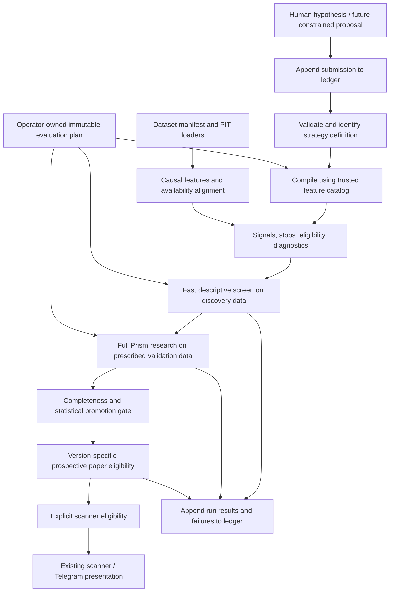

# Strategy Lab: repository audit and incremental design

Inspection date: 2026-10-03. This is a design grounded in the existing implementation,
including the local database and generated reports. Only the representation foundation
described in section 6 is implemented. No production strategies, evaluation rules,
database schemas, paper records, or Telegram paths were changed.

## 1. Current architecture

| Area | Existing implementation | Reuse |
|---|---|---|
| Spot strategy interface | `setups/base.py`: `Setup`, `SetupContext`, `SetupOutput(signal, stop, eligible, diagnostics)`, registry, `edge_trigger`, `conditions_mask`, `ConditionsSetup` | Preserve the eligibility/diagnostic contract and causal trigger helper. Adapt to this interface rather than replace it. |
| Spot strategies | `quality_pullback.py`, `breakout_retest.py`, `rerating.py`; defaults in `config/setups/`; experiment overrides in `config/experiments/` | Keep existing implementations and defaults. Breakout/retest is a state machine; the small conjunction DSL cannot faithfully replace it. |
| Spot experiments | `research/runner.py`: `Experiment`, `ResearchContext`, `evaluate_universe`, `run_experiment`, `save_report`; `research/run_all.py` | Reuse loaders, feature cache, PIT fundamentals/regimes, reporting and research orchestration. |
| Perp strategies | `perps/strategies.py`: `PerpStrategy`, `Signals`, `STRATEGIES`; each declares hypothesis, defaults, primary horizon, sensitivity and walk-forward choices | Retain registered Python strategies; eventually allow an explicitly supplied compiled candidate alongside them. |
| Price features | `features.py`: command-scoped `FeatureStore`; `indicators/technical.py`: causal SMA/EMA, Wilder RSI/ATR, ROC, ranges, volatility, relative volume | Reuse individual indicator functions. The full feature frame assumes daily calendar horizons and annualisation. |
| Event studies | `backtest/events.py`: `forward_returns`, `AssetEvents`, `run_event_study`, `baseline_bars`, `decluster`, random-entry test | Shared statistical core for both markets; reuse forward-return calculations for screening. |
| Perp returns | `perps/backtest.py`: `daily_funding`, `perp_frame`, `side_forward_returns`, `perp_asset_events` | Reuse daily, side-specific returns with funding and costs. |
| Robustness | `backtest/robustness.py`: `walk_forward`, `window_excess`, `sensitivity_grid`, `plateau_verdict`, `split_by_label`; shared `automatic_verdict` in `research/runner.py` | Stage 2 foundation. Preserve defaults, grids, seed and verdict implementation; add explicit completeness checks for Lab promotions. |
| Simulation | `backtest/engine.py` for spot; `perps/backtest.py` for perps; shared `backtest/metrics.py` | Preserve separate engines and market-specific execution assumptions. No new simulator is needed for daily candidates. |
| Persistence | `data/store.py`: DuckDB migrations, ingestion/run provenance, raw archives, scans, positions/journal, `research_runs`, perp tables | Extend using additive migrations and a single writer. Keep existing reports and identifiers. |
| Scanner and presentation | `scoring/engine.py`, `presenter.py`, `brief.py`, `dashboard/views/perps.py` | Later integration needs explicit versioned promotion records, not discovery of every Lab definition. |

Paths above are relative to `src/market_signal/` unless prefixed with `config/` or
`dashboard/`.

### Strategies, research and execution

Spot has three maintained strategies: Quality Pullback (trend plus pullback/momentum),
Breakout + Retest (a sequential breakout/retest state machine), and Fundamental Re-rating
(PIT equities; crypto current-only). The additional conditions DSL already supports named
boolean predicates and numeric `min/max/gt/lt` bounds. `control_trend_only` is an existing
economic control. Composite scanner scores are not themselves the backtested strategies.

Perps has `trend_ls`, `funding_fade`, and `breakout_ls`, each producing both long and short
signals and stops. `funding_fade` ranks trailing average daily funding against the coin's
history. No existing perp strategy uses OI. Perp `Signals` currently has no eligibility
mask, unlike spot `SetupOutput`.

Spot event returns enter at the next open and exit at the horizon close, on total-return
prices, net of configured fee/slippage assumptions. Signal features use split-adjusted
prices. Event baselines use each asset's eligible bars; independent events are spaced by
the horizon. Perp studies reuse this machinery with separate `coin:long`/`coin:short`
series and same-side baselines. Returns are on notional, without leverage, subtracting
signed funding weighted by price. Windows spanning missing funding are excluded.

Walk-forward uses anchored training, window-local baselines, training purges, at most two
varying parameters, and reports default-parameter OOS outcomes as well as the selected
parameters. Sensitivity uses up to two axes and assesses a plateau around defaults.
The spot runner also reports regime, benchmark-trend, volatility, rate-cycle and class
splits. The perp runner reports side and coin/side breakdowns but does not yet attach the
spot runner's regime/trend/rate splits.

Both simulators schedule entries for the next open, skip entries gapping through their
stop, use conservative adverse-first intrabar rules, and fill close-decided time exits at
the next open. Spot sizes by stop risk or a fixed investment allocation, with cash and
gross-exposure limits. Perps uses isolated margin, risk-sized notional, bounded leverage
derived from stop/liquidation distance, fees on fills, extra stop slippage, funding erosion
and conservative liquidation loss. These are distinct from event-study holding returns.
Perp missing funding during a position is carried from the last known rate (zero if none),
and imputed days are counted. Neither simulator models an exchange order book.

Current configured spot per-side fee + slippage is 10 + 10 bps for crypto (HYPE 10 + 20),
5 + 5 for equities/commodities, and 5 + 3 for ETFs. Perp taker fee assumptions are 4.5 bps
on Hyperliquid and 5 on Binance, plus coin-specific slippage and 10 bps extra stop
slippage. Perp risk defaults include 0.5% account risk, 3x leverage cap, 50% equity per
position's notional and 2x total gross notional. These are repository configuration values,
not a verification of current exchange fee schedules.

### Data and point-in-time handling

Spot bars are keyed by asset, timeframe, provider and open timestamp. The update path
validates OHLC, timestamps and duplicates, stores only closed bars, logs gaps/revisions,
and archives raw payloads with SHA-256 and ingestion metadata. Provider series are explicit.
Raw bars and corporate actions generate split/total-return views on read.

Configured crypto spot data uses Coinbase (4h aggregated from complete 1h buckets) and
Hyperliquid for HYPE; equities/ETFs/commodity proxies use Tiingo. Bitstamp, Stooq and CSV
paths also exist. Daily and 4h spot series are configured; `Timeframe.H1` and provider
capabilities exist, but the inspected database has no stored 1h series. Weekly bars are
derived on read. Macro uses FRED/ALFRED vintages and EIA release rules; equity fundamentals
use EDGAR filing availability. `data/pit.py` rejects reconstructed data for historical
research. Crypto fundamentals accumulate prospective snapshots as well as separately
labelled reconstructed history.

Perp `perp_bars`, `perp_funding` and `perp_snapshots` are separate from spot. Hyperliquid
and Binance ingestion/loaders currently hard-code **daily** perp candles. Funding history
has settlement timestamps and `available_at`; Hyperliquid snapshots contain mark/oracle
prices, premium, current funding, OI in coins, OI notional and max leverage. The funding
history and current predicted funding snapshot are different datasets. Binance currently
has candle/funding ingestion, not an OI feed. No liquidation tape, CVD or trade/order-flow
history is ingested.

Point-in-time primitives already exist: explicit `close_time`, backward regime/label
joins, vintage-aware macro lookup, closed-bar filtering, and complete-bucket aggregation.
They are useful building blocks, not a complete multi-timeframe feature service.

### Paper, scanner, Telegram and CLI

`portfolio/book.py` records manually entered paper/real positions and journal entries;
it does not submit orders. Separately, `perps/paper.py` records strategy checks during
`market update`, only for the newest closed bar within 36 hours. Checks are write-once,
missed days are not backfilled, and evaluation uses only live-checked bars as the baseline.
This is forward signal tracking, not an automated paper fill engine. Spot
`research/track_record.py` scores persisted ACTIONABLE/WAIT episodes.

The scanner evaluates the three spot setups, then combines technicals, fundamentals,
regime, entry zones and risk sizing. It persists assessments. `presenter.py` separates
research evidence from scores and caps rejected setups at WATCH for displayed decisions.
Evidence currently loads the latest saved run by **name**. Perp dashboard signals are
labelled candidates for PROMISING or WEAK_POSITIVE verdicts; all preregistered perp
strategies are paper-checked regardless of verdict. The daily Telegram brief renders the
stored spot scan, freshness and undelivered alerts through `portfolio/telegram.py` when
`market brief --send` is explicitly invoked. It does not currently run a general perp Lab
scanner. No Telegram messages were sent during this task.

Relevant commands:

- Data: `update`, `doctor`, `import-csv`, `assets`, `demo-data`.
- Spot research: `experiments`, `backtest [experiment-or-path]`, `research [--only …]`.
- Perps: `perps`, `perp-strategies`, `perp-research [name] [--venue binance]`, `perp-paper`.
- Scanner/output: `scan`, `asset`, `regime`, `hype`, `brief`, `track`, `telegram-setup`.
- Manual book: `open`, `close`, `portfolio`, `journal`, `alerts`, `alert-add`.

### Existing evidence inspected

README, RESULTS.md and parts of ROADMAP/PLAN still describe real research as pending.
The local artifacts and read-only database inspection show it has run:

- Six spot experiment reports dated September 25: saved `breakout_retest` is PROMISING;
  the other five are REJECT. Its saved positive excess differs substantially by asset
  class; it should not be read as proof across all classes.
- Latest October 3 reports for all three perp strategies are REJECT on both Hyperliquid
  and the earlier Binance windows. An earlier Binance `trend_ls` report is also retained.
- There are 13 saved `research_runs` rows. Inspecting these did not rerun the research or
  independently recertify the saved verdicts.
- Perp bars: 11,755 Hyperliquid and 11,923 Binance rows, all daily. Funding rows: 147,416
  and 35,845 respectively. Price history and usable funding history have different starts.
- OI: **18 Hyperliquid snapshot rows, all October 3**. This cannot support historical
  24-hour OI changes yet. A same-day sample must not be represented as a historical OI feed.

Generated reports live under ignored `results/` and include Markdown, summary JSON,
events, trades and equity CSVs. References: `results/RESULTS_generated.md`,
`results/perps/<strategy>/<run>/report.md`, `docs/BACKTESTING.md`,
`docs/PERPS_BACKTEST.md`, `docs/SETUPS.md`, `docs/DATA_SOURCES.md` and `PLAN.md`.

## 2. Gaps and compatibility constraints

| Requirement | Already present | Remaining work |
|---|---|---|
| Standard strategies | Spot protocol/DSL, perp callable strategies, YAML experiments | Typed, versioned Lab definitions; compiler/adapters without forcing state machines into conjunctions |
| Feature vocabulary | Price/volume indicators; daily funding and rolling funding percentile | Parameterised feature catalog with units, warmup, market, timeframe, availability and implementation versions; volume z-score/change, relative strength and OI research features |
| Many assets/timeframes | Multi-asset daily research, spot 4h/weekly display | Explicit dataset selection and general closed-bar MTF alignment; perp 1h/4h ingestion and execution validation |
| Cheap screening | Vectorised forward-return functions, baselines, basic summary metrics | Cached returns/features, batched descriptive summaries, fixed selection policy, resource limits; no simulations/WF/bootstrap per candidate |
| Full validation | `run_perp_research`, spot runner, shared robustness/verdicts | Explicit candidate injection, eligibility masks, immutable evaluation plans, provenance, perp regime splits, validation completeness |
| Permanent ledger | Successful report saves append `research_runs`, including negative verdicts | Record submissions and attempts before work, errors/cancellations/zero events, canonical identity, lineage, dataset snapshots and methodology versions |
| Multiple testing | Roadmap calls for block bootstrap and Benjamini–Hochberg across `research_runs` | Neither implemented; define trial families and holdouts before large-scale screening |
| Promotion | Current name-based evidence, live checks, manual positions | Version-specific research → paper → scanner eligibility, matched dataset/policy evidence and independent promotion records |

Details that constrain reuse:

1. **Feature meanings differ.** Spot ATR is Wilder-smoothed with a particular seed;
   perp `_atr` is a rolling simple mean including its first true range. Percentile
   conventions also differ: technical `rolling_percentile` and funding `rolling.rank`
   have different tie rules. A shared feature catalog must name/version both meanings.
   `compute_features` uses daily class horizons even when called on 4h data; do not call
   a 30-bar intraday ROC “one month” or apply daily volatility annualisation to 1h data.
2. **Eligibility is incomplete for new perp candidates.** Current research defaults to
   funding-defined bars rather than each strategy's full feature warmup. The adapter
   must supply explicit per-side eligibility to `perp_asset_events`; this changes the
   baseline for new Lab runs and needs a recorded methodology version. Regime filters
   and matched baselines also need an explicit policy: spot currently filters signals
   by regime but retains a broader eligible baseline. The trend-only control is a
   separate experiment; `automatic_verdict` does not automatically test a pullback
   candidate against that control, despite the economic comparison described in RESULTS.md.
3. **Existing verdicts are not a promotion state machine.** `automatic_verdict` skips
   checks for missing WF/sensitivity objects and can return PROMISING with a plateau
   even if WF is absent. `--no-wf`/`--no-sens` are valid existing research options, not
   evidence of complete Lab validation. A separate Lab completeness gate must require
   the prescribed checks before promotion. Preserve historical verdicts as issued.
4. **Statistical assumptions need explicit review at scale.** Random-entry draws match
   the number of declustered observed events, but do not enforce horizon spacing within
   each random draw. Coin/side independence also does not remove correlations between
   coins. Walk-forward purges training with a calendar-time approximation; test windows
   are selected by signal time and can have outcomes beyond a fold boundary. Arbitrary
   gaps/intraday horizons need outcome timestamps and explicit outcome boundaries.
   `run_event_study(n_boot=0)` currently yields a primary p-value of 1 when events exist;
   it is not an appropriate “screen only” public result without changing its contract.
5. **Funding is a daily approximation.** `daily_funding` infers cadence from the median
   spacing of the entire supplied history, rounds settlements to the nearest minute,
   and scales sufficiently covered partial days. Appending a different funding cadence
   could change earlier coverage calculations. Daily funding must not be broadcast into
   earlier intraday decisions; settlement availability and changing schedules need
   focused tests and a versioned policy before intraday or strict PIT Lab evaluation.
6. **Historical margin inputs are not fully PIT.** `load_perp_input` uses the latest
   Hyperliquid max-leverage snapshot (or config default) for the whole simulation. Label
   this as an assumption, or introduce as-of margin tables under a new methodology.
7. **Simulation timing deserves a separate audit before generalisation.** Both engines
   iterate by bar close, processing a whole symbol's bar before another symbol's bar at
   that timestamp. Their shared-equity sizing can therefore depend on another symbol's
   later-in-bar result when filling an earlier open. Test global open/close ordering
   before claiming an intraday or cross-calendar portfolio implementation. No execution
   changes are made here.
8. **Provenance and versioning are partial.** Spot fingerprints cover raw bar series,
   not every corporate-action/macro/fundamental dependency. Perp reports record counts,
   ranges and coverage but no full data content hash. Config hashes/commits omit some
   resolved strategy defaults, feature semantics, dirty code and dependencies.
   Perp upserts overwrite revisions. Paper hashes include name/defaults, not signal
   implementation; paper primary keys omit the hash. Latest evidence is selected by
   name rather than exact strategy version. Timestamp-to-the-second report directories
   can collide. These patterns are insufficient for a permanent high-volume ledger.
9. **Source isolation must be explicit in the Lab.** Default perp loaders can fall back
   to synthetic data; `load_snapshots` includes real and synthetic sources together for
   Hyperliquid. Lab manifests must pin exact sources and forbid silent fallback/mixing.

These are inspection findings and design constraints, not fixes hidden inside this first
step. Existing regression tests pass; they do not prove these additional properties.

## 3. Proposed architecture and control boundaries



Keep three separate objects:

- **Hypothesis/definition:** economic explanation, source, declared ancestry and immutable
  rule. Single directional candidates simplify side-specific baselines. A future composite
  can refer to long/short child IDs; existing two-sided Python strategies remain supported.
- **Evaluation plan:** operator-owned universe, exact venues/price bases, discovery and
  validation windows, warmup, horizons, costs, execution model, null model, seeds, grids,
  thresholds and required checks. Snapshot before evaluation. The hypothesis cannot
  override it. Regenerating a plan after seeing outcomes is another recorded research
  decision, not a silent retry. A future AI process gets submission access only, not
  writable source/config, result rows, database credentials or evaluation settings.
- **Run:** definition ID + plan ID + dataset manifest ID + feature/compiler/code version +
  attempt ID, status history, results and artifacts. Same strategy on another asset,
  timeframe/period or venue is traceable without pretending to be independent evidence.

### Feature and MTF contract

Feature calculation should be pure and cached by exact dataset, asset, market, venue,
price basis, native timeframe, feature version and parameters. Reuse existing individual
indicators and complete-bar aggregation. Calculate only requested dependencies; keep
forward outcomes in a separate cache that signal evaluation cannot read.

Every feature output needs its value, native bar identity, `available_at`, validity and
coverage/staleness metadata. At trigger close T, select only the latest completed source
bar available at or before T with a backward as-of join. A daily bar opened at midnight
is unavailable until its following midnight close; it cannot inform that day's 1h bars.
Equal close timestamps may be used only under a documented availability/latency policy.
Normalise UTC and timestamp resolution; require sorted, unique series. Snapshot data is
available at capture time, not retroactively at the market timestamp it describes.

Missing input makes a condition **undefined** and the decision **ineligible**, not an
ordinary false observation. No backfill. Set maximum source age and completeness rules
in the trusted plan/catalog, rather than filling through long outages. Crossing operators
must eventually require valid consecutive native observations and documented behaviour
on the trigger clock. Warmup is loaded before a window; signal/output eligibility is
masked to the window. Enforce outcome cutoffs separately from signal cutoffs.

Daily price/volume/funding features come first. Add OI only when a manifest establishes
coverage and capture times. Choose explicitly between OI in contracts/coins and USD
notional: price changes alone can move USD OI. Price-up/OI-up and the other three quadrants
must use matched elapsed windows, not an unqualified number of irregular snapshots.
Funding percentile needs explicit average/lookback/minimum history and tie convention.
Basis from snapshots is prospective; liquidation/CVD need new provider datasets.

### Fast screen versus full research

Fast screen reuses `forward_returns` / `side_forward_returns` with cached horizon arrays.
Aggregate finite, eligible events by asset, side, horizon and predeclared time block:
signal/evaluable/completed counts, mean/median return, hit rate, excess versus eligible
same-asset/same-side/window baseline, dispersion and asset/time consistency. A rough
mean/standard-deviation ratio is descriptive; overlapping event returns are not an
annualised portfolio Sharpe. Missing horizons stay missing, with exclusions reported.
Keep costs and daily funding inexpensive and consistent with the selected policy.

Screen outcomes are `REJECT_SCREEN`, `REVIEW_FULL` or `INSUFFICIENT_DATA`, never PROMISING
or live-eligible. No parameter search, bootstrap, WF, sensitivity or portfolio simulation
is implicitly invoked. Screens use designated discovery data only. Full validation must
retain untouched data; running ordinary WF after screening on its test periods does not
restore out-of-sample status.

For Stage 2, inject a compiled candidate into `perps/research.py` explicitly, keeping
`get_strategy(name)` as the default for existing callers. Adapt signals/stops into
`PerpInput` and explicit eligibility into `AssetEvents`. Reuse `_events`, the shared
event study, robustness functions, `simulate_perps`, verdict calculation and report
rendering. For spot, adapt to `Setup`/`SetupOutput` and allow explicit setup injection in
the runner rather than mutating the production registry. Existing stateful strategies
can use implementation-reference adapters with code/config hashes; they need not be
translated into a lossy DSL.

Extend completeness/provenance and missing splits in small follow-ups. Lab reports get
their own namespace and link back to existing `research_runs`; the legacy latest-by-name
evidence reader must never interpret a screen as validation. Daily engine reuse does not
establish intraday execution correctness.

### Permanent ledger and multiple testing

Use additive tables in the existing DuckDB, written through a Lab-only service. Do not
create another result database or overwrite old `research_runs`. Suggested tables:

| Table | Immutable record |
|---|---|
| `lab_submissions` | Receipt ID/time, raw proposal, source, authored timestamp, hypothesis text, validation outcome/error, canonical ID when valid; includes invalid submissions |
| `lab_definitions` | Full canonical definition, schema/catalog version, content ID; duplicate submissions link here, not to a fresh strategy |
| `lab_lineage` | Parent/child IDs, declared family and revision reason; ancestry never deletes a failed parent |
| `lab_plans` / `lab_datasets` | Resolved methodology JSON/hash and exact data manifest/hash; venue, assets, timeframes, periods, coverage, input versions |
| `lab_runs` | Attempt ID, stage, strategy/plan/data/code IDs, start time and old research-run link if applicable |
| `lab_run_events` | Append-only lifecycle/results/errors/cancellation records, artifact paths and checksums; current status is a projection |
| `lab_promotions` | Version-specific paper/scanner eligibility, supporting run IDs, reason and later revocation |

Commit a submission/run before invoking evaluation. Record failed, cancelled, timed-out,
zero-event and unavailable-data attempts. A crash leaves an observable unfinished run;
recovery appends an interruption record. Never auto-replace earlier results. Use run IDs
in directories (`results/lab/<strategy_id>/<run_id>/`), atomically publish artifacts and
check their hashes. Store resolved plans and canonical rules with reports. A hash verifies
an input but cannot reconstruct overwritten history: retain exact local input snapshots
or reconstructible revision sets, with backups of the DB and artifacts. Keep provider
data local. Application-level append-only access is not tamper-proof storage against a
database owner.

Content identity detects renames and condition reordering. It cannot prove general
logical/economic equivalence or catch every near-duplicate parameter tweak. Preserve all
submissions, parameter variants, family/parent links and similarity diagnostics. Explicitly
register the testing family and all planned endpoints before evaluation. Identical reruns
are reproducibility checks, not new independent discoveries; changing data, horizon,
methodology or inspected results is visible in the trial history.

`docs/ROADMAP.md` already proposes block bootstrap and Benjamini–Hochberg. Add a batch
manifest listing all candidates tested, including screen failures, with raw p-values and
adjusted q-values where valid. Do not run BH only over survivors evaluated on the same
data that selected them. A defensible initial design screens on discovery data and runs
preregistered family tests on an untouched validation window. Define how asset/side/horizon
claims and revisions count, and address correlated strategies/assets and repeated batches
before asserting FDR control. Ledger visibility alone and a per-run p < 0.05 threshold do
not control data mining; BH does not repair invalid or adaptively selected p-values.

## 4. Phases and review boundaries

| Phase | Files/modules | Reviewable completion criterion |
|---|---|---|
| 1 — Representation (this change) | New `research/lab/spec.py`, `config/lab/examples/`, `tests/test_lab_spec.py`, this report | Strict data-only documents, explicit timeframes/ATR meaning, stable identity, no production imports or evaluation |
| 2 — Ledger and locked plans | Add `research/lab/ledger.py`, `policy.py`, `datasets.py`; additive migrations in `data/store.py`; Lab-only `cli/lab_cmds.py` | Every attempted submission/run is durably recorded before work; duplicate/lineage/crash tests; plan/data/code hashes; exact inputs retained. No mass screening yet |
| 3 — Daily compiler/features | Add `research/lab/features.py`, `compiler.py`, `alignment.py`, `adapters.py`; reuse `indicators/technical.py`, `setups/base.py`, perp helpers | Small daily vocabulary compiles to signals/stops/eligibility; synthetic hand-calculation, missing-data, truncation/future-shock and legacy parity tests; no registry mutation |
| 4 — Fast screen and comparison | Add `research/lab/screen.py`, `report.py`; extend Lab CLI with `screen`, `compare`, `history` | Bounded deterministic batches on discovery data; cached returns; all failures persisted; asset/time/side summaries; measured runtime/memory; cannot invoke full research or promote |
| 5 — Full-research adapters and statistical gate | Extend spot/perp runners for explicit candidate injection; add `research/lab/validation.py`, `multiple_testing.py`; reuse reports/robustness/simulators | Existing strategies retain parity; trusted plan requires completed checks; address audit items with separate versioned methodology patches; holdout/family controls before large-scale claims; link old reports |
| 6 — Perp MTF and OI | Extend `perps/data.py`, `perps/binance.py`, provider loaders and dataset manifests; extend Lab features/alignment and research policy | Stored 1h/4h data with completeness/availability; settlement-level funding treatment; same-close/gap/stale/snapshot tests; portfolio timing validated before intraday execution claims |
| 7 — Paper and scanner eligibility | Add `research/lab/promotion.py`; additive versioned paper storage and opt-in adapters in `perps/paper.py`, `scoring/engine.py`, presenter/brief/CLI | Exact strategy + implementation + policy versions carry evidence; paper starts prospectively, no backfill; explicit scanner allowlist; existing strategies unchanged |
| Later — Constrained hypothesis generation | Submission client only, reading the versioned catalog and writing proposals through ledger service | No AI dependency until separately requested; model cannot edit evaluator, plans, tests, data/results or promotion policy |

The MTF contract is specified now and encoded in references. Enabling additional data and
execution clocks is a later capability, not an implicit consequence of accepting an MTF
document. Ledger and discovery/validation boundaries must precede bulk evaluation.

## 5. Risks and decisions still required

- **Leakage/alignment:** close time versus bar open, publication/capture latency, incomplete
  higher bars, stale as-of matches, irregular OI samples, funding schedule changes, weekly
  completeness, adjusted prices and portfolio event order. The existing `weekly_from_daily`
  docstring mentions `weekly_asof`, but no such helper is implemented. Add boundary tests
  before a general MTF research path uses weekly data.
- **Parameter/data snooping:** specify untouched periods, hypothesis families, primary
  endpoints, revision policy and promotion thresholds before looking at new screen output.
  Earlier Binance windows already used by existing research are not fresh holdouts for
  hypotheses derived from those results. Today's universe remains selection-biased.
- **Versioning:** separate authored label, behaviour ID, code/catalog version, evaluation
  plan and attempt. A changed feature implementation cannot inherit an old strategy's
  paper evidence. Historical result imports must be labelled retrospective, with missing
  provenance explicit; do not invent preregistration timestamps.
- **Reproducibility:** snapshot all inputs, not just bar counts; record Python/dependency
  lock, git revision plus dirty patch/hash, seeds, exact venue/basis and compiler versions.
  Canonical definitions alone cannot reproduce a backtest.
- **Cost:** avoid recomputing full indicator frames, horizon outcomes and event DataFrames
  for every candidate/grid point. Bound features, candidates, retained detail and memory;
  share immutable arrays; use one DuckDB writer. Benchmark before adding process workers.
- **Compatibility:** maintain callable/stateful strategies and separate spot/perp engines.
  Schema v1's conjunctions intentionally cannot express every legacy setup. Any parity
  failure should produce an explicit new version, not a silent replacement.
- **Policy choices:** baseline conditioning, OI units/sampling/staleness, simultaneous
  conflicting directions, allowed timeframe/venue combinations and exact paper/live gates
  need operator-owned definitions. This task chooses no new return or significance hurdle.

## 6. Step 1 implemented

`research/lab/spec.py` adds immutable Pydantic models using Prism's existing dependency
and `Timeframe` enum: `FeatureRef`, `Condition`, `ExitIntent`, `StrategyDefinition`, and
`Hypothesis`, plus `load_hypothesis(Path)`. No existing module imports the Lab.

The minimal vocabulary is grounded in existing functions:

| Reference | Defined meaning for a future compiler |
|---|---|
| `close` | Native closed bar's close; declared market/source and price basis from the plan |
| `sma_20`, `sma_50`, `sma_200` | `technical.sma`, periods in native bars, full warmup |
| `ema_21` | `technical.ema`, recursive `adjust=False` semantics and warmup |
| `rsi_14` | `technical.rsi`, existing Wilder seeding |
| `rel_volume` | Volume divided by full 20-native-bar volume mean |
| `roc_1m` | Existing daily class-based month ROC, 30 crypto / 21 NYSE bars; daily only |
| `funding_day` | Existing daily funding aggregation semantics; perp/daily only, subject to the audit above |
| Exit `wilder_14` / `perp_sma_14` | Explicit distinction between `technical.atr` and perp `_atr`; sampled on trigger bars |

One definition is one market/side, a trigger timeframe, one to four conjunctive
comparisons (`gt/ge/lt/le`) against a finite number or another feature, a bounded cooldown
and exit intent. Dependencies must be at least as slow as the trigger. Spot shorts and
spot funding are rejected. Future evaluation will apply existing `edge_trigger` semantics
to the valid conjunction (first rising edge, then silence for the cooldown); unsupported
data/timeframes must fail at compilation, not fall back. This module does not evaluate
that contract yet.

Stop distance is positive and at most 10 ATR; optional target at most 20 R; holding/cooldown
counts are bounded at 10,000 native bars. These are representation limits, not optimized
values or research pass thresholds. Candidate definitions cannot specify fills, sizing,
costs, evaluation thresholds, test periods or results. Unknown fields are rejected at every
level; numeric strings, booleans in numeric parameters and nonfinite thresholds are rejected.
YAML uses a safe loader and rejects duplicate/merge keys. The JSON schema is available
through `Hypothesis.model_json_schema()` for a later constrained proposal client.

Full SHA-256 identity hashes the canonical behaviour, including schema version, resolved
defaults, feature references, thresholds and exits. Condition order and numeric spelling
do not change it; name, explanation, source, authored timestamp and ancestry are metadata.
Changing a rule/timeframe/side/exit produces a different ID. The timestamp must be aware;
parent IDs are validated structurally and cannot point to the same definition. Existence
and family/near-duplicate checks remain ledger responsibilities. This is **not** the
permanent ledger, and no proposal has been screened or promoted by this change.

Example: `config/lab/examples/daily_trend.yaml` is outside `config/experiments/`, so
`market research` will not automatically discover or run it. Load it locally with:

```python
from pathlib import Path
from market_signal.research.lab.spec import load_hypothesis

h = load_hypothesis(Path("config/lab/examples/daily_trend.yaml"))
print(h.strategy_id)
print(h.definition.canonical_json())
```

Not implemented: feature evaluation, signals, screen runner, storage migrations, new CLI
commands, AI integration, or paper/live promotion. This is a small foundation for the
ledger/compiler phases, not a second backtesting engine.

## 7. Verification

Baseline before changes: **173 tests passed**, repository Ruff checks passed, and all
89 existing source/test Python files passed format checking. New focused tests cover
canonical round trips, rename/reorder identity, rule changes, nested immutability,
methodology field rejection, finite numeric parameters, bounded counts, explicit MTF
references, market restrictions, lineage, schema versions and safe YAML parsing.

Final checks:

| Check | Result |
|---|---|
| `.venv/bin/python -m pytest` | **205 passed** in 99.79 seconds, including existing backtest/PIT, research, paper, scanner, dashboard and Telegram tests |
| `.venv/bin/python -m pytest tests/test_lab_spec.py` | **32 passed**, including the pinned canonical ID and default resolution |
| `.venv/bin/ruff check src tests dashboard` | Passed |
| `.venv/bin/ruff format --check src tests` | All 92 files formatted |
| `git diff --check` | Passed |
| `.venv/bin/market --help`, example load and JSON-schema generation | Passed; existing CLI commands intact |

The repository does not configure a static type checker in `pyproject.toml`, so a separate
static type check was not run. No new type-checking tool or dependency is introduced.
Runtime model validation is covered by pytest. Database inspection was read-only, and
tests used their existing isolated fixtures; no real-data research or live/paper scan
was triggered.
